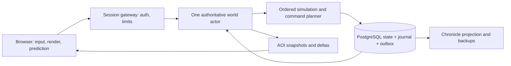

# The Unfinished Earth — Persistence & Production

Tài liệu thiết kế v0.1 · 11/09/2026 · Các mục 75–108 của Game Design Bible.

Đây là hợp đồng thiết kế để làm prototype và kiểm chứng, chưa phải mô tả phần mềm đã triển khai. **ASSUMPTION** chỉ quyết định có ảnh hưởng lớn; toàn bộ số hiệu năng, thời gian sản xuất và tiêu chí thử dưới đây là mục tiêu chưa đo. Phạm vi mặc định là một world riêng, co-op PvE, mời tối đa tám người. Repository công khai không biến game thành MMO công khai.

## 75 Co-op

**Purpose.** Cho một nhóm sống chung và thực hiện những việc bổ sung cho nhau. **Player Experience.** Một người sửa cầu, một người chở gỗ, người còn lại thương lượng nguồn thực phẩm; solo làm cùng chuỗi bằng thứ tự và hợp đồng NPC.

**Core Rules.** Một account có một nhân vật đang hoạt động trong world; tối đa tám slot đồng thời, một homestead chung. Không class lock, không nhân damage hoặc nhu cầu sinh tồn theo số người. **Inputs.** Thành viên, quyền, vị trí, hành động hợp lệ và tài nguyên đã sở hữu.

**Outputs.** Lệnh được xác nhận, công trình chung, công việc nhận trách nhiệm, bản đồ chia sẻ có nguồn tin. **Interactions With Other Systems.** Co-op dùng cùng inventory ledger, logistics, reputation, protection và Chronicle; không tạo bản sao tài nguyên cho từng thành viên.

**Player Actions.** Nhận hoặc bàn giao việc, đánh dấu bản đồ, trao đồ, xây theo quyền. **NPC Actions.** NPC ký hợp đồng với nhóm hoặc cá nhân được chỉ rõ; thay người giao hàng không tạo hợp đồng thứ hai.

**Simulation Logic.** Server xếp thứ tự lệnh; một reservation có một chủ và hạn sử dụng. Hai người lấy món cuối cùng chỉ có một giao dịch thành công. **Offline Behavior.** Thành viên offline không chặn người khác chơi; world chỉ bắt đầu thời hạn vắng khi không còn ai kết nối hợp lệ.

**Failure States.** Sai quyền, kho hết hàng, reservation cũ hoặc thành viên rời nhóm. **Emergent Outcomes.** Nhóm tự chuyên môn hóa theo sở thích, nhưng khi người thợ nghỉ thì blueprint trong thư viện vẫn dùng được.

**UI Presentation.** Hiện ai đang làm việc gì, vật liệu đã dành cho đâu và lý do thao tác bị từ chối. **Performance Considerations.** Giới hạn tám vùng quan tâm và một ngân sách agent toàn world; không nhân toàn bộ simulation theo người chơi.

**Edge Cases.** Người sở hữu account bị mất quyền vẫn lấy được tài sản cá nhân qua điểm nhận an toàn; quyền rút kho chung bị thu hồi ngay. **Future Expansion.** Vai trò tùy chỉnh và nhóm liên minh chỉ sau khi quyền mặc định được kiểm thử.

| Vai trò | Quyền mặc định | Giới hạn |
|---|---|---|
| Owner | Mời, phân quyền, đổi cấu hình được phép, quản lý save | Chỉ public estate được tự nguyện bàn giao; không tự hủy bảo hộ homestead |
| Steward | Kho chung, xây, hợp đồng, ưu tiên sản xuất | Không xóa world hoặc đổi quyền owner |
| Member | Công việc, vật liệu theo quota, sử dụng hạ tầng | Không tháo tài sản ngoài quyền được giao |
| Guest | Tham quan, trao đổi trực tiếp | Không rút kho, đổi chính sách hoặc sửa địa hình |

MVP có ping và chat chữ; voice chat không phải phụ thuộc để chơi. Radio ảnh hưởng thông tin trong world, khoảng cách nhận báo cáo và cập nhật bản đồ; không cố cấm nhóm nói chuyện bằng ứng dụng ngoài. Việc đổi owner cần owner hiện tại; khôi phục quyền quản trị khi mất account là quy trình vận hành, không để NPC tự quyết.

## 76 PvP Options

**ASSUMPTION:** Không có PvP trong MVP hoặc cấu hình 1.0 mặc định. Đạn, melee và va chạm xe không gây sát thương trực tiếp lên đồng đội; vẫn có hậu quả môi trường nên quyền xây và thay dòng nước cần kiểm soát. Không dùng “PvE” như bảo đảm chống mọi hành vi phá nhóm.

Mục này kế thừa hợp đồng Co-op ở §75. Thay đổi chính nằm ở **Core Rules**, **Failure States** và **Future Expansion**: chế độ PvP thử nghiệm sau phát hành phải dùng save riêng, hiển thị trước khi gia nhập và không được bật lén trên save PvE đang tồn tại. Chưa thiết kế raid, chiến lợi phẩm từ người chơi hay cân bằng PvP. Quyền owner thao túng world là đặc tính của máy chủ riêng, không phải thành tích cạnh tranh có thể đem sang world khác.

## 77 Offline Protection

**Purpose.** Giữ thành quả cốt lõi trong khi thế giới bên ngoài còn thay đổi. **Player Experience.** Trở lại thấy nhà và kho khô còn nguyên; tuyến nước bị đứt và xưởng đang chờ sửa có giải thích.

**Core Rules.** Một homestead tối đa 32 × 32 m mỗi nhóm, không chồng đường công cộng hoặc lòng sông. Quyền sở hữu, độ bền lõi và vật phẩm không hỏng trong kho được bảo vệ cả online. **Inputs.** Ranh giới đã đăng ký, trạng thái utility, vật tư, chỗ chứa, workforce và credit lao động.

**Outputs.** Sản xuất đã commit hoặc trạng thái dừng có lý do; không tạo nợ âm. **Interactions With Other Systems.** Bảo vệ tài sản không sửa nước ngoài ranh giới, giữ giá thị trường hay miễn hậu quả từ công trình công cộng.

**Player Actions.** Chọn vị trí hợp lệ, giới hạn kho, lập hàng đợi, sửa nguồn cấp và tự nguyện chuyển public estate thành di sản. **NPC Actions.** Lao động thiết yếu trú an toàn hoặc tạm nghỉ; không phải lao động miễn phí vô hạn.

**Simulation Logic.** Mỗi bước kiểm tra hazard và đầu vào trước khi dành vật tư. Mỗi interval có công việc thực sự chạy commit tiến độ cùng credit đã dùng; khi recipe hoàn tất, debit vật tư và output commit nguyên tử cùng phần credit cuối còn đến hạn. **Offline Behavior.** Tối đa tám giờ thực công việc từ credit đã tích; hết credit hoặc gặp nguy cơ thì dormant.

**Failure States.** Mất điện, mất nước, đầy kho, hết vật liệu hoặc không đủ người. **Emergent Outcomes.** Nhà an toàn trở thành nơi tổ chức cứu trợ, nhưng nhóm vẫn phải khôi phục cầu để bán hàng.

**UI Presentation.** Báo “Dừng do mất nước”, số credit còn lại và giờ dự kiến hoàn thành có điều kiện. **Performance Considerations.** Hàng đợi theo sự kiện hoàn thành và đổi đầu vào; không chạy từng máy mỗi frame.

**Edge Cases.** Đăng ký vùng không dập cháy đang xảy ra; công trình mới phải qua kiểm tra hazard trước khi được bảo hộ. **Future Expansion.** Nhiều kiểu estate có mức rủi ro khác nhau; không tự biến vắng mặt thành đồng ý từ bỏ.

### State machine của homestead

```text
OPERATING -- không còn thành viên hoạt động --> BACKGROUND
BACKGROUND -- credit hết ------------------> DORMANT_CREDIT
OPERATING/BACKGROUND -- thiếu đầu vào ------> PAUSED_SUPPLY
OPERATING/BACKGROUND -- hazard bên ngoài ---> SHELTERED_HAZARD
mọi trạng thái -- kho đầu ra đầy -----------> PAUSED_STORAGE
PAUSED/SHELTERED -- điều kiện hợp lệ --------> OPERATING hoặc BACKGROUND
DORMANT_CREDIT -- có thành viên hoạt động ---> OPERATING
```

Các trạng thái này điều khiển **hoạt động**, không bật tắt bảo vệ tài sản. Đăng nhập không sửa nguồn điện và không hoàn lại credit. Nhà vẫn có thể đứng giữa vùng ngập; nhân vật được đặt ở điểm vào an toàn và được báo đường ra đang nguy hiểm. Collision của nhà không được dùng như một con đê miễn phí làm lệch dòng nước. Nếu ranh giới thiếu điểm ra hợp lệ, server cấp lối thoát cứu hộ đã xác định, không phá một công trình khác để mở đường.

Credit thuộc nhóm, trần 28.800 giây thực. Mỗi phút thực có ít nhất một thành viên hoạt động được server xác nhận nạp tối đa một phút credit; tám người không nạp nhanh tám lần. Hoạt động hợp lệ cần lệnh chơi có ý nghĩa trong cửa sổ năm phút, như đi tới vị trí mới, xây, giao dịch hoặc giao hàng; heartbeat và giữ phím vào tường không đủ. Đây là quy tắc chống AFK cơ bản, không lời hứa phát hiện mọi bot.

Khi nhóm không hoạt động, một phút xưởng thực sự vận hành tiêu một phút credit chung dù có nhiều máy; throughput vẫn bị chặn bởi lao động và công suất. Không tiêu credit khi toàn bộ dây chuyền dừng, không nhận bù sản lượng “đã bỏ lỡ” sau đó. Credit ban đầu bằng không; ví dụ chơi tích cực hai giờ rồi vắng một ngày chỉ tạo tối đa hai giờ sản xuất hợp lệ. Thực phẩm dễ hỏng vẫn tuân theo bảo quản; UI đánh dấu rõ vật phẩm nào không nằm trong bảo đảm tồn kho. Không lấy lương thực dự trữ của người chơi để âm thầm trả phí cứu hộ hoặc tiền bảo trì.

Mất kết nối ngoài nhà để nhân vật chịu rủi ro tối đa 60 giây, sau đó server cứu về nơi trú với phí có trần, không ép chết vĩnh viễn vì lỗi kết nối. Reconnect trong cửa sổ này lấy lại cùng entity, không sinh nhân vật thứ hai. Đây là ưu tiên công bằng cho co-op riêng, chấp nhận người chơi có thể dùng cứu hộ như phương án thoát đắt tiền; cooldown và cấm mang hàng hóa cồng kềnh qua cứu hộ ngăn nó thay thế logistics.

## 78 Persistent Simulation

**Purpose.** Một hành động hôm nay còn có trạng thái và nguyên nhân vào lần sau. **Player Experience.** World tiếp diễn khi nhóm vắng, rồi tạm ngủ theo quy tắc có thể dự đoán.

**Core Rules.** Khi không còn người kết nối, macro simulation tiếp tục tối đa 72 giờ thực; sau đó hibernate. **Inputs.** `absenceStartedAt`, `lastSimulatedAt`, thời gian đã tích, phiên bản mô phỏng và state đã commit.

**Outputs.** World revision mới, tick đã áp dụng, lịch sử sự kiện và trạng thái ngủ. **Interactions With Other Systems.** Dùng cùng tốc độ sinh thái, mùa, giá, NPC và bảo hộ như lúc có người; LOD đổi cách thực hiện hành vi, không đổi quy luật thu hoạch.

**Player Actions.** Xem báo cáo trở lại, kiểm tra nguồn tin cũ, chọn việc khắc phục. **NPC Actions.** Tiêu dùng, sản xuất, chuyển nghề, di chuyển hoặc trú ẩn theo macro rules.

**Simulation Logic.** Xử lý các mốc đến hạn theo thứ tự, commit watermark cùng kết quả. **Offline Behavior.** Thời hạn tính một lần cho mỗi đợt vắng; restart worker không cộng thêm 72 giờ.

**Failure States.** Catch-up lỗi, save không tương thích hoặc actor mất lease. **Emergent Outcomes.** Mưa cứu ruộng nhưng làm hỏng cầu; giá thực phẩm thay đổi và tạo đơn hàng mới.

**UI Presentation.** Hiện chính xác “World đã tiến 72 giờ và tạm ngủ”; không nói mọi ngày vắng đều đã được mô phỏng. **Performance Considerations.** Tối đa 144 ngày game để catch-up; chạy theo bucket sự kiện, không replay AI từng giây.

**Edge Cases.** Kết nối chỉ tới màn hình đăng nhập không kết thúc đợt vắng; đồng hồ máy chủ lùi không được tua ngược world. **Future Expansion.** Chủ world có thể chọn horizon ngắn hơn; không mở unlimited trước khi đo chi phí và hậu quả.

Một ngày game bằng 30 phút thực được mô phỏng; một năm có 120 ngày, tương đương 60 giờ thực được mô phỏng. 72 giờ vắng tối đa tương đương 144 ngày, tức 1,2 năm. 100 giờ world tiến là 1,67 năm, 1.000 giờ là 16,67 năm. Thời gian chơi cá nhân, thời gian server tiến và thời gian ngoài đời không được ghi chung dưới một cột “giờ chơi”.

```text
LIVE -- người cuối rời --> ABSENT_RUNNING
ABSENT_RUNNING -- tới absenceStartedAt + 72h --> HIBERNATING
ABSENT_RUNNING/HIBERNATING -- join hợp lệ --> CATCHING_UP
CATCHING_UP -- commit đủ target --> LIVE
CATCHING_UP -- lỗi --> RECOVERY_REQUIRED, chưa cho lệnh gameplay
```

Worker luôn chạy hay bị tạm dừng phải cho cùng kết quả ở các mốc macro. Khi world đang ngủ nhiều tuần, reconnect chỉ giải quyết phần còn thiếu trong **horizon ban đầu**. Sau catch-up thành công, reset mốc wall clock cho phiên live; bỏ khoảng ngủ, không biến khoảng ấy thành game time. Đợt vắng kế tiếp chỉ bắt đầu sau một phiên đã vào world thành công, không phải sau một ping hay restart.

### Thứ tự catch-up và thiên tai

Mỗi ngày chia thành 24 mốc giờ game, mỗi mốc tương đương 75 giây thực. Weather và water chạy ở mốc giờ; sinh thái và kinh tế kết sổ ở bình minh. Tại cùng timestamp: nhận weather → tính dòng nước/hazard → đánh dấu đường và utility → kiểm tra homestead → xử lý hoàn thành production/logistics → kết sổ dân số, lương thực và giá nếu đến hạn → tạo nhu cầu và Chronicle. Hai sự kiện ngang hàng sắp theo `systemPriority`, `entityId`, `eventId` ổn định.

Flood xảy ra trước lúc xưởng hoàn thành thì xưởng không nhận đầu ra dựa trên nguồn điện đã mất. Chuyến hàng đang đi chỉ tiến phần đường trước khi cầu đóng; sau đó chờ hoặc reroute, không “giao thành công rồi mới biết cầu hỏng”. Trong MVP, đầu vào được reserve lúc bắt đầu và vẫn nằm trong kho có chủ sở hữu; pause giữ reservation cùng tiến độ nhưng chưa tạo sản phẩm. Debit đầu vào và tạo output diễn ra nguyên tử khi hoàn tất. Hủy trước hoàn tất giải phóng reservation đúng một lần. Recipe chia giai đoạn chỉ sau MVP: mỗi giai đoạn cần commit đầu vào, bán thành phẩm và chi phí riêng; không hoàn vật tư của giai đoạn đã hoàn tất.

```text
resume(world, serverNow):
  assert actorLease.valid && world.version.supported
  deadline = world.absenceStartedAt + 72h
  target = min(serverNow, deadline)
  while world.lastSimulatedAt < target:
    boundary = nextDueBoundary(world, target)
    tickId = (world.id, world.absenceEpoch, boundary)
    patch = simulateOrderedInterval(world, boundary)
    assertConservationAndProtection(patch)
    commitStateEventsAndWatermarkOnce(tickId, patch, boundary)
    publishProgressAfterCommit()
  enterLiveWithFreshWallClockAnchor(serverNow)
```

`nextDueBoundary` giữ phase giờ/ngày còn dở; không làm tròn thêm một ngày khi người chơi quay lại. Credit được tiêu theo phần thời gian job thực sự chạy trong interval. Catch-up mục tiêu dưới năm giây trên cấu hình tham chiếu; nếu chưa đạt thì hiển thị tiến độ và giữ world khóa ghi, không bỏ qua tick để tạo cảm giác nhanh.

## 79 World Chronicle

**Purpose.** Biến hậu quả thành lịch sử có thể truy nguyên. **Player Experience.** Đọc một mục ngắn, mở bản đồ và nhận ra cây cầu mình sửa đã giúp khu định cư vượt đói.

**Core Rules.** Chronicle là tuyển chọn từ sự kiện đã commit, tách khỏi ledger phục hồi. **Inputs.** Event ID, thời điểm, địa điểm, chủ thể, nguyên nhân trực tiếp, độ chắc chắn và thay đổi đo được.

**Outputs.** Mục lịch sử, liên kết địa danh, dấu tích và thông báo quan trọng. **Interactions With Other Systems.** Lấy dữ kiện từ water, ecology, settlement, economy và legacy; không tự sáng tác casualty hay người sáng lập.

**Player Actions.** Đọc, lọc, đánh dấu, đặt tên có kiểm soát và thêm ghi chép được gắn tác giả. **NPC Actions.** Truyền tin, kể phiên bản riêng; lời đồn không thay đổi bản ghi sự kiện gốc.

**Simulation Logic.** Rule chọn event có ngưỡng và cooldown; nhiều vụ thiếu lương thực liên tiếp gộp thành một đợt. **Offline Behavior.** Chronicle được dựng từ event sau catch-up; thông báo gộp theo vấn đề thay vì spam 144 bản tin.

**Failure States.** Thiếu cause, địa danh đã xóa hoặc event chưa commit. **Emergent Outcomes.** Cùng một dự án có trang thành tựu và trang tranh chấp phản ánh các hậu quả khác nhau.

**UI Presentation.** Một câu kết quả, một câu nguyên nhân, nút “Xem bằng chứng” và “Đến vị trí”. **Performance Considerations.** Index theo world/time/entity; phân trang và chỉ giữ các cause cần thiết trong projection đọc.

**Edge Cases.** Người chơi đổi tên không thay ID; NPC nhầm lẫn được ghi là lời kể. **Future Expansion.** Xuất biên niên sử và tranh luận lịch sử; không cần AI sinh văn bản để MVP hoạt động.

Ví dụ bản ghi: “Ngày 43, cầu Bờ Sậy mở lại. Trong ba ngày tiếp theo, hai chuyến thực phẩm tới Bến Cạn; số ngày dự trữ tăng từ 2 lên 5.” Phần bằng chứng nối `bridge.reopened` → `route.available` → hai `shipment.delivered` → `settlement.food_reserve_changed`. Nếu có thêm nguồn thực phẩm từ mùa vụ, không gán toàn bộ mức tăng cho cây cầu.

Một sự kiện lịch sử chuẩn có dạng:

```json
{
  "eventId": "evt-bridge-0043",
  "worldRevision": 4812,
  "simTime": {"day": 43, "hour": 8},
  "type": "bridge.reopened",
  "entityIds": ["bridge-reed", "group-1"],
  "locationId": "crossing-reed",
  "causeIds": ["job-repair-398"],
  "effects": {"allocatedFreightBefore": 0, "allocatedFreightAfter": 40},
  "units": {"allocatedFreightBefore": "kg/game-day", "allocatedFreightAfter": "kg/game-day"},
  "sourceKind": "observed_simulation",
  "certainty": "confirmed",
  "templateVersion": 1
}
```

Trong ví dụ này, 40 kg/ngày game là lượng vận tải đã được tài trợ và phân lịch cho tuyến sau khi cầu mở, không phải sức chở vật lý tối đa của xe. Công thức §24 cho xe 120 kg đạt lý thuyết 22,5 kg/phút thực, tức 675 kg/ngày game nếu vận hành liên tục; sản lượng giao thực tế còn phụ thuộc hàng, lao động, giờ chạy và quyền dùng tuyến.

Chronicle không nhất thiết chứa mọi event ledger. Nhưng mục đã công bố phải giữ đủ evidence summary bền vững khi ledger chi tiết được compact. Xóa log kỹ thuật cũ không được để nút bằng chứng dẫn tới một chuỗi trống.

## 80 Procedural History

Kế thừa hợp đồng Chronicle §79; **Inputs** bổ sung seed, geography, faction templates và giới hạn content. **Simulation Logic** dùng 300 bước năm macro trước Player Era, không giả lập từng phút. Bắt đầu từ địa hình và di sản sau tận thế, mỗi bước cập nhật nơi cư trú, áp lực tài nguyên, thương mại và vài sự kiện có điều kiện; các sự kiện lớn có tuổi tối thiểu và khoảng cách thời gian để tránh hàng trăm cuộc chiến vô nghĩa.

Pipeline: sinh lưu vực → đặt tài nguyên và dấu tích công nghệ → đặt cộng đồng khả thi → tiến lịch sử → chuyển trạng thái cuối thành world đầu game → kiểm tra → lưu seed/version. Geography không bị các sự kiện lịch sử tùy ý làm mất lối đi khởi đầu. Nếu một thế giới kết thúc với cả hai khu định cư chết hoặc không có nước tiếp cận, seed không đạt điều kiện khởi đầu và sinh lại với lý do được ghi.

**Outputs** gồm đường cũ, ruin, genealogy cần dùng, tên địa danh và các lớp lời kể. Chỉ sự kiện thực sự có trong graph mới sinh dấu tích tương ứng. “Trận chiến ở cầu” cần có cầu hoặc phiên bản cũ của nó; đồ cổ không được trẻ hơn ngày nơi chứa bị niêm phong. MVP có một ruin và hai khu định cư hiện tại, nên 300 năm tiền sử chủ yếu là lớp dữ liệu và vài biến thể địa điểm, không 300 năm nội dung thủ công. Giới hạn mục tiêu 50–100 sự kiện đáng kể mỗi world khởi tạo, cần kiểm chứng khả năng đọc và đa dạng.

## 81 Player-Made History

Mục này kế thừa §79; thay đổi **Core Rules** là provenance ghi rõ nhóm, NPC tham gia và vật liệu đã commit. Một memorial không làm người đặt nó trở thành người thực hiện toàn bộ dự án. Ghi công dùng đóng góp xác minh được, gồm vận chuyển, xây và hợp đồng; không phát điểm chỉ vì đứng gần.

Homestead không trở thành phế tích chỉ vì owner nghỉ. Public estate được xác nhận bàn giao cho world mới có maintenance, NPC quản trị và suy tàn; màn hình bàn giao cho biết tài sản nào chuyển quyền, hợp đồng nào còn hiệu lực và hành động không tự đảo ngược bằng reconnect. Kỷ niệm có thể vẫn tồn tại khi công trình vật lý đã mất: landmark ID giữ tọa độ lịch sử, lớp map hiện tại cho biết nơi ấy nay là đầm lầy hoặc công trình khác.

World không cần đặt player ở trung tâm mọi sự kiện. Chronicle cũng ghi những cây cầu NPC sửa, những quyết định hội đồng và cuộc di cư không liên quan đến nhóm; điều này làm đóng góp của player nằm trong một lịch sử rộng hơn.

## 82 Mega Projects

Hệ thống dự án kế thừa đầy đủ 16 nhãn của §20 Building System; lịch vận chuyển theo §24 Logistics và thỏa thuận cộng đồng theo §54 Settlement System. Các khác biệt về quy mô, milestone, nguồn lực và thời điểm triển khai được quy định dưới đây.

Đại công trình là bài toán phối hợp nguồn cung, công suất, địa bàn và lợi ích nhiều cộng đồng. MVP không có mega-project; từ alpha thử một dự án liên settlement quy mô nhỏ, sau đó mới mở mạng lưới vùng. Mỗi dự án cần milestone hữu dụng độc lập, không bắt tích trữ 100 giờ trước lợi ích đầu tiên.

| Dự án dự kiến | Điều kiện | Lợi ích gameplay | Đánh đổi | Điều kiện dừng |
|---|---|---|---|---|
| Mạng vận tải ba vùng | Tuyến an toàn, kho trung chuyển, bảo trì | Tăng capacity và độ tin cậy giao hàng | Chiếm đất, tiêu vật tư, dịch bệnh đi xa hơn | Kho thiếu đầu vào hoặc tuyến mất an toàn |
| Phục hồi lưu vực | Dữ liệu nước, vùng bảo tồn, thỏa thuận dân cư | Ổn định nước và phục hồi sinh cảnh | Giảm diện tích khai thác trước mắt | Chưa xử lý nguồn ô nhiễm thì không tính hoàn thành |
| Mạng radio | Điện, điểm đặt trạm và linh kiện | Báo giá, cảnh báo và bản đồ mới hơn | Chi phí duy trì, vị trí nhạy cảm | Thiếu điện làm vùng phủ suy giảm |

Các tên như Orbital Network hoặc Climate Stabilization là hướng nghiên cứu sau phát hành. Chưa đưa vào cam kết 1.0 vì đòi hỏi nền công nghiệp, nhiều vùng và hệ thống cân bằng chưa được chứng minh. Solo vẫn hoàn thành dự án ở quy mô hữu dụng qua NPC và nhiều giai đoạn; không có nút cần tám người đứng đồng thời.

## 83 Endgame

Khi đời sống cơ bản đã ổn, câu hỏi đổi từ “kiếm bữa ăn” sang “giữ nơi này đáng sống và làm điều gì tiếp theo”. Các đích tự chọn gồm hoàn thiện tuyến hàng, giảm phụ thuộc một nguồn nước, lập thư viện tri thức, giữ loài trước áp lực săn và chuyển di sản cho NPC. Mốc hoàn thành cho phép nghỉ; không sinh thuế bảo trì vô hạn chỉ để kéo player quay lại.

Thành công có bằng chứng: một mùa không thiếu nước, thời gian giao hàng ổn định, hoặc quần thể duy trì trên ngưỡng an toàn. Không bắt mọi settlement thành thành phố. Một làng nhỏ bền vững là kết quả hợp lệ. Sau khi đạt mục tiêu, player có thể quan sát, giúp bạn mới, phát triển vùng khác trong giới hạn map hoặc tạo world mới; không cần boss cuối để đóng game.

## 84 Infinite / Long-Term Gameplay

**ASSUMPTION:** Mục tiêu là chơi lâu với hậu quả bền vững, không cam kết nội dung vô hạn hay máy chủ tồn tại vĩnh viễn. World hữu hạn, finite stocks và POI đã lấy đồ không tự refill. Nguồn vật liệu lâu dài đến từ renewable có sức tải, recycling có hao hụt và ngoại thương được ghi là imports có quota, chi phí và nguồn gốc.

Theo dõi world sau 100, 300 và 1.000 giờ được mô phỏng: còn con đường tạo công cụ cơ bản, có nước tiếp cận, giá không tiến tới vô hạn, ít nhất một phương án khôi phục food chain còn khả thi, và Chronicle không bị tràn bản ghi lặp. Không cưỡng ép thảm họa khi mọi người đang sống ổn. Nếu mô hình hội tụ về trạng thái tẻ nhạt, trước hết xem thiếu quyết định hoặc feedback; không chữa bằng random damage.

No routine wipe áp dụng như định hướng release. Save phát triển có version, thông báo migration/reset; bản 1.0 cần phương án export, backup và migration trước khi hứa giữ lâu. Hết vận hành dịch vụ là vấn đề hosting cần thông báo và đường xuất save, không được mô tả là một biến cố trong lore để che mất dữ liệu.

## 85 UI/UX

Giao diện ưu tiên hành động tiếp theo và nguyên nhân đang cản nó. Tầng một là cảnh vật: nước cao, cây héo, kho đóng cửa. Tầng hai là tooltip ngắn: “Ruộng thiếu nước; cổng tưới đóng từ ngày 31”. Tầng ba là bảng chi tiết tùy chọn có timeline, đơn vị và khoảng dữ liệu. Không hiển thị hàng chục biến normalized như phần bắt buộc của màn hình thường.

Màn trở lại có tối đa ba vấn đề chính, một thay đổi tích cực và một nút tới Chronicle. Tách “Đã xảy ra” khỏi “Tin gần nhất”: giá nghe qua radio cách đây hai ngày có thể khác lúc giao dịch. Bản đồ phân lớp nước, đường, khu định cư, nguồn tin và nguy cơ; nguồn chưa xác minh dùng nét/biểu tượng khác, không chỉ màu nhạt.

Build preview trả lời đủ ba việc: đặt được không, cần gì, ảnh hưởng gì. Đặt gate chỉ cần báo “Giữ nước phía trên; có thể giảm nước phía dưới” cùng phạm vi dự kiến; người muốn chi tiết mở panel lưu lượng. Giá mua bán hiện giá cuối, khối lượng và khả năng vận chuyển trước xác nhận. Lệnh đang lưu có trạng thái pending; “Đã lưu” chỉ xuất hiện sau ACK bền vững.

Mục tiêu thử UX: người mới hoàn thành vòng sửa cầu đầu tiên trong một phiên hướng dẫn; sau một sự cố có thể chỉ đúng nguyên nhân gần nhất mà không mở bảng nâng cao. Đo tỷ lệ hoàn thành, thời gian mắc kẹt và câu giải thích của người thử; chỉ tỷ lệ click không chứng minh họ hiểu simulation.

## 86 Accessibility

MVP hỗ trợ đổi phím, giữ hoặc bật/tắt cho các thao tác kéo dài, chỉnh tốc độ camera, zoom, cỡ chữ và UI scale. Không yêu cầu thao tác lặp nhanh để đào/chặt. Mọi cảnh báo âm thanh quan trọng có chữ hoặc hình, màu không là kênh duy nhất để phân biệt giá tăng/giảm, trạng thái cây hay phạm vi xây.

Menu, inventory, journal và confirmation dùng thành phần HTML có focus rõ, thứ tự bàn phím hợp lý và nhãn đọc được; canvas có mô tả ngữ cảnh và lối mở danh sách tương tác gần. Tầm nhìn game 3D vẫn cần kiểm chứng riêng; không tuyên bố toàn game dùng được với screen reader chỉ vì menu đọc được. Có tắt rung màn hình, chớp sáng, hạt thời tiết dày và giảm chuyển động; các tùy chọn không xóa hazard gameplay.

Co-op cung cấp ping mục tiêu, “cần vật tư”, “nguy hiểm”, “chờ tôi” và nhật ký việc để không phụ thuộc voice. Solo cho pause ở world riêng khi chọn pause rõ ràng; pause là trạng thái world lưu được, khác tab ẩn và khác offline catch-up. Trong co-op, không một client tự dừng đồng hồ chung. Các ngưỡng chữ, tương phản và thao tác sẽ được QA kiểm tra với người dùng mục tiêu; chưa gắn nhãn đạt một chuẩn chứng nhận.

## 87 Audio Direction

Âm thanh truyền tình trạng vùng: nước chảy yếu, chim thưa, xe gỗ khó đi, xưởng mất điện. Dùng lớp ambience theo state đã làm mượt để thời tiết không đổi âm đột ngột mỗi tick. Mỗi cue mang thông tin có biến thể ít nhất đủ tránh lặp khó chịu; không dùng nhạc căng thẳng liên tục chỉ vì có predator ở xa.

MVP cần bước chân theo vài bề mặt, thao tác xây, cart, nước, mưa, ambience khu định cư và tín hiệu UI. Voice acting, hội thoại sinh tự động và dàn nhạc lớn ngoài scope. Âm lượng master/music/effects/ambience tách riêng; subtitle môi trường bật được. Tắt âm khi tab ẩn là tùy chọn tiết kiệm tài nguyên, không làm world dừng. Sound designer chịu trách nhiệm một cuộc thử “chỉ nghe” và một cuộc thử “tắt âm” để kiểm tra cue bổ sung cho nhau.

## 88 Visual Direction

Đề xuất low-poly 3D với camera orthographic, xoay yaw theo 90 độ, tông đất và vật liệu đọc rõ. Một tầng công trình trong MVP giảm che khuất, pathfinding và công việc asset. Nước, ruộng, đường và sinh cảnh phải phân biệt ở mức zoom settlement; silhouette và pattern quan trọng hơn độ chi tiết bề mặt.

Công trình có các trạng thái nguyên, xuống cấp, bỏ hoang và phế tích; shader/mesh thay theo ngưỡng có hysteresis, không giật đổi qua lại sát ngưỡng. Cây hiển thị stress trước khi chết; nước bẩn có cue nhưng không nhất thiết xanh phát sáng. Đồ cổ có dấu sử dụng và nguồn gốc; không dùng cột sáng tím để báo rarity.

Art spike phải thử cùng một cảnh ở cả bốn góc, trời mưa và đêm với laptop GPU tích hợp. Tắt mái hoặc làm mờ vật che nhân vật trong phạm vi hữu hạn; không xuyên tường cho biết mọi đồ loot. Mỗi asset có footprint, pivot, LOD, collider và material budget do technical artist duyệt. Cảnh đẹp nhưng phá đọc đường đi hoặc không đạt frame budget không đạt cổng duyệt.

## 89 Technical Architecture Proposal

**Purpose.** Giữ simulation nhất quán, có thể phục hồi và nằm trong chi phí của world nhỏ. **Player Experience.** Hành động có phản hồi nhanh; đồ đã được xác nhận không nhân đôi hay mất sau reconnect.

**Core Rules.** Server có thẩm quyền; một actor ghi mỗi world, giao dịch có ID, mọi save có version. **Inputs.** Lệnh đã xác thực, clock server, content manifest, PRNG state và durable state.

**Outputs.** State đã commit, ACK, AOI deltas, snapshot, ledger và Chronicle projection. **Interactions With Other Systems.** Mọi thay đổi kinh tế và simulation dùng cùng ranh giới giao dịch; UI đọc projection có revision.

**Player Actions.** Gửi ý định như xây/di chuyển, không gửi “tôi có 20 gỗ”. **NPC Actions.** Gửi internal intents qua cùng kiểm tra tài nguyên; không được sửa kho bằng đường tắt.

**Simulation Logic.** Fixed-step cho hành động, lịch giờ/ngày cho macro; thay đổi quan trọng được lập patch rồi commit. **Offline Behavior.** Worker có thể ngủ; persisted horizon và catch-up không phụ thuộc browser chạy nền.

**Failure States.** Mất kết nối, DB timeout, actor trùng, migration lỗi hoặc quá budget. **Emergent Outcomes.** Kỹ thuật không tạo story riêng; nó bảo đảm các chuỗi hậu quả kể ở phần design có thể được chứng minh.

**UI Presentation.** Pending, saved, reconnecting và catch-up có nghĩa khác nhau. **Performance Considerations.** Dùng budget §94 và ưu tiên simulation quan trọng hơn trang trí.

**Edge Cases.** Replay chỉ bảo đảm trong phiên bản tương thích; seed không thay thế snapshot. **Future Expansion.** Tách nhiều world sang worker khác khi đo thấy cần; không mặc định microservices hay Kubernetes.

Đề xuất thử TypeScript + Three.js ở client, Node.js/TypeScript cho actor, PostgreSQL cho state/journal và WebSocket cho session. Đây là lựa chọn spike; chưa có benchmark để khóa engine. Tài liệu Three.js hiện ghi `WebGLRenderer` dùng WebGL 2 và không hỗ trợ WebGL 1 từ r163; vì vậy phải kiểm tra khả năng thiết bị trước tải asset, không hứa chạy mọi browser. [Three.js WebGLRenderer](https://threejs.org/docs/pages/WebGLRenderer.html)



Các mục 90–95 kế thừa đầy đủ hợp đồng này; từng mục dưới chỉ ra các rule, dữ liệu, lỗi và kiểm chứng bổ sung. Server và client chia sẻ schema/đơn vị, nhưng client không được coi bản sao công thức là nguồn sự thật.

## 90 Server Architecture

Một process world actor sở hữu hàng đợi intent và state trong bộ nhớ; gateway quản lý xác thực/kết nối. Một cơ sở dữ liệu đủ cho MVP. Dùng lease có `fencingToken` tăng dần trong DB: mỗi commit phải khớp token hiện tại. Actor cũ còn sống sau network partition cũng không ghi được khi actor mới nhận quyền. “Chỉ có một process theo dự kiến” không thay thế kiểm tra này.

Actor nhận movement intent ở tối đa 20 Hz; resource, build và policy commands có rate limit riêng. Ngân sách active agent toàn world tối đa 128 NPC/động vật chi tiết, cộng tám player; chia cho hợp các AOI, không cấp 128 cho mỗi người. Khi căng, giảm frequency quyết định agent nền và hiệu ứng trước; NPC đang tương tác, projectile nếu sau này có, và vật cản thiết yếu không được biến mất.

Một actor không có quyền sửa world khác. Alpha nhiều region vẫn một actor điều phối macro của world; dịch chuyển giữa region là chuyển ownership entity nội bộ đã commit. Chưa cần distributed transaction giữa nhiều shard. Nếu ngân sách một world không đạt ở chín region, giảm số region phát hành hoặc đổi mô hình sau spike; không dùng nhiều server để che thuật toán tăng theo bình phương.

**Recovery contract:** khi mất DB, dừng chấp nhận giao dịch kinh tế và báo reconnecting; không tiếp tục sinh đồ “sẽ lưu sau”. Khi mất lease, actor dừng publish lẫn write. Admission mới chỉ mở sau load snapshot, áp dụng journal còn thiếu, kiểm tra invariants và catch-up. Log vận hành có world ID, revision, tick ID, thời lượng và lỗi; không cần ghi toàn nội dung chat hoặc token đăng nhập.

## 91 Persistence Model

**ASSUMPTION:** Tách state bền vững, journal khôi phục và Chronicle. Không lưu mọi frame vào event store. Vật phẩm, sở hữu, xây, job, NPC identity, nguồn khoáng, water state, PRNG và clock phải durable. Vị trí di chuyển có checkpoint định kỳ; khôi phục vị trí có thể lệch tối đa năm giây theo mục tiêu, nhưng một giao dịch inventory đã ACK không được mất do process crash.

PostgreSQL transaction gom nhiều thay đổi thành thao tác toàn bộ hoặc không có gì; đây là cơ sở cho debit kho và tạo output cùng một commit. [PostgreSQL Transactions](https://www.postgresql.org/docs/current/tutorial-transactions.html) Quy tắc “ACK sau commit” và fencing bên dưới là thiết kế của dự án, không tính năng tự có chỉ vì chọn DB.

| Record | Khóa và dữ liệu bắt buộc | Invariant |
|---|---|---|
| World | ID, revision, schema/sim/content version, seed, PRNG state, lease token | Một writer hợp lệ; revision chỉ tăng |
| Clock | absence epoch/start, last simulated wall instant, game time, phase, pause state | Không mô phỏng lại interval đã commit |
| Entity | ID, type, region, revision, trạng thái, owner | ID không tái sử dụng cho đối tượng khác |
| Inventory ledger | Transaction ID, accounts, item, quantities, source/sink | Tổng vào = tổng ra + sink khai báo |
| Job/reservation | ID, inputs, output capacity, progress, lease, owner | Một reservation chỉ tiêu hoặc hoàn một lần |
| Command receipt | World/account/command ID, request hash, result/revision | Retry cùng payload trả cùng kết quả |
| Simulation tick | World/epoch/boundary/version, result hash | Mỗi interval áp dụng nhiều nhất một lần |
| Event/outbox | Event ID, causes, payload, publish status | Không publish trước durable commit |
| Snapshot | World/revision/version, checksum, thời điểm | Chỉ trỏ tới snapshot đã ghi và kiểm tra xong |

Tài nguyên dùng số nguyên ở đơn vị nhỏ nhất hợp lý, ví dụ gram hoặc millilitre cho giao dịch; state sinh thái normalized có clamp và kiểm tra NaN. Tiền không dùng float. Không cố bảo toàn “số lượng item” qua recipe; bảo toàn từng đầu vào/đầu ra theo định mức và phân loại rõ nguồn, sink, spoilage, imports. Một command ID tái dùng với payload khác phải bị từ chối, không trả thành công cũ như thể đã thực hiện yêu cầu mới.

```text
handleEconomicCommand(command):
  verifySessionAndRole(command)
  receipt = lookupReceipt(command.scope, command.id)
  if receipt exists:
    assert receipt.requestHash == hash(command.payload)
    return receipt.result
  proof = captureAuthoritativeInteractionAtAdmission(command)
  patch = planAgainstCommittedRevisions(command, proof)
  begin database transaction
    lock world row; assert currentFencingToken == actorToken
    recheck dedupe, touched revisions, balances and permissions
    apply patch debits, credits, jobs, entities and invariants
    increment durable world revision
    insert receipt, ledger events and outbox records
  commit
  apply committed patch to actor state
  acknowledge result and revision
```

Actor không publish patch dự kiến như kết quả đã lưu. Movement prediction tạm dùng sequence riêng; transaction lưu proof vị trí server tại lúc nhận lệnh, không tin tọa độ client. Command liên quan entity đang có patch chưa commit phải chờ hoặc nhận “đang xử lý”. Có thể batch những lệnh độc lập trong một commit ngắn; không giữ transaction mở trong lúc tải asset hoặc chờ player.

Với world row lock và một writer, có thể dùng `READ COMMITTED` cùng kiểm tra revision rõ ràng. Đường quản trị hoặc thao tác nhiều world cần `SERIALIZABLE` nếu chưa chứng minh được khóa tương đương; PostgreSQL có thể trả serialization failure và ứng dụng phải retry toàn transaction. [PostgreSQL Transaction Isolation](https://www.postgresql.org/docs/current/transaction-iso.html) Retry giữ command ID, dùng state mới để lập lại patch; không tái dùng debit đã tính từ snapshot cũ.

Snapshot mục tiêu mỗi năm phút và trước migration; journal từ snapshot tới hiện tại phục vụ crash recovery. Snapshot mới ghi sang bản riêng, xác minh checksum rồi mới cập nhật manifest; không ghi đè bản duy nhất. Sau phục hồi, outbox có thể publish lại nên client dedupe event ID. Chronicle projector cũng idempotent. Backup DB tách khỏi snapshot game; beta cần diễn tập restore trên môi trường độc lập. Mục tiêu RPO cho hỏng toàn storage tối đa 15 phút và RTO 60 phút chỉ được công bố sau khi phương án backup/WAL thực tế đạt thử; backup hằng ngày đơn thuần không đáp ứng mục tiêu này.

## 92 Simulation Scheduling

Clock đang chạy dùng monotonic elapsed; UTC persisted dùng ranh giới qua restart, có clamp khi thời gian lùi và cảnh báo khi nhảy bất thường. Không tin thời gian client. Paused, hibernating và downtime có state riêng; chỉ elapsed nằm trong khoảng world được phép tiến mới cộng vào game time.

| Lớp | Nhịp đề xuất | Nội dung | Khi quá tải |
|---|---|---|---|
| Action | 20 Hz, bước 50 ms | Movement, va chạm, interaction gần | Giảm admission; không nhân timestep tùy tiện |
| Agent decisions | 2–5 Hz tùy LOD | Chọn việc, né, bước tiếp theo | Giảm AI nền, giữ intent đang tương tác |
| Replication | 5–10 Hz | AOI snapshot/delta | Gộp state chưa gửi, giữ receipt |
| Weather/water | Mỗi giờ game = 75 giây thực | Mưa, node nước, hazard | Chạy cùng thứ tự, có backlog hiển thị |
| Macro | Mỗi ngày game = 30 phút thực | Growth, population, food, economy | Chia công việc theo region nhưng commit đúng boundary |
| Catch-up | Tới tối đa 144 ngày | Cùng hàm macro, agent được trừu tượng | Progress UI; không bỏ ledger |

Mô hình tăng trưởng và tiêu dùng chỉ chạy một lần ở mốc của nó dù entity đang near hay far. AI gần quyết định “đi lấy nước”; lượng nước lấy vẫn qua transaction. Tránh cộng cả mô phỏng NPC cụ thể lẫn kết sổ population cho cùng người. MVP có 24 named NPC, luôn giữ identity; cohort đông hơn chỉ tới alpha và cần phép chuyển đổi bảo toàn.

Headless equivalence test so sánh world chạy liên tục và world catch-up với cùng seed, cùng command script, cùng boundaries: inventory, population IDs, food, water và event causes phải khớp; animation/path vi mô không buộc khớp. Thử đổi LOD mỗi vài giây để tìm lỗi spawn tài nguyên. Replay trong cùng sim version lưu PRNG state; migration không giả định chạy lại seed bằng thuật toán mới sẽ ra cùng world.

## 93 Multiplayer Synchronization

Client gửi `protocolVersion, worldId, sessionId, commandId, clientSeq, intent, expectedEntityRevision`; server trả `accepted/rejected/pending`, reason, `worldRevision`, `serverTick`. Movement dùng sequence tăng, dự đoán tại client và reconciliation; inventory/build không thành công bằng prediction. Build ghost có thể hiện ngay nhưng vật liệu chưa trừ cho tới ACK.

Snapshot gồm AOI revision, entity ID/revision và tombstone; delta chỉ áp dụng nếu có đúng base. Thiếu base hoặc reconnect thì yêu cầu snapshot mới, không ghép các delta tùy ý. AOI mới phải chứa NPC đang nói chuyện, vật cản và tài sản liên quan trước khi nhận lệnh tương tác. Server không gửi kho bí mật, vị trí tài nguyên chưa khám phá hoặc toàn lịch sử riêng ngoài quyền.

WebSocket thông thường không cung cấp backpressure tự động; nếu thông điệp đến nhanh hơn xử lý, bộ đệm và CPU có thể tăng quá mức. [MDN WebSocket](https://developer.mozilla.org/en-US/docs/Web/API/WebSocket) Thiết kế áp dụng quota gửi, giới hạn queue và coalesce delta trạng thái. Client có thể đọc `bufferedAmount` để biết số byte gửi còn xếp hàng; thuộc tính đó không xác nhận server đã xử lý. [MDN bufferedAmount](https://developer.mozilla.org/en-US/docs/Web/API/WebSocket/bufferedAmount)

Ngưỡng thử ban đầu: queue state 256 KB mỗi client thì dừng delta dư, gửi snapshot gọn sau khi thoát nghẽn; vượt 1 MB hoặc quá năm giây không tiêu được thì đóng có mã reconnect. Receipt kinh tế giữ trong DB để truy vấn lại; không âm thầm bỏ nó như hiệu ứng bụi. Số ngưỡng phải đo trên mạng yếu, không xem là chuẩn WebSocket.

Tab nền có thể bị throttled timer và ngừng callback animation, nên browser không làm chủ clock hay offline production. [MDN Page Visibility API](https://developer.mozilla.org/en-US/docs/Web/API/Page_Visibility_API) Khi tab hiện lại, yêu cầu authoritative time và delta mới; không chạy hàng nghìn frame bù. Target mạng kiểm thử là RTT 150 ms, jitter 50 ms, mất kết nối 10 giây và ACK thất lạc; gameplay phải cho biết pending và không double-spend.

## 94 Performance Strategy

**Mọi số trong bảng là mục tiêu chưa benchmark**, áp dụng một world trên máy server tham chiếu 4 vCPU/8 GB RAM và client laptop GPU tích hợp/8 GB RAM, 1080p. Ghi rõ model CPU/GPU, browser, build, seed và chất lượng đồ họa khi đo; “laptop trung bình” không đủ để tái lập.

| Hạng mục | Mục tiêu | Bài đo/cổng thất bại |
|---|---|---|
| Client frame | 30 fps; p95 frame ≤33,3 ms | 20 phút đi qua settlement, mưa và bốn góc camera |
| First load | ≤20 MB compressed | Cold cache từ vào trang đến điều khiển; báo riêng thời gian theo mạng |
| Client memory | ≤500 MB trong scope đã định | Chạy vòng chunk và mở/đóng journal 60 phút; không tăng vô hạn |
| World actor | p95 work ≤25 ms, deadline 50 ms | Tám người phân tán, xây và chuyển kho đồng thời |
| World RAM | ≤2 GB RSS | 24 giờ soak, bao gồm queue/caches của actor |
| Detailed agents | ≤128 toàn bộ AOI | Không tạo thêm quần thể khi tăng số người |
| Network egress | Trung bình ≤40 KB/s/player | Ghi cả p95/burst và initial snapshot riêng |
| Catch-up | 72 giờ trong <5 giây | Tính cả DB commit; nếu trượt phải hiện tiến độ |
| Save correctness | Không mất ACK hoặc duplicate stock do crash | Fault injection tại các điểm commit/publish |

Một region 512 × 512 m có 16.384 cell sinh thái 4 m và 256 chunk 32 m. Building grid 1 m là lớp khác, không bắt mọi biến khí hậu chạy ở 1 m. Render instancing cho cây, chunk mesh và LOD xa; dirty flags cho nước/đường, không tính lại toàn map sau mỗi lần đặt ghế. Pathfinding cache theo revision đường; nếu gate đổi thì invalidate vùng ảnh hưởng, không cả lịch sử world.

Không cam kết tám người trước khi đạt gate: một người → bốn người functional → tám người stress. Nếu tám người không đạt, giữ milestone chưa đạt hoặc giới hạn bản thử rõ ràng; không ghi “1–8 supported” chỉ vì tám socket kết nối. Ưu tiên cắt hạt mưa, detail asset và frequency AI nền; không cắt identity, conservation hoặc lưu dữ liệu để đạt fps.

## 95 Anti-Cheat Considerations

Mục tiêu MVP là giữ dữ liệu và nhóm riêng đáng tin, không xây hệ thống anti-cheat cấp giải đấu. Server kiểm tra khoảng cách, cooldown, recipe, quyền, sở hữu, khối lượng, collision và input bounds. Client không được tự chọn loot, random roll, kết quả va chạm gây damage hoặc thời điểm kết thúc job. Rate limit theo account/world; schema từ chối NaN, số âm, ID quá dài và payload vượt cỡ cho phép.

Authentication tách khỏi invite code; link mời có thể thu hồi và không tự cấp owner. Kết nối dùng HTTPS/WSS khi triển khai. Membership được kiểm lại lúc commit, nên một lệnh xếp hàng trước khi bị thu quyền không mặc nhiên hợp lệ. Audit ưu tiên thao tác rút kho, tháo công trình và chuyển estate; owner nhìn được ai làm gì và revision liên quan.

Không xem replay request là bằng chứng gian lận: mất ACK là tình huống bình thường. Dedupe phải xử lý nó. Sandbox ngoại tuyến và server tùy chỉnh có thể sửa save; thành tựu của chúng không nhập sang world mặc định. Kiểm thử bảo mật trước beta tập trung session isolation, quyền truy cập world khác, injection trong tên/ghi chép và tải malformed content; scan tự động không thay kiểm thử abuse cases cụ thể.

## 96 Modding Architecture

Hệ thống mở rộng dữ liệu kế thừa đầy đủ 16 nhãn của §89 Technical Architecture Proposal; các ràng buộc bổ sung dưới đây áp dụng cho manifest, quyền chạy mã và migration.

MVP thiết kế content data có schema để nhóm phát triển thay recipe, cây, loài và asset; chưa có runtime mod executable. Mục này kế thừa §89 về validation, version và failure recovery. Mỗi content pack có ID, version, dependency và hash; save khóa manifest. Thiếu pack cần báo đúng tên và dừng load an toàn, không đổi vật phẩm lạ thành gỗ.

Sau alpha có thể cho pack dữ liệu giới hạn. Numeric bounds và reference validation chạy trước admission; mỗi species mới phải có food links, carrying capacity và cost, không chỉ mesh. Script do cộng đồng viết là nghiên cứu sau phát hành, cần sandbox, quota và chính sách quyền riêng; không cho server chạy mã tùy ý chỉ vì gọi nó “mod”. Gỡ một mod phải có migration cho entity đang tồn tại; không tự xóa tài sản người chơi.

## 97 Server Configuration

Hệ thống cấu hình kế thừa đầy đủ 16 nhãn của §89 Technical Architecture Proposal, cùng kiểm tra quyền ở §75 Co-op; phần dưới xác định thay đổi nào được phép và ảnh hưởng tới save.

Owner chọn tên world, lời mời, số slot tới giới hạn đã đo, ngôn ngữ, quality presentation và horizon vắng tối đa 72 giờ. Giới hạn homestead, credit, calendar và recipe rates thuộc preset có version; đổi chúng trên save đang chạy cần preview hậu quả, backup và audit. Mặc định không expose hàng trăm biến sinh thái cho casual host.

| Nhóm cấu hình | Đổi trực tiếp | Cần world mới/migration |
|---|---|---|
| Thành viên, chat, thông báo | Có, có audit quyền | Không |
| Đồ họa/âm thanh client | Có, không đổi simulation | Không |
| Horizon vắng | Giảm cho đợt vắng kế tiếp | Tăng trên 72 giờ ngoài preset hỗ trợ |
| Calendar, cell size, sim/content version | Không | Có, kiểm thử và bản phục hồi |
| PvP | Không trên preset mặc định | Save thử nghiệm riêng sau phát hành |

Self-hosting là hướng đóng gói sau khi restore và migration ổn định; chưa hứa click một lần cho mọi hệ điều hành. Save export gồm manifest/version và checksum. Tùy chọn pause world phải rõ người có quyền bật; không được dùng ẩn để làm giá cả hoặc khủng hoảng khác nhau giữa các thành viên đang chơi.

## 98 Content Pipeline

Một feature đi qua brief ngắn → data schema → prototype không art → kiểm tra systemic links → asset/audio → UI giải thích → scenario regression → duyệt vào manifest. Definition of done yêu cầu có source/sink, offline rule, failure/recovery và nguyên nhân hiển thị; một đồ vật đẹp mà không có tương tác cần thiết không vào MVP.

MVP dự toán khoảng 24 item definitions, 12 recipes và 8 build definitions; hai plant functional types, ba loài và một crop. Mỗi definition có ID ổn định, đơn vị, phase xuất hiện, localization key và dependency. Artist không đặt kích thước collider tùy theo file; technical designer kiểm footprint khớp grid và đường đi.

CI kiểm reference thiếu, cycle recipe tạo lời vô hạn, negative cost, loot table vượt quota, memory/event payload giới hạn và migration fixtures. Scenario runner lưu seed, lệnh, expected invariant và event traces để designer xem một thay đổi recipe làm chết settlement nào. Không kiểm bằng snapshot văn bản Chronicle nguyên câu; kiểm cause và kết quả, để chỉnh wording không làm hỏng test vô nghĩa.

## 99 MVP Scope

**ASSUMPTION về đội:** Sáu FTE: một lead/system designer kiêm producer; hai gameplay/full-stack engineers; một backend/simulation engineer; một technical artist/UI generalist; một QA/tools generalist. Audio và art bổ sung thuê ngoài chưa nằm trong effort. Đây là giả định kế hoạch, cần thay bằng năng lực đội thực tế trước đặt lịch.

MVP 16–24 tuần lịch, tương đương 96–144 person-weeks. Trong đó dành khoảng 20% cho tích hợp, kiểm thử và lỗi; không cộng thêm 20% lên số này như thể đã có hai khoản dự phòng. Mục tiêu là kiểm chứng bảy yếu tố DNA bằng một vùng, chưa bán một sandbox hàng nghìn giờ.

| DNA cần chứng minh | Nội dung MVP | Owner chịu trách nhiệm | Bằng chứng thoát milestone |
|---|---|---|---|
| Persistent world | State/journal, save/reload, version | Backend engineer | Crash sau ACK vẫn giữ giao dịch |
| Ecosystem changes | Grass/tree; grazer/predator/fish; một crop | Systems designer + gameplay engineer | Thay nước làm đổi cây/food, có phục hồi |
| NPC settlement development | Hai settlement, tổng 24 named adults | Gameplay engineer | Nhu cầu/việc làm/food làm trạng thái thay đổi |
| Player building | Homestead, một tầng, 8 definitions | Gameplay engineer + technical artist | Xây bằng vật liệu thật, đường đi hợp lệ |
| Simple logistics | Carry/cart, kho, bridge, irrigation gate | Systems designer | Capacity và tuyến hỏng đổi giao hàng |
| Offline world | Horizon 72 giờ, credit 8 giờ, shelter | Backend + QA | Chạy liên tục/catch-up khớp invariants |
| World history | Event graph, Chronicle, vị trí bằng chứng | QA/tools + designer | Một chuỗi ba hệ thống truy được nguyên nhân |

MVP có mưa, hạn và lũ; không wildfire, disease đại dịch, guns, rail, aircraft, genetics, nuclear power, xã hội đầy đủ hay mega-project. Một ruin phục vụ khám phá/knowledge; chống địch dùng né và một melee weapon. Một–bốn người là thứ tự functional test, tám người là stress gate phải vượt trước nhận target này là tính năng hoạt động.

Tuần 1–3 làm rendering/network/save spike và kịch bản giấy. Tuần 4–9 nối water–food–settlement–logistics ở greybox. Tuần 10–15 thêm building, protection, Chronicle và crash tests. Tuần 16–24 dành để đóng gaps, UI, trải nghiệm solo/co-op và performance; mốc nào trượt thì cắt breadth trước. Không chia hệ thống cho sáu người phát triển riêng rồi đợi cuối dự án mới tích hợp.

## 100 Vertical Slice

Sau MVP, thêm 8–12 tuần = 48–72 person-weeks để làm một lát trải nghiệm đạt chuẩn trình bày, vẫn cùng region. Scenario trung tâm: mưa lớn → cầu hỏng → cart không giao được → dự trữ settlement giảm → yêu cầu sửa → nhóm vận chuyển vật liệu → cầu mở → thực phẩm tới → Chronicle ghi chuỗi. Gate tưới cho phương án hỗ trợ crop khi đường chưa sửa, giúp tình huống có hơn một lựa chọn.

Lead designer chịu trách nhiệm chuỗi ra quyết định; technical artist chịu readability bốn góc; gameplay engineers chịu tương tác; backend chịu save/catch-up; QA chịu thử không có người hướng dẫn. Ít nhất mười người thử bên ngoài đội, gồm solo và nhóm; mục tiêu tám trong mười giải thích được vì sao settlement thiếu đồ, không cần đọc bảng sâu. Đây là ngưỡng nghiên cứu định tính sơ bộ, không bằng chứng thị trường.

Gate thoát gồm art/audio/UI đại diện chất lượng cuối ở một khu vực, không mất giao dịch qua reconnect, tất cả bảy DNA nhìn thấy trong một phiên, và không phải diễn viên trong đội giả vờ làm NPC. Nếu chỉ video đẹp mà mô phỏng bị script cứng theo thời gian, chưa đạt vertical slice của dự án này.

## 101 Alpha Scope

Thêm 12–16 tuần = 72–96 person-weeks. Mở ba vùng kết nối, cohort nền có bảo toàn identity, thêm tuyến thương mại và một lớp governance/faction đủ tác động đến policy. Named NPC và quan hệ cũ phải tồn tại khi chuyển LOD; qua biên region không sao chép cart hoặc shipment.

Owner milestone là producer; backend ký gate multi-region, designer ký cân bằng và QA ký persistence. Nội dung mới chỉ nhận nếu tạo liên kết hữu dụng với hệ thống đang có. Chạy soak và lịch giả lập 100 giờ trước cohort người chơi lớn hơn; chứng minh một vùng phục hồi sau thiếu nước mà không cần reset. Đo chi phí mỗi world-hour và thời gian hỗ trợ mỗi lỗi save để biết vận hành có chịu được.

Không thêm government catalog dài ở alpha. Một dạng hội đồng và một dạng điều hành tập trung đủ để thử khác biệt quyền quyết định, thuế và chấp thuận dự án; các tên khác chỉ thêm khi behavior thật khác. Tám người phân tán ba vùng phải qua cùng performance gate, không dùng benchmark tất cả đứng yên cùng một chỗ.

## 102 Beta Scope

Thêm 8–12 tuần = 48–72 person-weeks. Đóng feature, làm onboarding, accessibility, compatibility, quyền nhóm, migration, vận hành và balance. Tối đa chín vùng chỉ nếu ngân sách đã đạt; nếu chưa, phát hành map nhỏ hơn. Cấu hình browser/hardware được xác định từ testing, không tuyên bố hỗ trợ mobile chỉ vì trang web mở được.

QA và backend cùng chịu restore drill: khôi phục sang môi trường sạch, xác minh inventory, NPC IDs, Chronicle causes và pending jobs. Không còn blocker mất dữ liệu, nhân đồ, khóa world hoặc phá bảo hộ trong test suite và cohort thử. Theo dõi p95 không chỉ trung bình; công bố build, cấu hình và workload cho mọi số hiệu năng dùng làm release evidence.

Lead designer duyệt economy trong nhiều seed và kiểu chơi: khai thác mạnh, bảo tồn, trade và solo chậm. Lỗi world rơi vào không thể có nước hoặc không thể tạo công cụ cơ bản phải có đường khôi phục trong luật, không nhờ GM spawn hàng. Chính sách backup, export, hỗ trợ và kết thúc dịch vụ cần được viết trước mở truy cập trả phí nếu sau này chọn thương mại hóa.

## 103 Version 1.0 Scope

Thêm 4–8 tuần ổn định = 24–48 person-weeks. Tổng từ lúc bắt đầu MVP đến 1.0 là 48–72 tuần, 288–432 person-weeks với giả định sáu FTE không đổi. Đây là dải kế hoạch có điều kiện, chưa phải lịch phát hành hay báo giá. Chi phí nhân lực = person-weeks × chi phí đầy đủ mỗi người-tuần; hosting, asset thuê ngoài, pháp lý/thương mại và dự phòng kinh doanh cần cộng riêng khi có đơn giá thực.

1.0 là sandbox PvE riêng có world hữu hạn, ecology–settlement–history liên kết, save migration, co-op đạt số người đã benchmark, offline horizon minh bạch và vòng chơi dài hạn khả thi. Không bắt có toàn bộ 117 tên hệ thống ở độ sâu bằng nhau. Mutation, species revival, orbital network, PvP, mod scripts và mô phỏng chiến tranh chi tiết chưa thuộc lời hứa 1.0.

Release chỉ khi producer nhận bằng chứng từ design, engineering và QA; owner nào chưa ký vì blocker thì milestone chưa đạt. Có known-issues list giới hạn rõ, backup/export đã chạy thật, migration rehearsal và rollback build. “Không wipe thường lệ” không có nghĩa bỏ qua migration an toàn để giữ ngày phát hành.

## 104 Post-Launch Expansion

Ưu tiên dựa trên thiếu hụt đo được trong world đã chơi lâu: logistics đa vùng, thêm ecological niches, một dạng governance có hành vi khác, restoration projects và công cụ Chronicle. Mỗi expansion phải nêu ảnh hưởng lên save cũ, dependency, chi phí agent/network và cách vào world mà không refill POI đã loot.

Các nghiên cứu đắt gồm rail, mega-dam, extinction recovery, giới hạn mutation và nhiều thế hệ NPC. Chỉ chọn một nhánh lớn mỗi chu kỳ để tránh làm cả ecology lẫn politics lẫn combat mất ổn định cùng lúc. PvP và executable mod là nhánh riêng có security/compatibility budget, không dùng làm “nội dung miễn phí” cho game chưa ổn định.

Không lập cam kết tháng ra mắt expansion trong Bible. Producer đánh giá số world còn hoạt động, lỗi persistence, chi phí vận hành và nhu cầu người chơi; một tháng dành sửa save có thể giá trị hơn thêm quái mới.

## 105 Technical Risks

| Rủi ro | Dấu hiệu phát hiện sớm | Tác động | Người chịu trách nhiệm | Cổng giảm rủi ro |
|---|---|---|---|---|
| Double-spend qua retry/crash | Stock tăng sau mất ACK | Phá economy/save | Backend | Fault injection mọi điểm commit |
| LOD tạo/mất NPC hoặc wildlife | Tổng population đổi khi player đi qua | Mất tính đáng tin | Simulation engineer | Materialize/dematerialize property tests |
| Actor trùng sau partition | Hai writer cùng revision | Corrupt world | Backend | Lease fencing + split-brain test |
| Catch-up khác live | Food/water lệch cùng script | Offline bất công | Simulation engineer | Equivalence suite theo boundary |
| Tám AOI quá nặng | p95 tăng khi nhóm tách | Không đạt target co-op | Gameplay engineer | Stress ngay MVP, cap tổng agents |
| Browser/GPU không đáp ứng | Context fail hoặc fps thấp | Không thể chơi | Technical artist | Capability check + hardware matrix |
| Migration phá save | ID/reference mất sau đổi version | Mất lâu dài | Backend + QA | Migrate fixture và restore độc lập |
| Chronicle phình dữ liệu | Cause queries chậm, log lặp | Save lớn/khó đọc | QA/tools | Projection, compaction giữ evidence |

Không giải quyết rủi ro persistence bằng xóa world lỗi và gọi là cân bằng. Save bất thường cần quarantine bản sao, giữ original, ghi revision lỗi và tạo công cụ kiểm tra; sửa chỉ thực hiện qua migration có log.

## 106 Design Risks

Chuỗi hậu quả quá dài khiến người chơi thấy bị phạt ngẫu nhiên. Designer đặt cue sớm, độ trễ và báo cáo nguyên nhân; thử hỏi người chơi dự đoán điều gì xảy ra trước khi cho xem panel. Nếu không dự đoán được dù đã hiểu cue, giảm số mắt xích hoặc tăng độ rõ, không chỉ thêm tooltip.

Bảo vệ homestead quá mạnh có thể làm mất nhu cầu quan tâm world; quá yếu phá niềm tin. Cân bằng bằng utility, hợp đồng và cơ hội ngoài nhà, giữ tài sản cốt lõi ổn định. Không tăng decay trong kho để buộc online. Credit tám giờ có thể bị cảm nhận là grind; thử lượng credit thường dùng và cách trình bày trước khi điều chỉnh tỷ lệ, không giấu cap.

Solo có thể mắc kẹt trong chuyên chở và co-op có thể mất người có blueprint cá nhân. Dùng knowledge lưu ở thư viện, công việc có thể bàn giao và NPC contracts. NPC dễ thành “máy làm thuê” nếu consent chỉ là thanh happiness; thử một vài lời từ chối có nguyên nhân rõ trước khi mở rộng personality. World quá ổn định không tự là thất bại: đo còn quyết định có ý nghĩa hay không, không đếm số disaster để đánh giá độ vui.

## 107 Scope Risks

Concept chứa nhiều game lớn trong cùng một ý tưởng. Công trình nhiều tầng kéo theo camera occlusion, navmesh, combat elevation và asset; rail kéo theo topology, scheduling và ga; thế hệ NPC kéo theo quan hệ, nhà ở và kế thừa. Ước lượng từng feature phải tính cả các hệ thống bị kéo theo, không chỉ màn hình hoặc entity mới.

Quy tắc nhận feature: chứng minh nó tăng chiều sâu của một vòng đã có, nêu owner, dependencies, cost và test; feature không có chỗ trong milestone phải vào backlog, không “làm nhanh tiện tay”. Khi trượt thời gian, thứ tự cắt là cosmetic breadth → số item/biome/loài → phương tiện nâng cao → số vùng. Không cắt atomic saves, bảo toàn population hoặc lời giải thích nguyên nhân, vì đó là nền DNA.

Nếu đội nhỏ hơn sáu FTE hoặc chưa có kinh nghiệm multiplayer/persistence, dải tuần trên không còn áp dụng bằng cách chia tuyến tính đơn giản. Producer phải dựng lại kế hoạch theo năng lực và bottleneck; không ép một người làm đồng thời backend, art và QA rồi giữ cùng ngày phát hành.

## 108 Risk Mitigation

Mỗi tuần review một causal scenario end-to-end và một phép phục hồi; mỗi milestone có danh sách bằng chứng chứ không chỉ phần trăm code xong. Lập risk register gồm xác suất định tính, mức tác động, owner, tín hiệu báo sớm, ngày kiểm lại và quyết định cắt. Các con số giả định được đổi bằng benchmark/playtest có nguồn, giữ lịch sử thay đổi để toàn đội dùng cùng baseline.

| Kiểm chứng bắt buộc | Cách thử | Kết quả phải đạt |
|---|---|---|
| Crash trước/sau debit, commit, ACK | Kill process ở từng fault point; resend command | Một kết quả; không số dư âm hoặc output nhân đôi |
| Restart sau 71 giờ và 73 giờ vắng | Giữ nguyên absence epoch, khởi động lại nhiều lần | Tổng tiến không vượt 72 giờ của đợt vắng |
| Credit reconnect farming | Reconnect 100 lần; tám account cùng online | Không reset 8 giờ, không nạp nhanh tám lần |
| Flood cùng thời điểm job hoàn thành | Chạy live và catch-up qua đúng timestamp | Cùng quyết định pause/complete, cùng stock |
| Hai người lấy món cuối | Lệnh đồng thời và retry sau mất ACK | Một người nhận; người kia thấy lý do rõ |
| Quần thể qua tám AOI | Đi vào/ra, hạ/nâng LOD liên tục | IDs/population/động vật bị săn đối soát đúng |
| Homestead giữa vùng ngập | Offline, reconnect, utility đứt | Tài sản được bảo hộ còn; sản xuất dừng; đường ra an toàn |
| Chronicle sau compaction | Nén journal rồi mở mục lịch sử | Cause summary, chủ thể và vị trí còn đọc được |
| Migration và restore | Save cũ → version mới → môi trường sạch | Inventory, NPC, jobs và clock đúng invariant |
| World dài hạn | Nhiều seed, script 100/300/1.000 giờ | Có đường hồi phục; không runaway stock/giá/log |

Các test này kiểm tra ranh giới mà lỗi sẽ làm mất công sức hoặc phá simulation, không nhằm đạt một con số coverage đẹp. Sau khi gate đạt, chỉ mở rộng kiểm thử khi có hệ thống mới, failure hoặc unresolved risk. Producer có ba lựa chọn minh bạch nếu spike thất bại: giảm breadth, thay approximation hoặc kéo dài milestone; không chuyển mục tiêu chưa đạt thành claim trong README.

Nguồn kỹ thuật trong phần này được kiểm tra ngày 11/09/2026 và chỉ hỗ trợ các đặc tính được dẫn ngay cạnh câu. Không nguồn nào chứng minh hiệu năng, chi phí, lịch làm game hoặc chất lượng trải nghiệm của The Unfinished Earth; những điều đó cần prototype và bằng chứng của chính dự án.
