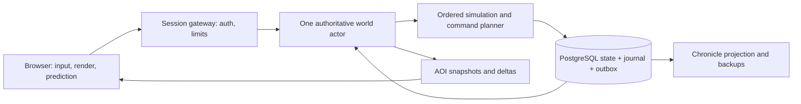

# The Unfinished Earth Game Design Bible

Version 0.1 · 11 September 2026

Bộ tài liệu thiết kế dành cho đội phát triển prototype. Bao gồm 117 mục và 5 phụ lục. Thông số là giả thuyết thiết kế cần kiểm chứng; chưa có implementation hoặc benchmark. Nguồn chỉnh sửa chuẩn là năm chương trong thư mục docs.

[Chỉ mục và các chương nguồn](../docs/README.md)

# Vision and Player Systems

## 1 Executive Summary

The Unfinished Earth là sandbox co-op PvE trên trình duyệt, đặt người chơi vào một thế giới khoảng 300 năm sau khi nền văn minh cũ sụp đổ. Mỗi người điều khiển một nhân vật, sống bằng khám phá, xây dựng, trao đổi và tổ chức hậu cần. Giá trị khác biệt của game nằm ở việc một hành động nhỏ có thể thay đổi hệ sinh thái, sinh kế của NPC và lịch sử địa phương theo chuỗi nguyên nhân quan sát được.

Đề xuất triển khai đầu tiên là một vùng 512 × 512 m, hai khu định cư NPC và một lưu vực có các nhánh nước. Người chơi sửa một tuyến vận chuyển hoặc thay đổi dòng nước, nhìn thấy nguồn thức ăn biến đổi, rồi chứng kiến cộng đồng phản ứng. Prototype phải lưu được những thay đổi đó qua nhiều phiên, cập nhật khi người chơi vắng mặt và giải thích chúng trong World Chronicle. Nếu chuỗi này chưa tạo được quyết định thú vị, tăng số biome hoặc công thức chế tạo sẽ không giải quyết vấn đề.

**ASSUMPTION A01:** Game dùng thế giới riêng có lời mời, hỗ trợ solo và hướng tới 8 người đồng thời; repository công khai không có nghĩa game là MMO công khai. MVP kiểm thử trải nghiệm 1–4 người trước, sau đó kiểm tra tải 8 người. Chưa có build hoặc kết quả benchmark.

**ASSUMPTION A02:** Một nhóm có một homestead được bảo hộ thường trực. Tài sản cốt lõi không mất vì offline; hạ tầng công cộng vẫn chịu hậu quả. Sản xuất tại nhà tiêu vật tư và tín dụng vận hành có giới hạn. Thế giới vắng toàn bộ người chơi tiến thêm tối đa 72 giờ thực rồi ngủ đông. Thiết kế này giữ hậu quả địa phương mà không buộc người chơi đăng nhập để tránh bị phạt.

**ASSUMPTION A03:** MVP giữ số loại nội dung thấp: 2 kiểu thực vật chức năng, 3 loài động vật, 1 cây trồng, khoảng 24 định nghĩa vật phẩm, 12 công thức và 8 định nghĩa công trình. Các con số là ngân sách khởi đầu; phần 99 quy định tiêu chí phải đạt trước khi mở rộng.

Tài liệu v0.1 là cơ sở cho thiết kế, prototype và quyết định sản xuất. Thông số đề xuất phải được đo hoặc playtest; mục tiêu hiệu năng không phải cam kết đã được chứng minh. Các ví dụ tương lai phân biệt rõ tính năng MVP, mục tiêu 1.0 và phần nghiên cứu sau phát hành.

## 2 High Concept

Người chơi tới một thung lũng nơi rừng đã phủ lên công trình cũ, hai cộng đồng phụ thuộc vào cùng một dòng sông và một cây cầu hỏng làm trao đổi lương thực đình trệ. Không có vai cứu thế được định sẵn. Người chơi có thể dựng nhà, trồng trọt, sửa cầu, buôn bán hoặc rời đi; NPC vẫn phải ăn, tìm việc và quyết định nơi sống.

Một phiên chơi tốt kết thúc bằng thay đổi mà người chơi có thể chỉ ra trên bản đồ: nước tới được ruộng, kho của làng ổn định hơn, đường mòn xuất hiện hoặc một người quen chuyển nghề. Những thay đổi có ý nghĩa được ghi lại để người quay lại sau này hiểu vì sao thế giới có hình dạng hiện tại.

Tên The Unfinished Earth là tên làm việc bằng tiếng Anh. Cụm “unfinished” nói tới quá trình tiếp diễn, không hàm ý game phát hành thiếu tính năng. Tài liệu nội bộ dùng tiếng Việt; tên hệ thống tiếng Anh giữ để đội đa chuyên môn tra cứu cùng một khái niệm.

## 3 Game Vision

Thiết kế ưu tiên hậu quả dễ đọc, có độ trễ và có phương án phản ứng. Một cống tưới giúp ruộng hạ lưu gần nhà nhưng có thể làm giảm nước ở bãi sinh sản của cá. Game phải cho người chơi thấy dấu hiệu trước khi thiệt hại lớn xảy ra, cho phép thay đổi lịch vận hành và công nhận thành quả khi hệ thống ổn định.

“Nothing exists in isolation” là quy tắc về quan hệ nhân quả, không yêu cầu mọi module đọc trạng thái của mọi module khác. Mỗi hệ thống công bố đầu vào, đầu ra và thời điểm cập nhật. Những phản hồi dài đi qua sự kiện hoặc dữ liệu tổng hợp có phiên bản. Một biến động không được gây hàng loạt sụp đổ trong cùng bước mô phỏng chỉ vì thứ tự xử lý.

Ba câu hỏi duyệt tính năng: người chơi có thể nhận biết tác động bằng cách nào; có ít nhất một lựa chọn đối nghịch có lợi ích thật hay không; hệ thống nào dùng kết quả của nó. Chưa trả lời được thì không đưa vào MVP.

## 4 Design Pillars

| Trụ cột | Biểu hiện phải thấy | Điều kiện kiểm chứng |
| --- | --- | --- |
| Living Ecosystem | Nước, cây và quần thể đổi vì điều kiện thật | Can thiệp vào nước tạo khác biệt có thể đo giữa hai nhánh cùng seed |
| Living Civilization | NPC chọn nghề, nơi sống và trao đổi dựa vào nhu cầu | Một tuyến vận chuyển tốt làm giảm thiếu hụt và thay đổi ít nhất một quyết định NPC |
| Persistent World History | Công trình và biến cố để lại hồ sơ có nguyên nhân | Load lại vẫn giữ tác động và liên kết từ sự kiện tới địa điểm |

Xây dựng nối ba trụ cột. Survival tạo giới hạn cho một chuyến đi; combat tạo rủi ro có thể tránh. Tỷ trọng 30/25/20/15/10 trong concept là định hướng chú ý của thiết kế, không phải quota thời gian bắt buộc của người chơi.

## 5 Player Fantasy

Người chơi muốn sống ở một nơi đáng hiểu và đáng chăm sóc. Quyền lực đến từ kiến thức, công cụ, quan hệ và khả năng tổ chức vật chất. Xây một cây cầu quan trọng vì người, thực phẩm và thông tin có thể đi qua đó; game không thưởng giá trị trừu tượng chỉ vì người chơi đặt đủ số khối.

Solo có thể hoàn thành cùng loại mục tiêu với dự án nhỏ hơn và hợp đồng lao động NPC. Co-op giúp chia việc khảo sát, chuyên chở và thương lượng, không tạo cửa khóa cần hai người bấm công tắc cùng lúc. Người chuyên chăm rừng phải có đóng góp rõ ngang người xây nhà.

## 6 Target Audience

Đối tượng chính là nhóm bạn thích chơi sandbox hợp tác, xây căn cứ, khám phá và chứng kiến hệ quả dài hạn. Đối tượng phụ là người chơi solo thích thử nghiệm hệ thống nhưng không muốn quản lý từng NPC như game điều hành thuộc địa. Nhịp phiên tham chiếu 30–90 phút; game vẫn có việc hữu ích trong 5–15 phút.

Giả thuyết nhu cầu chưa được xác nhận bằng nghiên cứu người dùng. Test với ít nhất 5 nhóm có kinh nghiệm khác nhau ở vertical slice. Đo khả năng giải thích nguyên nhân, thời gian đến quyết định đầu tiên, tỷ lệ bỏ dở do vận chuyển lặp lại và mức lo lắng khi chuẩn bị offline; không suy luận thành công chỉ từ thời lượng online cao.

## 7 Platform Strategy

**ASSUMPTION A04:** Desktop browser, chuột/bàn phím và màn hình 1080p là nền tảng đầu tiên. Mobile, touch và console không nằm trong MVP. Camera trực giao trên cảnh 3D low-poly giúp xoay 90° mà không cần vẽ bốn bộ sprite cho mọi tổ hợp công trình. Lựa chọn Three.js/WebGL2 là đề xuất kỹ thuật cần spike ở 89; hỗ trợ thiết bị được chốt theo kiểm thử thực tế.

Client tải phần cần nhìn; máy chủ nắm trạng thái thế giới. Mất tab, trình duyệt tiết kiệm pin hoặc máy khách bị chỉnh sửa không được làm dừng/điều khiển lịch sử của server. Có màn hình kiểm tra khả năng đồ họa, giảm bóng/chi tiết và giải thích kết nối trước khi vào thế giới.

**ASSUMPTION A05:** Chưa chốt mô hình doanh thu. Không thiết kế bán tốc độ mô phỏng, vật tư hoặc bảo hộ offline. Chi phí hosting phải được đo trong prototype trước khi quyết định tự host, thuê world hoặc gói dịch vụ; dự toán sản xuất ở 99–108 chưa bao gồm lời hứa vận hành lâu dài.

## 8 Core Gameplay Loop

```text
Quan sát một thay đổi
  -> Thu thập bằng chứng từ địa hình, NPC và bản đồ
  -> Chọn can thiệp cùng chi phí và tác động dự kiến
  -> Chuẩn bị vật tư, công cụ và tuyến hậu cần
  -> Trực tiếp thực hiện hoặc thuê NPC theo hợp đồng
  -> Thế giới cập nhật theo các bước mô phỏng
  -> Nhìn hậu quả, đọc nguyên nhân và sửa phương án
  -> Lưu dấu vào địa điểm, quan hệ và Chronicle
```

Vòng đầu tiên: thấy ruộng khô, hỏi người trông ruộng, đo mực nước, mang gỗ tới sửa cống, chọn mở vừa thay vì mở hết, rồi quay lại xem ruộng và bờ sông. Nhiệm vụ giới thiệu hướng mắt người chơi vào các dấu hiệu; sau đó hệ thống sinh yêu cầu từ trạng thái thật, có thể tự kết thúc nếu NPC khác giải quyết vấn đề.

Không yêu cầu phải làm đúng chuỗi trên ở mọi phiên. Người chơi có thể thu thập vật tư cho dự án chung hoặc đi khảo sát; các hoạt động đó vẫn phải kết nối được với một mục đích trong thế giới.

## 9 Short / Mid / Long-Term Gameplay Loop

| Khoảng thời gian chơi | Kết quả hữu hình | Giới hạn nhịp thiết kế |
| --- | --- | --- |
| 5 phút | Khảo sát một đoạn sông, giao một kiện hàng, đặt một bản thiết kế | Không bắt mở toàn bộ bảng quản trị |
| 1 giờ | Một chuyến khám phá và một can thiệp nhỏ có phản hồi | Đi bộ rỗng dưới 25% phiên ở test |
| 10 giờ | Một tuyến xe kéo, dự trữ ổn định và quan hệ với NPC | Tự động hóa việc lặp lại trước khi mở quy mô mới |
| 100 giờ | Thay đổi một phần lưu vực và liên kết các cộng đồng | Mở dự án tự chọn, cho phép giai đoạn ổn định |
| 1000 giờ | Nhiều lớp công trình và lịch sử xấp xỉ 16,67 năm nếu mô phỏng liên tục | Là viễn cảnh 1.0, không là lượng nội dung cam kết của MVP |

**ASSUMPTION A06:** 1 ngày game = 30 phút thực; 1 năm = 120 ngày game; 1 mùa = 30 ngày = 15 giờ thực. Vì vậy 100 giờ mô phỏng tương đương 200 ngày, không phải nhiều thế kỷ. Tuổi thế giới dùng thời gian đã mô phỏng; số giờ chơi riêng của một người không xác định được tuổi world có co-op/offline. Lịch sử 300 năm trước game tạo bằng bước macro. Không đổi tốc độ lịch âm thầm để ép xuất hiện thế hệ mới.

## 10 Camera & Controls

**Purpose:** Giữ cảm giác sống qua một nhân vật và cho phép đọc địa hình. **Player Experience:** Theo chân nhân vật khi di chuyển, lùi camera để bố trí nhà và xem tuyến đường.

**Core Rules:** WASD di chuyển theo màn hình; chuột trỏ mục tiêu; E tương tác; Tab inventory; B xây; M map; J journal; Q/R xoay camera 90° ngoài menu; con lăn zoom. Phím có thể remap. Đổi hướng camera giữ nguyên vị trí con trỏ thế giới khi khả thi và không đổi hướng lệnh đang giữ giữa frame. **Inputs:** Bàn phím, con trỏ, trạng thái focus và vị trí nhân vật.

**Outputs:** Ý định di chuyển/tương tác và góc nhìn cục bộ. **Interactions With Other Systems:** Camera dùng che khuất mái, preview xây dựng và quyền khám phá; zoom không mở thông tin chưa biết.

**Player Actions:** Đi, chạy, quan sát, xoay, đánh dấu và hủy hành động. **NPC Actions:** Không nhận lệnh trực tiếp từ click lên bản đồ; tương tác đi qua hội thoại/hợp đồng.

**Simulation Logic:** Input gửi cho server theo sequence; client dự đoán di chuyển, server xác nhận va chạm. Camera hoàn toàn client. **Offline Behavior:** Mất focus ngừng sinh input; không giả định tab nền vẫn chạy timer.

**Failure States:** Kẹt sau mái, chọn sai tầng hoặc thao tác kéo quá xa. **Emergent Outcomes:** Đọc dòng nước và giao thông ngay trên cảnh giúp người chơi tự phát hiện vấn đề.

**UI Presentation:** Outline đối tượng, tooltip thao tác, phím hủy luôn rõ. Mái mờ khi che nhân vật, mode xây giữ một tầng trong MVP. **Performance Considerations:** Giới hạn khoảng zoom; xa chuyển mesh/nhãn tổng hợp, không tải tất cả chi tiết của settlement.

**Edge Cases:** Chat focus vô hiệu hóa WASD; Esc đóng panel trước khi mở menu; thay phím không làm mất phím hủy. **Future Expansion:** Gamepad và nhiều tầng sau khi giải quyết chọn tầng, không chỉ thêm nút.

## 11 Character System

**Purpose:** Nhân vật là điểm tiếp xúc với thế giới. **Player Experience:** Mang giới hạn cơ thể vừa đủ để chuẩn bị chuyến đi, có năng lực riêng mà không bị khóa nghề.

**Core Rules:** MVP có stamina 0–100, tải mang, tình trạng sống/đang gục và bộ kỹ năng hoạt động. Ngoại hình không tạo buff. Mỗi tài khoản chỉ có một nhân vật hoạt động trong world. **Inputs:** Ý định người chơi, vật phẩm mặc, tải, hiệu ứng môi trường và trạng thái injury.

**Outputs:** Tốc độ di chuyển, khả năng dùng công cụ, nhu cầu nghỉ và các hành động có chứng từ. **Interactions With Other Systems:** Crafting kiểm công cụ và kiến thức; logistics kiểm tải; NPC đánh giá hành vi và quan hệ.

**Player Actions:** Chọn tên, diện mạo, bộ đồ nghề khởi đầu rồi học thêm qua làm việc. **NPC Actions:** Công nhận tư cách thành viên/hợp đồng, hướng dẫn sử dụng trạm hoặc hỗ trợ cứu hộ.

**Simulation Logic:** Đi bộ 3 m/s trên đường phẳng; chạy 4,5 m/s tiêu 10 stamina/giây, hồi 8 stamina/giây sau 2 giây không chạy. Đây là điểm bắt đầu playtest. Server tính tải và stamina; kỹ năng không tăng chỉ nhờ giữ nút ở trạng thái không sinh kết quả. **Offline Behavior:** Không tiêu đói, khát, stamina hoặc tuổi sinh lý bắt buộc khi ngắt kết nối an toàn.

**Failure States:** Quá tải, kiệt sức hoặc gục. **Emergent Outcomes:** Vai trò của nhóm hình thành từ công cụ và thói quen, có thể đổi mà không cần tạo nhân vật lại.

**UI Presentation:** Chỉ hiện stamina rõ khi dùng; mục hồ sơ ghi kinh nghiệm và quyền sử dụng trạm. **Performance Considerations:** Tối đa 8 player actors; không gửi mọi thống kê mỗi frame.

**Edge Cases:** Hai tab cùng tài khoản chỉ một phiên được quyền phát lệnh; phiên cũ thành quan sát rồi ngắt. **Future Expansion:** Ngoại hình theo tuổi tùy chọn, thói quen nghề và di sản cá nhân; không buộc người chơi chết già.

Vật phẩm khởi đầu dùng ngân sách onboarding cố định trong seed, tối đa tám suất cho một world. Mỗi lần cấp lưu receipt theo account/world; xóa nhân vật, cứu hộ hoặc reconnect không cấp lại. Khi đã dùng hết ngân sách, thành viên mới dùng đồ do nhóm chuyển giao hoặc mượn công cụ từ kho cứu hộ ở mục 13. Đổi tài khoản không tạo thêm vật tư ngoài tổng ngân sách. Công cụ mượn không thể bán, tháo hay dùng làm nguyên liệu; trả về kho khi kết thúc quyền mượn.

## 12 Player Progression

**Purpose:** Mở rộng loại vấn đề có thể giải quyết. **Player Experience:** Có bản vẽ trước khi có máy móc để dùng nó; tìm một chuyên gia hoặc sửa đường có thể quan trọng hơn săn thêm vật liệu.

**Core Rules:** Công nghệ yêu cầu knowledge record, dụng cụ, trạm, nguyên liệu và quyền truy cập; không yêu cầu cấp nhân vật. Kỹ năng thực hành chỉ giảm tối đa 20% thời gian công việc, không tăng vật chất tạo ra từ cùng đầu vào. **Inputs:** Việc hoàn tất có giá trị, tài liệu, cố vấn và khám phá.

**Outputs:** Quyền thử công thức và tốc độ thao tác. **Interactions With Other Systems:** Knowledge 71–74 lưu nguồn tri thức; nghề NPC cung cấp lao động; hạ tầng quyết định khả năng sản xuất thật.

**Player Actions:** Quan sát, sao chép, thực hành, thử nghiệm, thuê chuyên gia. **NPC Actions:** Dạy trong thời gian hợp đồng hoặc từ chối nếu người chơi chưa có quan hệ/quyền vào trạm.

**Simulation Logic:** Ba mức thực hành Familiar/Practiced/Proficient đạt bằng công việc hợp lệ đa dạng; thời gian giảm 0/10/20%. Nhật ký bài học lưu ID hành động để chống gửi lặp. **Offline Behavior:** Chỉ công trình nghiên cứu có đủ nhân công và vật tư hoạt động; nhân vật vắng không tự học kỹ năng cơ thể.

**Failure States:** Biết công thức nhưng thiếu trạm hoặc kiến thức nằm ở thư viện đã mất. **Emergent Outcomes:** Nhóm đầu tư vào trường học/bản sao thay vì ôm một bộ blueprint duy nhất.

**UI Presentation:** Hiện đúng điều kiện còn thiếu và cách tìm, không có cây khóa với hàng chục icon mờ. **Performance Considerations:** Cập nhật khi event hoàn tất; không tick mọi skill.

**Edge Cases:** Mượn blueprint không tự chuyển quyền sở hữu; tri thức đã đọc còn trong nhật ký nhưng không thay giấy phép dùng trạm. **Future Expansion:** Nghiên cứu nhiều cộng đồng, chuyên ngành giao nhau; hoãn cây công nghệ lớn.

## 13 Death & Legacy

**Purpose:** Giữ rủi ro có ý nghĩa mà không xóa công sức xây world. **Player Experience:** Bị gục là lúc cần cứu, chuẩn bị tốt giảm tổn thất; cái chết vĩnh viễn là lựa chọn luật world riêng sau MVP.

**Core Rules:** Mặc định Able → Downed → Rescued → Recovering → Able. Downed kéo dài 60 giây đủ thời gian gọi hỗ trợ; solo có cứu hộ tự động. Phí cứu hộ tối đa 10 credit, trừ tối đa 25% tiền đang mang; không đủ thì ghi nhận cứu trợ không nợ lãi. Trang bị giữ, hàng hóa đang mang rơi thành container cứu hộ thu hồi trong 24 giờ thực. Cứu hộ chỉ phục hồi trạng thái nhân vật, không cấp lại bộ vật phẩm khởi đầu. Khi cần tránh bế tắc, người chơi mượn công cụ gắn quyền sử dụng từ kho cứu hộ hữu hạn; công cụ mượn không thể giao dịch và mỗi lần cấp phải ghi allocation. **Inputs:** Chấn thương, hỗ trợ và disconnect.

**Outputs:** Thời gian hồi phục, vị trí cứu hộ và container rơi có ID. **Interactions With Other Systems:** Hợp đồng vận tải có thể chậm, NPC ghi nhớ cứu giúp; Chronicle chỉ ghi cái chết khi xảy ra thật.

**Player Actions:** Cứu đồng đội, gọi cứu hộ, quay lại lấy hàng; sau MVP có thể chủ động kết thúc đời nhân vật. **NPC Actions:** Đội cứu hộ đưa về điểm an toàn đã biết, không tạo bản sao cơ thể ở vùng khác.

**Simulation Logic:** Server giải quyết một kết quả cuối cùng theo casualtyId; nhân vật/corpse không cùng sở hữu inventory. MVP không có trạng thái chết vĩnh viễn. Legacy 1.0 tùy chọn giữ đất, nhóm và hồ sơ tri thức đã gửi thư viện; người kế tục có kỹ năng thực hành mới. **Offline Behavior:** Disconnect ngoài nhà giữ cơ thể tối đa 60 giây, sau đó cứu hộ theo cùng phí; reconnect nhận trạng thái server.

**Failure States:** Hàng cứu hộ không thu hồi sẽ chuyển kho cứu trợ địa phương, mất quyền đòi sau hạn; tài sản trong nhà không liên quan. **Emergent Outcomes:** Một thất bại trở thành chuyến cứu người/hàng, không buộc cày lại căn cứ.

**UI Presentation:** Cảnh báo đang gục, đếm thời gian hỗ trợ, vị trí và hạn container. **Performance Considerations:** Một container có TTL thay vì vật phẩm rơi riêng rẽ.

**Edge Cases:** Disconnect không xóa injury hay đưa miễn phí đến nơi mong muốn; cứu hộ chọn điểm gần nhất hợp lệ. Với container ở nước sâu, đặt điểm tiếp cận bờ gần nhất, giữ ID. **Future Expansion:** Chế độ legacy death tự chọn, mộ và di chúc; không thay luật giữa phiên mà thiếu đồng thuận.

## 14 Survival System

**Purpose:** Tạo quyết định chuẩn bị, trú ẩn và thời điểm trở về. **Player Experience:** Mang một ít thức ăn và nước cho cả chuyến đi, nhận cảnh báo sớm thay vì bị ép ăn vài phút một lần.

**Core Rules:** Một ration 0,5 kg đáp ứng 90 phút thực hoạt động; 1 lít nước đáp ứng 60 phút, trời nóng nhân nhu cầu tối đa 1,5. Đói/khát trước hết giảm hồi stamina, không giết trực tiếp trong MVP. Nhu cầu sinh hoạt player dùng phút hoạt động để bảo vệ nhịp chơi; NPC dùng khẩu phần/ngày game trong mô hình dân số, không là mô hình dinh dưỡng hiện thực. **Inputs:** Thời gian hoạt động hợp lệ, hoạt động nặng, môi trường và vật tư.

**Outputs:** Hiệu ứng stamina, nhu cầu trú và tiêu thụ vật phẩm. **Interactions With Other Systems:** Nước bẩn tăng exposure disease; mái và quần áo giảm tiếp xúc; nguồn thực phẩm nối với kinh tế.

**Player Actions:** Ăn, đổ bình, đun/lọc, nghỉ tại nơi trú. **NPC Actions:** Tiêu khẩu phần từ kho theo ngày, chọn việc và di cư khi thiếu kéo dài; chi tiết ở phần 47.

**Simulation Logic:** Cảnh báo ở mức còn 25%; đến 0 giảm hồi stamina 50% tối đa. Nghỉ có mái 30 giây phục hồi exhaustion, không tua giờ toàn server. Player không cần ngủ liên tục qua một đêm game (30 phút thực/ngày game). **Offline Behavior:** Player dừng nhu cầu khi đã shelter/rescue; NPC ngoài homestead vẫn chịu mô hình thiếu hụt, NPC trú homestead ngủ đông theo phần 77.

**Failure States:** Chuyến đi kéo dài, nước không an toàn, gánh quá nặng. **Emergent Outcomes:** Trạm nước và nơi trú ven đường thay đổi tuyến di chuyển.

**UI Presentation:** Bình nước/đồ ăn chỉ cảnh báo khi cần; inspect nguồn nước ghi tình trạng và độ tin cậy. **Performance Considerations:** Nhu cầu mỗi giây hoặc khi ăn, không theo 20 Hz movement.

**Edge Cases:** AFK không nạp credit sản xuất; tạm không tiêu đói không được coi là active work. Thức ăn trong nhà có thể thiu theo lịch nếu không bảo quản, nhưng UI nêu trước và không tự tiêu vật liệu nhà để bù. **Future Expansion:** Nhiệt độ, giấc ngủ tùy chọn và bệnh theo vùng ở alpha; mỗi loại phải tạo phương án xử lý riêng.

## 15 Combat System

**Purpose:** Tạo rủi ro địa phương có thể tránh hoặc giải quyết bằng chuẩn bị. **Player Experience:** Một con thú bảo vệ lãnh thổ khiến người chơi đổi đường, xua đuổi hoặc dùng vũ khí, không thành điểm farm.

**Core Rules:** MVP một vũ khí cận chiến, một kiểu né ngắn và hành vi bỏ chạy; không súng, suppression hoặc chiến thuật đội hình. Không tăng máu địch theo cấp người chơi. Đánh có windup 0,45 giây, recovery 0,65 giây, tiêu 15 stamina; hit test từ server. **Inputs:** Ý định, khoảng cách, line of sight, condition vũ khí và stamina.

**Outputs:** Injury, tác động lên quần thể và sự kiện thù địch. **Interactions With Other Systems:** Săn trừ population thật; hành hung NPC tác động quan hệ, quyền vào làng và thương mại.

**Player Actions:** Tránh, lùi, đe dọa, đánh, cứu người. **NPC Actions:** Đánh giá sợ hãi, bảo vệ người quen hoặc chạy về nơi trú; không truy đuổi vô hạn.

**Simulation Logic:** Có thể chọn attack nếu target còn trong tầm ở tick giải quyết; mỗi attackId gây hit tối đa một lần/target. Thú thoát khi vượt bán kính lãnh thổ 60 m hoặc mất dấu 10 giây. **Offline Behavior:** Combat không chạy trong home được bảo hộ; disconnect ngoài nhà theo phần 13, quần thể còn lại chuyển macro sau khi kết thúc encounter.

**Failure States:** Bị gục, công cụ hỏng, gây thù hoặc săn quá mức. **Emergent Outcomes:** Tuyến xe tránh vùng sinh sản hoặc đội nhóm dùng tiếng động để giảm đối đầu.

**UI Presentation:** Windup rõ qua chuyển động và âm thanh; không cần đọc sát thương nổi. **Performance Considerations:** Tối đa số actor hoạt động chung cho toàn world; hành vi xa dùng ý định cấp vùng.

**Edge Cases:** Friendly fire off ở mặc định; tấn công không phá công trình nhóm. Server từ chối hit qua tường và sequence quá cũ. **Future Expansion:** Súng ít đạn, cover và điều kiện thời tiết ở 1.0 sau test độ trễ; mục tiêu combat vẫn phụ.

## 16 Injury System

**Purpose:** Chuyển va chạm thành nhu cầu chăm sóc có thể đọc. **Player Experience:** Băng bó và nghỉ có vai trò, không phải chẩn đoán y khoa phức tạp.

**Core Rules:** MVP Bruised, Bleeding, Downed; chảy máu gây giảm condition theo giây cho tới khi băng hoặc gục, thời gian gục ở phần 13. Không mô phỏng từng cơ quan. **Inputs:** Damage event, exposure và vật tư cứu thương.

**Outputs:** Hiệu ứng tốc độ, hồi phục và casualty event. **Interactions With Other Systems:** Vận tải cung cấp băng, NPC y tế hỗ trợ, combat tạo nguồn injury.

**Player Actions:** Băng bó trong 5 giây có thể bị gián đoạn; giúp người khác khi đứng gần. **NPC Actions:** Nhận hợp đồng cấp cứu, ưu tiên người gục trước người bầm.

**Simulation Logic:** Một effect loại Bleeding có intensity cộng dồn tối đa 3, không tạo vô hạn effect độc lập. Băng tiêu 1 item khi hoàn tất, không ở đầu animation. **Offline Behavior:** Rescue chặn tiến triển gây chết của player; bên trong shelter hiệu ứng được xử lý rồi ngủ đông.

**Failure States:** Thiếu băng hoặc bị gián đoạn khi đang nguy hiểm. **Emergent Outcomes:** Trạm cứu hộ bên đường giúp mở tuyến mới.

**UI Presentation:** Icon + chữ + chuyển động, không chỉ màu đỏ. **Performance Considerations:** Event/effect list ngắn, update 1 Hz.

**Edge Cases:** Hai người cứu cùng lúc chỉ một transaction tiêu băng; người còn lại nhận kết quả đã cứu. **Future Expansion:** Fracture/infection/pain ở alpha nếu phân biệt rõ cách xử lý; hệ thống hoàn toàn giả tưởng phục vụ gameplay.

## 17 Inventory System

**Purpose:** Làm khoảng cách và hậu cần có giá trị. **Player Experience:** Mang đủ đồ dùng, cần xe kéo cho hàng xây dựng.

**Core Rules:** Túi 30 kg tải chuẩn, tối đa 45 kg; trên 30 kg tốc độ giảm tuyến tính tới 60% ở 45 kg. Không nhặt nếu vượt 45 kg. Vật có tag Bulky không vào túi dù nhẹ. Đồ mặc tính vào khối lượng. **Inputs:** Item stacks, ownership, container revision và yêu cầu chuyển.

**Outputs:** Tải, trạng thái slot chức năng và transfer receipt. **Interactions With Other Systems:** Craft reservation, xe, kho, loot và quyền nhóm dùng cùng ledger.

**Player Actions:** Chuyển số lượng, chia stack, đánh dấu giữ riêng, gửi kho. **NPC Actions:** Lấy đúng allocation theo hợp đồng, không tự mượn công cụ cá nhân.

**Simulation Logic:** Tính mass từ định nghĩa có version; chuyển nguyên tử trừ nguồn/cộng đích và kiểm capacity sau reservation. Giới hạn 80 stacks/container, stack vật liệu 50 đơn vị; đồ cá thể có condition riêng. **Offline Behavior:** Kho giữ ownership; perishables xuống chất lượng theo batch, không tự biến thành hàng mới.

**Failure States:** Kho đầy, mất quyền, hàng đang được đặt trước. **Emergent Outcomes:** Kho trung chuyển trở thành nơi trao đổi và mục tiêu sửa đường.

**UI Presentation:** Danh sách/search/filter, hai panel nguồn–đích, thanh kg; không grid-tetris. **Performance Considerations:** Gửi delta theo container đang mở; không sync inventory mọi NPC cho mọi client.

**Edge Cases:** Hai người lấy item cuối, reconnect gửi lại và đổi capacity khi đang craft đều được kiểm soát bằng version/transactionId. **Future Expansion:** Bảo quản lạnh, container kín và hàng nguy hiểm sau MVP.

## 18 Item System

**Purpose:** Tạo giá trị từ công dụng, nguồn gốc và độ tin cậy. **Player Experience:** Một dụng cụ cũ đã sửa có thể hữu ích hơn đồ mới thiếu phụ tùng.

**Core Rules:** ItemDef xác định mass, volumeClass, tags và chức năng; ItemInstance giữ condition 0–100, provenance và mods khi cần. Không rarity màu. Vật tư đồng nhất gộp theo batch; kỷ vật giữ ID. **Inputs:** Recipe, salvage, resource harvest và repair.

**Outputs:** Dụng cụ, vật liệu, phế liệu và thông tin nguồn. **Interactions With Other Systems:** Craft, trade, pollution, Chronicle và knowledge dùng tag/ID.

**Player Actions:** Kiểm tra, dùng, bảo dưỡng, tháo và giữ làm kỷ vật. **NPC Actions:** Định giá theo công dụng/condition; bảo tàng tương lai mới trả thêm cho lịch sử đã chứng thực.

**Simulation Logic:** Condition giảm theo số lần dùng thật; về 0 thì unusable, không xóa item. Repair tiêu phụ tùng và chỉ phục hồi nếu vượt ngưỡng hiệu quả, không tạo kim loại ròng. **Offline Behavior:** Đồ không tiêu hao chỉ vì người sở hữu vắng; food batch có expiry riêng.

**Failure States:** Đồ hỏng, giả thông tin hoặc không tương thích trạm. **Emergent Outcomes:** Một máy tồn tại qua nhiều chủ có lịch sử phục hồi.

**UI Presentation:** Công dụng, condition, yêu cầu phụ tùng, provenance ngắn; chi tiết kỹ thuật trong inspect. **Performance Considerations:** Chỉ một phần item cần instance; phần lớn dùng stack/batch.

**Edge Cases:** Đổi bản định nghĩa không làm âm khối lượng; save migration giữ defVersion cũ tới khi chuyển hợp lệ. **Future Expansion:** Manufacturer, mods và bảo tàng; không triển khai hàng trăm biến thể ở MVP.

## 19 Crafting System

**Purpose:** Biến vật tư và lao động thành công cụ tác động thế giới. **Player Experience:** Bắt đầu làm tay, tiến tới trạm và sản xuất theo yêu cầu; không phải bấm hàng nghìn lần.

**Core Rules:** Recipe cần knowledge, station, inputs, workSeconds và output capacity. Handcraft cho nhu yếu; workstation cho công cụ; industry sau MVP. Hàng đợi tối đa 10 job/trạm. **Inputs:** Vật tư có đặt trước, người làm, nguồn điện nếu cần và quyền sử dụng.

**Outputs:** Sản phẩm, phụ phẩm, heat/pollution khi recipe khai báo. **Interactions With Other Systems:** Logistics đặt vật tư, workforce phân công, energy giới hạn throughput, ecology nhận waste.

**Player Actions:** Tạo job, chọn số lượng/đích đến, hủy, làm việc. **NPC Actions:** Nhận job đúng nghề và lịch; dừng khi hết lương/đồ ăn/quyền.

**Simulation Logic:** Planned → Reserved → Working → Completed hoặc Paused/Cancelled. Reserve giữ item ở kho với ownerJob; Completed trừ vật tư, cộng output và ghi event trong một transaction. Trong MVP, hủy trước Completed chỉ giải phóng reservation đúng một lần; chưa trừ vật tư và chưa có output để thu hồi. Recipe chia nhiều giai đoạn là mở rộng sau MVP; khi đó mỗi giai đoạn phải ghi riêng vật tư đã tiêu và chỉ hoàn lại phần chưa dùng. **Offline Behavior:** Job tại home cần credit phần 77; hết điều kiện thì Paused, không catch-up nhân output theo elapsed đơn thuần.

**Failure States:** Thiếu nguyên liệu, full kho, trạm hỏng hoặc mất điện. **Emergent Outcomes:** Sửa cầu mở nguồn vật liệu giúp xưởng vận hành, công việc mới hút NPC.

**UI Presentation:** Lý do tạm dừng cụ thể, ước tính thời gian và khối lượng vận chuyển. **Performance Considerations:** Chỉ job đang chạy được lịch hóa; trạm dormant không tick.

**Edge Cases:** Hai recipe tranh input, disconnect ở tick hoàn tất, kho output bị thu quyền; mọi trường hợp dùng reservation và idempotency. **Future Expansion:** Orders theo mức tồn kho, belt/assembly sau khi xe và kho chứng minh vòng cốt lõi.

### Bộ dữ liệu khởi đầu

Các công thức dưới đây minh họa đơn vị và ledger, không phải toàn bộ danh mục 24 item. Thời gian là giây thực làm việc; lao động NPC dùng cùng workSeconds, dân số và mùa dùng ngày game.

| Công thức | Đầu vào | Đầu ra và phụ phẩm | Thời gian |
| --- | --- | --- | --- |
| Sẻ gỗ | 10 kg gỗ | 8 kg ván + 2 kg mùn | 60 giây tại bàn |
| Khẩu phần | 2 kg hạt + 1 L nước sạch | 4 ration × 0,5 kg + 1 L nước thải/thoát hơi | 45 giây tại bếp |
| Băng | 0,2 kg vải | 2 băng × 0,1 kg | 20 giây làm tay |
| Thu hồi kim loại | 5 kg phế liệu | 3 kg kim loại + 2 kg xỉ | 120 giây tại trạm |
| Bộ sửa cầu | 8 kg ván + 2 kg kim loại | 1 bộ 10 kg Bulky | 90 giây tại bàn |

Nước 1 L quy đổi 1 kg cho hậu cần; recipe khai báo đủ đầu ra để giữ cân bằng khối lượng. Số food 0,5 kg là đơn vị game, không cam kết calorie hay quy trình thực.

## 20 Building System

**Purpose:** Cho người chơi tạo tài sản, tuyến đi và can thiệp môi trường. **Player Experience:** Đặt preview, nhìn phần vật tư còn thiếu, tự xây hoặc để nhóm vận chuyển tới.

**Core Rules:** Grid 1 m, các phần kết cấu snap; đồ nhỏ đặt tự do trong footprint hợp lệ. MVP một tầng, không mô phỏng phá hủy vật lý. Tám def khởi đầu: nền, tường, mái, kho, bàn, ruộng, cầu, cống. Lửa trại là deployable item; house ghép từ 3 def kết cấu. **Inputs:** Blueprint, quyền đất, mặt bằng, vật liệu và lao động.

**Outputs:** Công trình có ID/condition, thay đổi nav và dịch vụ hạ tầng. **Interactions With Other Systems:** Nền có chiếm đất, ruộng rút nước, cầu nối đường, mái giảm exposure, cống sửa đồ thị nước.

**Player Actions:** Survey, đặt, cung ứng, xây, sửa, tháo. **NPC Actions:** Nhận hợp đồng công trình, chọn dùng đường/trạm sau hoàn thành.

**Simulation Logic:** Preview → Planned → Supplied → Building → Operational → Damaged → Ruin. Footprint được reserve ngay khi Plan được server nhận; collider đầy đủ chỉ khi kết cấu đủ điều kiện. Tháo tạo batch phế liệu bằng 70% vật liệu đã đầu tư, không hoàn 100% để farm repair. **Offline Behavior:** Homestead bảo hộ core condition; ngoài đất bảo hộ có maintenance daily và cảnh báo trước. Cầu public hỏng không xóa nhà quanh đó.

**Failure States:** Mặt bằng chặn lối, thiếu vật tư, support không hợp lệ, utility mất. **Emergent Outcomes:** Người khác và NPC đi qua một công trình, làm trung tâm trao đổi phát triển.

**UI Presentation:** Trước đặt hiện ảnh hưởng diện tích/nước/lối đi; trước tháo cảnh báo dịch vụ và quyền người khác. **Performance Considerations:** Nav invalidations theo chunk, mesh instance các def lặp; giới hạn MVP 2.000 placed parts/world để benchmark.

**Edge Cases:** Không được bịt đường public duy nhất tới home hoặc cửa vào vùng. Hai người đặt trùng ô, nhân vật đứng trong preview và tháo kho khi còn đồ phải trả lỗi rõ. **Future Expansion:** Tầng hai, stairs, thẩm mỹ tự do; kết cấu support graph đơn giản thay rigidbody.

## 21 Terraforming

**Purpose:** Cho sửa địa hình cục bộ với chi phí hữu hình. **Player Experience:** Đào rãnh và san nền giúp dự án hoạt động nhưng phải xử lý đất dư.

**Core Rules:** MVP chỉ rãnh irrigation định sẵn và nền san trong footprint; độ cao đất đổi tối đa ±0,5 m mỗi ô, không đào hang. Sông chính và vị trí claim không được đổi để chặn shared flow. **Inputs:** Height cell, soil class, quyền, cuốc và đất thải.

**Outputs:** Surface patch, spoil stock, nav dirty và water edge update. **Interactions With Other Systems:** Water phần 34 đọc độ dốc/cống; vegetation mất diện tích; building kiểm độ nền.

**Player Actions:** Xem mặt cắt, chọn độ sâu, đào/bồi; public hydrology edit cần quyền Steward phần 75. **NPC Actions:** Làm theo hợp đồng, vận chuyển đất dư đến điểm tập kết.

**Simulation Logic:** V thay đổi = diện tích ô × độ cao thay đổi; 4 m² × 0,25 m = 1 m³ đất. Soil cargo đo theo m³ và khối lượng giả định 1.500 kg/m³; cần xe để dọn lượng lớn. **Offline Behavior:** Công việc dừng nếu kho container đất dư đầy; terrain patch đã commit vẫn còn.

**Failure States:** Hết diện tích tập kết, tạo ô không thể đi hoặc rãnh không nối. **Emergent Outcomes:** Cải đất ở một nơi để lại bãi đất cần trồng phủ ở nơi khác.

**UI Presentation:** Hiện m³ đất cần chuyển và nhánh nước ảnh hưởng trước xác nhận. **Performance Considerations:** Cập nhật vùng dirty đệm theo batch; không rebuild toàn map mỗi nhát cuốc.

**Edge Cases:** Không đào dưới chân NPC hoặc công trình đang ở; đổ đất vào sông không làm biến mất khối lượng. **Future Expansion:** Mỏ sâu, ao và đê ngoài MVP; rủi ro sạt lở dùng stability score.

## 22 Infrastructure

**Purpose:** Biến công trình thành mạng dịch vụ. **Player Experience:** Sửa một điểm nghẽn tạo lợi ích cho nhiều người dùng tuyến.

**Core Rules:** Một service graph/node có mức phục vụ, capacity, condition và owner. Cầu đang hỏng không cấp connection; ruộng không coi là được tưới chỉ vì gần cống. **Inputs:** Công trình operational, routes và demand.

**Outputs:** Reachability, capacity và service allocation. **Interactions With Other Systems:** Trade/dân cư tìm tuyến, water chạy mạng riêng; road giảm habitat cục bộ.

**Player Actions:** Khảo sát, đặt ưu tiên bảo dưỡng, ký hợp đồng sửa chữa. **NPC Actions:** Đi đường mở, thuê vận chuyển, tăng trade offer nếu đủ capacity.

**Simulation Logic:** Mỗi network loại khác nhau có ID riêng; road không tự thành điện. Demand đặt trước slot throughput; nodes dirty được tính lại khoảng cách. Trail score tăng theo traversal thật tối đa 10 điểm/ngày/cell, đủ 50 và đất hợp lệ thì hiện trail; đường gravel phải xây. **Offline Behavior:** Traffic macro thật cũng tăng trail; không tăng do đứng AFK.

**Failure States:** Đứt mạng, capacity quá tải, maintenance thiếu. **Emergent Outcomes:** Tuyến mới dịch chuyển cửa hàng và khu ở, vùng cũ có thể vắng.

**UI Presentation:** Overlay dịch vụ bật theo nhu cầu, nút “vì sao không tới được”. **Performance Considerations:** Graph cấp chunk/định cư, chỉ refine route gần player.

**Edge Cases:** Cầu sập đang có xe, chọn giải pháp dừng trước mép hoặc cứu hộ; không dịch xe qua để khớp graph. **Future Expansion:** Cảng, đường sắt, đèn đường, radio; ngân sách mạng định lượng trước.

## 23 Electricity

**Purpose:** Tạo bài toán capacity và ưu tiên dịch vụ. **Player Experience:** Chọn giữa vận hành xưởng nhanh và giữ điện dự trữ cho bơm/lạnh.

**Core Rules:** Sau MVP; mạng điện abstraction, không electrical circuit physics. Node công suất kW, battery energy kWh; ưu tiên cứu hộ/nước uống trước industry, đèn decor cuối. **Inputs:** Generation, loads, wire connectivity, fuel và weather.

**Outputs:** Energy allocation, blackout, fuel/waste ledger. **Interactions With Other Systems:** Water cho phép thủy điện, weather ảnh hưởng solar/wind, craft hiểu năng lượng đã nhận.

**Player Actions:** Nối mạng, đặt priority, đầu tư battery, bảo dưỡng. **NPC Actions:** Chỉ vận hành station đã cấp điện, vận chuyển fuel.

**Simulation Logic:** Với Δt giờ thực, energy = power × Δt; 5 kW × 0,5 giờ = 2,5 kWh. Dùng đồng hồ thực vận hành để recipe và offline credit nhất quán; day/night theo lịch game quy định profile phát. Charge/discharge giới hạn công suất và dung lượng, hiệu suất 0,9 mỗi chiều. **Offline Behavior:** Chỉ tích điện khi máy vận hành trong hạn credit; khi dormant không phát miễn phí vào lưới public.

**Failure States:** Thiếu điện, cạn fuel, hỏng mạng. **Emergent Outcomes:** Cộng đồng giữ rừng để chống bồi lắng cho thủy điện, hoặc đổi lịch xưởng theo nắng.

**UI Presentation:** “Đủ điện/thấp/quá tải”, nguyên nhân và công việc bị dừng; chi tiết kW/kWh optional. **Performance Considerations:** Giải phân phối theo service priority mỗi giây khi mạng dirty, không theo mỗi dây/frame.

**Edge Cases:** Mạng vòng không nhân energy, hai battery đấu nối không tự nạp vô hạn; ngắt giữa chu kỳ chỉ tính energy đã nhận. **Future Expansion:** Grid liên vùng và máy phát hạt nhân không cam kết 1.0; thủy điện lớn chỉ sau validation nước.

## 24 Logistics

**Purpose:** Chuyển vật chất và lao động thành throughput có thể dự đoán. **Player Experience:** Mang bằng tay ở đầu, đặt hợp đồng tuyến khi việc lặp lại; nhìn thấy vì sao kho thiếu.

**Core Rules:** Shipment luôn có source, destination, cargo reservation, vehicle, carrier và route version. MVP xe kéo 120 kg, kho 500 kg; capacity không chỉ là icon. Nhận đơn khi đích có slot nhận. **Inputs:** Order, tồn kho nguồn, sức chở, người vận chuyển và lối đi.

**Outputs:** Cargo move, ETA, phí lao động và route wear. **Interactions With Other Systems:** Trade đặt shipment; craft tạm dừng khi hàng chưa tới; survival tiêu đồ ăn người kéo.

**Player Actions:** Kéo xe, tạo tuyến, chọn mức tồn kho mục tiêu và ưu tiên đơn. **NPC Actions:** Nhận việc, đến bốc hàng, đi qua tuyến, trả hàng; đóng vai world carrier khi xa.

**Simulation Logic:** Requested → Reserved → Loaded → InTransit → Delivered; Blocked khi tuyến hỏng, Cancelled chỉ trả hàng theo trạng thái. Throughput tham chiếu = payload/(thời gian đi + về + bốc dỡ). Với 120 kg, chặng 240 m, vận tốc 2 m/s, 40 giây bốc dỡ mỗi đầu: 120/(120 + 120 + 80) = 0,375 kg/s = 22,5 kg/phút. **Offline Behavior:** Carrier xa đi theo edge ETA, vẫn kiểm cầu và nguy hiểm theo tick; không teleport hàng khi đến ETA trong tuyến đã đứt.

**Failure States:** Cầu hỏng, kho đầy, carrier bệnh, cargo bị đặt trước bởi đơn khác. **Emergent Outcomes:** Tuyến đảm bảo thuốc giữ làng sống được dù làng không sản xuất thuốc.

**UI Presentation:** Mỗi tuyến 3 thông tin: hàng đang ở đâu, nghẽn vì sao, việc khắc phục. **Performance Considerations:** Path cấp graph xa; actor/render entity chỉ vật chất hóa ở vùng nhìn.

**Edge Cases:** Hai người nhìn thấy cùng xe phải chung shipmentId; đứt tuyến ở tick Delivered phải kiểm revision trước commit. Cướp hàng tại kho đích trước claim là truy cập trái phép. **Future Expansion:** Đội xe, trạm trung chuyển, đường sắt; không conveyor belt MVP.

## 25 Transportation

**Purpose:** Làm đầu tư hạ tầng thay đổi khả năng đi lại. **Player Experience:** Tuyến tốt rút ngắn chuyến đi, phương tiện lớn đòi hỏi đường phù hợp.

**Core Rules:** MVP đi bộ và xe kéo; đường phẳng đi bộ 3 m/s, kéo xe đầy 2 m/s, đất khó × 0,6. Xe cần lối rộng 2 m, cầu đủ capacity. Không teleport mặc định; rescue phần 13 là hệ thống thất bại, không là dịch vụ chuyển hàng. **Inputs:** Terrain, road condition, weight và vehicle capability.

**Outputs:** Thời gian, hao mòn và exposure. **Interactions With Other Systems:** Logistics phần 24 sở hữu cargo/state; exploration dùng chuyến đi để thu thập information.

**Player Actions:** Kéo thả xe, đổi tuyến và thiết lập điểm dừng. **NPC Actions:** Chọn đường theo chi phí gồm thời gian + rủi ro + phí đường, không luôn chọn đường ngắn nhất.

**Simulation Logic:** Mỗi edge cost dùng metre/velocity; router thêm phí/risk đã chuẩn hóa theo trọng số personality. Đổi đường khi đường hiện tại bị khóa hoặc phương án mới tốt hơn 20% để tránh dao động. **Offline Behavior:** World carrier đi theo lịch phần 24; xe player đỗ giữ quyền, có nhận job thì mới chạy.

**Failure States:** Quá tải, cầu hẹp, xe đứt bánh và không có tuyến an toàn. **Emergent Outcomes:** Cộng đồng dịch chuyển ra đường lớn, đường mòn bỏ hoang trở thành rừng.

**UI Presentation:** ETA kèm độ tin cậy, cảnh báo tuyến chưa khảo sát và cách xác nhận. **Performance Considerations:** Xe MVP không rigidbody; kinematic actor trên surface.

**Edge Cases:** Player đang kéo disconnect thì xe đỗ điểm hợp lệ cuối, không đi 60 giây vô lệnh. **Future Expansion:** Boat/bicycle ở Alpha, xe tải nhỏ ở 1.0; rail là đại dự án, aircraft ngoài kế hoạch 1.0.

## 26 Exploration

**Purpose:** Tạo kiến thức có ích cho quyết định. **Player Experience:** Khám phá được nguồn nước, hàng phế liệu và cơ hội hợp tác có thể thay đổi kế hoạch của nhóm.

**Core Rules:** Vùng chưa biết không hiển thị trạng thái chính xác; ruin loot stock hữu hạn. Tỷ lệ nội dung đặt trước MVP: 1 ruin, 2 settlement và các điểm quan trắc tạo từ seed. **Inputs:** Đường đi, line of sight, rumor và archives.

**Outputs:** Observation timestamp, POI state và knowledge record. **Interactions With Other Systems:** Map phần 27 lưu độ tươi; quest phần 66 có thể khởi phát nhờ bằng chứng, ruin phần 69 giữ nguồn gốc.

**Player Actions:** Khảo sát, chụp và ghi chú game, đánh dấu, chia sẻ, lấy mẫu và trở lại. **NPC Actions:** Kể rumor có nguồn, đi ra đường và cập nhật tin ở chợ.

**Simulation Logic:** Discovery event ghi duy nhất người khám phá đầu tiên, observation sau cập nhật thời gian; đọc map người khác sao chép information, không spawn loot. **Offline Behavior:** POI tiếp tục thay đổi, hồ sơ khám phá không tự làm mới.

**Failure States:** Bản đồ cũ, chuyến đi thiếu tiếp tế, loot đã được thu hồi. **Emergent Outcomes:** Một POI cũ trở thành trạm NPC, khiến mang hàng trao đổi hữu dụng hơn săn loot.

**UI Presentation:** Dấu hiệu thấy tại chỗ, lời NPC, mặt cắt địa hình và ghi chú đủ đọc. **Performance Considerations:** Discovery theo chunk, không tính visibility cho mọi tile xa.

**Edge Cases:** Co-op khám phá đồng thời lưu nhóm tham gia, không là cuộc thi đánh last-hit. **Future Expansion:** Radio, tháp quan trắc và drone; vệ tinh nằm ngoài 1.0.

## 27 Map & Information System

**Purpose:** Giữ thông tin có nguồn và tuổi, giúp quyết định trong thế giới thay đổi. **Player Experience:** Thấy cây cầu từng hoạt động nhưng lần xác nhận đã lâu; có thể hỏi thương nhân thay vì tự chạy đi.

**Core Rules:** Observation {subjectId, value, observedAt, sourceId, confidence, visibilityScope}; bản đồ không đọc server truth của chủ thể chưa được báo tin. Confidence Confirmed/Reported/Rumor, thông tin trái dấu hiện cả 2 nguồn. **Inputs:** Khám phá phần 26, radio, người đưa tin và member chia sẻ.

**Outputs:** Bản đồ theo tri thức của người/nhóm, cơ hội khảo sát và độ chắc chắn ETA. **Interactions With Other Systems:** Trade phần 64 và quest phần 66 tách “được biết” với “thực tế”; Chronicle phần 79 cũng có quyền xem.

**Player Actions:** Lọc, tạo pin, chia sẻ hoặc thu hồi quyền ghi notes. **NPC Actions:** Mua/bán tin, truyền tin qua mạng dựa trên tuyến thật.

**Simulation Logic:** Độ tươi age = worldNow − observedAt; ví dụ cầu trên 2 ngày game chưa được nhìn lại hiện “chưa xác nhận gần đây”, không tự báo hỏng. Chat ngoài game vẫn dùng được; communication infrastructure tác động tin NPC, tự động cập nhật map và hợp đồng, không cấm bạn nói chuyện. **Offline Behavior:** age cộng theo giờ đã mô phỏng, chặn ở khi ngủ đông.

**Failure States:** Quyết định dựa vào tin cũ hoặc tin nhầm. **Emergent Outcomes:** Người khảo sát có giá trị kinh tế và xã hội mà không cần săn đồ.

**UI Presentation:** “Cầu hoạt động · xác nhận 2 ngày trước · người đưa tin Nara”; overlay tùy chọn chứ không đầy biểu đồ. **Performance Considerations:** Lưu snapshot tri thức cho chủ thể quan trọng; không lưu mọi frame quan sát.

**Edge Cases:** Có tri thức không tự được quyền truy cập trạm xa hoặc nội dung kho; thu hồi quyền nhóm không xóa ký ức đã biết, nhưng ngừng nhận tin mới. **Future Expansion:** Cartography trade, mạng radio có độ trễ và ký lục nguồn gốc bằng chứng.


# World and Ecology

## 28 Procedural World Generation

**Purpose.** Tạo địa hình có quan hệ nhân quả với tài nguyên và lịch sử. **Player Experience.** Người chơi hiểu vì sao làng ở cạnh sông, mỏ ở sườn đá và đường cũ dẫn tới phế tích.

**Core Rules.** MVP dùng một region 512 × 512 m; seed và generatorVersion bất biến trong save. **Inputs.** Seed, bảng khí hậu, ràng buộc địa hình, ngân sách nội dung và lịch sử tiền kỳ 300 năm.

**Outputs.** Heightfield, watershed graph, lớp đất, trữ lượng, quần thể, hai làng và một phế tích có ID. **Interactions With Other Systems.** Lịch sử đặt dấu vết; sinh thái kiểm tra khả năng sinh tồn của trạng thái đầu.

**Player Actions.** Chọn seed hoặc dùng seed đề xuất; xem mức khó trước khi lập world. **NPC Actions.** Chọn nơi định cư theo nước, đất và đường trong bước tiền kỳ, chưa chạy AI từng cá thể.

**Simulation Logic.** Pipeline: địa hình → thoát nước → khí hậu → sinh cảnh → tài nguyên → tiền sử → kiểm định. **Offline Behavior.** Generation chỉ chạy lúc tạo world; reconnect không tạo lại địa hình hoặc loot.

**Failure States.** Seed thiếu lối đi, nước hay chỗ đặt homestead bị loại. **Emergent Outcomes.** Một đường thương mại bỏ hoang có thể trở nên hữu ích khi người chơi sửa cầu, dù không có quest định sẵn.

**UI Presentation.** Preview chỉ hiện đặc điểm khởi đầu, không tiết lộ mỏ ẩn. **Performance Considerations.** Giới hạn 20 lần sinh; thất bại chuyển sang seed mẫu đã kiểm định, báo rõ lựa chọn.

**Edge Cases.** Không sửa lặng lẽ seed đang chơi khi generator đổi phiên bản. **Future Expansion.** Alpha mở tổng cộng ba region; tối đa chín region cho Beta/1.0 nếu đạt ngân sách hiệu năng.

Acceptance: mỗi làng có đường đi bộ tới nguồn nước trong 150 m; một homestead 32 × 32 m nằm ngoài lòng sông, hành lang đường và vùng ngập thiết kế. Tài nguyên đầu đủ thực hiện chuỗi cầu–nước–lương thực ít nhất hai lần. Kiểm định không bảo đảm dân làng luôn sống sót sau quyết định của người chơi.

## 29 Region System

**Purpose.** Chia simulation thành miền có chi phí hữu hạn và biên trao đổi rõ. **Player Experience.** Di chuyển thay đổi cảnh quan, hàng hóa và thông tin, không gặp thế giới reset ở ranh giới.

**Core Rules.** MVP: 262.144 m²; 16.384 ô sinh thái 4 × 4 m; 256 chunk 32 × 32 m. **Inputs.** Địa hình, đồ thị liên kết và trạng thái region liền kề.

**Outputs.** Snapshot, tồn kho sinh thái, thông lượng qua biên và báo cáo địa phương. **Interactions With Other Systems.** Logistics, nước và di cư trao đổi bằng transfer ID chung thay vì tự tăng giảm ở hai đầu.

**Player Actions.** Khám phá, xây hành lang và đọc báo cáo có timestamp. **NPC Actions.** Dùng cổng đường, sông hoặc hành lang sinh cảnh đã xác định; không dịch chuyển xuyên một biên bị chặn.

**Simulation Logic.** Bốn tiểu lưu vực bằng nhau, mỗi lưu vực 65.536 m², kết nối bốn river node theo đồ thị không chu trình. **Offline Behavior.** Region cùng world chia sẻ một đồng hồ và giới hạn nền 72 giờ thực.

**Failure States.** Mất cầu hoặc dòng chảy có thể cô lập một phần region. **Emergent Outcomes.** Một điểm qua sông nhỏ trở thành nút thương mại quan trọng vì nó nối hai nguồn cung khác nhau.

**UI Presentation.** Ranh giới quản lý không vẽ thành tường; bản đồ dùng địa danh tự nhiên. **Performance Considerations.** Chỉ gửi chunk thuộc vùng quan sát; trạng thái xa vẫn được tính theo lịch macro.

**Edge Cases.** Thực thể trên biên có đúng một owner region và một transfer đang xử lý. **Future Expansion.** Liên kết nhiều region dùng tổng chuyển đi bằng tổng nhận; không mô phỏng chín thế giới riêng rẽ.

## 30 Climate Simulation

**Purpose.** Tạo xu hướng dài hạn để người chơi lập kế hoạch. **Player Experience.** Vùng đất khô dần có dấu hiệu nhiều ngày trước khi cây trồng thất bát; một cơn mưa không xóa hạn hán.

**Core Rules.** Đây là mô hình phục vụ game, không dự báo khí hậu thực. **Inputs.** Mùa, cao độ, độ phủ cây, độ ẩm đất, xu hướng mưa và tham số seed.

**Outputs.** Nhiệt độ mục tiêu °C, mưa kỳ vọng mm/ngày game, khả năng bốc hơi mm/ngày và chỉ số khô hạn [0,1]. **Interactions With Other Systems.** Weather lấy đường nền; Water và Vegetation tạo phản hồi chậm.

**Player Actions.** Trồng và giữ rừng, chọn lịch gieo, xây hệ thống dự trữ. **NPC Actions.** Điều chỉnh lịch canh tác từ thông tin họ biết; không đọc được dự báo tương lai hoàn hảo.

**Simulation Logic.** Trung bình trượt 30 ngày; tác động mất cây giới hạn ±2°C và ±15% mưa nền. **Offline Behavior.** Cập nhật mỗi ngày game trong cùng vòng catch-up, tối đa 144 ngày khi world vắng người.

**Failure States.** Phản hồi tự khuếch đại gây sa mạc hóa ngay lập tức bị chặn bởi giới hạn tốc độ. **Emergent Outcomes.** Phá rừng có lợi ngắn hạn nhưng làm kho nước ít ổn định trong mùa khô kế tiếp.

**UI Presentation.** Ba xu hướng: ổn định, khô hơn, ẩm hơn; panel nâng cao hiện nguồn đóng góp. **Performance Considerations.** Tính trên bốn lưu vực, không giải khí quyển từng ô.

**Edge Cases.** Thiếu mẫu lịch sử dùng baseline seed, đánh dấu độ tin cậy thấp. **Future Expansion.** Alpha bổ sung khác biệt khí hậu giữa region; không thêm áp suất và gió 3D nếu không tạo quyết định mới.

## 31 Weather

**Purpose.** Tạo biến động quan sát được trên đường nền khí hậu. **Player Experience.** Mưa giúp nước và cây nhưng làm đường chậm, tầm nhìn thấp; thời tiết có ích lẫn bất tiện.

**Core Rules.** Mỗi giờ game bằng 75 giây thực; chuyển trạng thái có quán tính. **Inputs.** Khí hậu, mùa, trạng thái mây trước đó và PRNG đã lưu.

**Outputs.** Nhiệt độ, mưa mm/giờ, bốc hơi và hệ số tầm nhìn. **Interactions With Other Systems.** Gửi cùng một mẫu mưa cho Water, Crop, giao thông và âm thanh; không random riêng từng hệ thống.

**Player Actions.** Đọc dự báo 24 giờ game, che hàng và hoãn chuyến xe. **NPC Actions.** Thay tuyến hoặc trú khi vận chuyển trở nên quá nguy hiểm, vẫn tiêu thụ lương thực.

**Simulation Logic.** Markov ba trạng thái quang–âm u–mưa; mỗi trạng thái giữ tối thiểu hai giờ game. **Offline Behavior.** Catch-up tái tạo đúng chuỗi 24 mẫu/ngày từ PRNG, không thay bằng lượng mưa trung bình.

**Failure States.** Chuỗi cực đoan vượt envelope thiết kế bị giới hạn; không dùng thiên tai ngẫu nhiên để trừng phạt tiến độ. **Emergent Outcomes.** Một cơn mưa kéo dài vừa cứu vụ mùa vừa khiến xe chở hàng mắc phía bên kia sông.

**UI Presentation.** Mây và âm thanh báo trước; dự báo dùng khoảng xác suất. **Performance Considerations.** Client nội suy hiệu ứng, server chỉ gửi trạng thái và thời điểm chuyển.

**Edge Cases.** Mưa không chấm dứt khi host reconnect; hiệu ứng client không quyết định lượng nước. **Future Expansion.** Gió, sương mù và tuyết chỉ bổ sung khi hệ thống chịu tác động tương ứng đã tồn tại.

## 32 Seasons

**Purpose.** Tạo chu kỳ dự trữ, gieo trồng và sửa chữa có thể học. **Player Experience.** Người chơi chuẩn bị cho mùa tiếp theo thay vì hoàn thành chuỗi việc lặp lại mỗi buổi đăng nhập.

**Core Rules.** Một năm 120 ngày game; bốn mùa, mỗi mùa 30 ngày = 15 giờ thực được mô phỏng. **Inputs.** Ngày tuyệt đối và bảng mùa của region.

**Outputs.** Đường nền nhiệt, mưa, bốc hơi và cửa sổ sinh sản. **Interactions With Other Systems.** Kế thừa hợp đồng Climate Simulation; mùa điều chỉnh đầu vào, không trực tiếp sửa kho nước hoặc số động vật.

**Player Actions.** Dự trữ trước mùa khô, ưu tiên bảo trì đường trước mùa mưa. **NPC Actions.** Lập nhu cầu mua hạt và khẩu phần từ dự báo mùa, không được tạo hàng miễn phí.

**Simulation Logic.** Nội suy đường nền trong năm ngày quanh ranh mùa. **Offline Behavior.** Mùa chạy theo tuổi world; sau hibernation không nhảy lịch theo toàn bộ thời gian đồng hồ ngoài đời.

**Failure States.** Người vào giữa mùa khô vẫn có nguồn sinh tồn tối thiểu ở điểm xuất phát đã chọn. **Emergent Outcomes.** Kho dư mùa trước trở thành lợi thế thương mại khi mưa đến muộn.

**UI Presentation.** Hiện “mùa khô, ngày 11/30”, kèm thời gian game tới chuyển mùa. **Performance Considerations.** Tra bảng theo ngày, không tính riêng cho mọi thực thể.

**Edge Cases.** 100 giờ world hoạt động = 200 ngày = khoảng 1,67 năm; không gọi đó là nhiều thế hệ. **Future Expansion.** Region khác có bảng mùa riêng nhưng dùng cùng lịch tuyệt đối.

| Mùa thử nghiệm | Nhiệt nền | Mưa kỳ vọng | Bốc hơi tiềm năng |
|---|---:|---:|---:|
| Hồi xanh | 19°C | 4 mm/ngày | 2 mm/ngày |
| Khô | 27°C | 1 mm/ngày | 4 mm/ngày |
| Mưa | 22°C | 7 mm/ngày | 2 mm/ngày |
| Lạnh | 12°C | 3 mm/ngày | 1 mm/ngày |

Các số là giả thuyết cân bằng; mưa thực lấy từ Weather, không cộng thêm lượng “kỳ vọng” vào nước.

## 33 Natural Disasters

**Purpose.** Biến áp lực tích lũy thành khủng hoảng có thể giải thích và ứng phó. **Player Experience.** Thấy cảnh báo, chọn bảo vệ, sửa hạ tầng, chia khẩu phần hoặc sơ tán.

**Core Rules.** MVP chỉ hạn và lũ, cùng mưa thông thường. **Inputs.** Độ ẩm đất, dung tích sông, dòng vào, sức chịu công trình và mức phơi nhiễm.

**Outputs.** Hazard footprint, tổn thất định lượng, nhu cầu cứu trợ và lịch sử có nguyên nhân. **Interactions With Other Systems.** Thiệt hại phát sinh từ Water và Durability; Disaster không trừ kho hoặc dân lần thứ hai.

**Player Actions.** Mở cống, giữ hành lang thoát nước, sửa cầu, vận chuyển thức ăn. **NPC Actions.** Tránh vùng nguy hiểm, giữ vật tư và chuyển chỗ ở theo năng lực logistics.

**Simulation Logic.** Hạn vào trạng thái cảnh báo khi ẩm đất <0,25 trong năm ngày; thoát khi >0,35 trong ba ngày. **Offline Behavior.** Macro áp dụng cùng ngưỡng; homestead bảo vệ lõi, utility có thể ngắt và sản xuất dừng an toàn.

**Failure States.** Không cảnh báo lặp mỗi tick; hazard đang hoạt động phải đạt ngưỡng phục hồi mới đóng. **Emergent Outcomes.** Cứu làng bằng mở cống có thể làm ngập con đường người chơi đang phụ thuộc.

**UI Presentation.** Báo địa điểm, thời gian tích lũy, đối tượng bị đe dọa và phương án khả thi. **Performance Considerations.** Một incident ID cho cùng đợt; gộp các ô liền nhau để hiển thị.

**Edge Cases.** Lũ là nước tràn thật, không tự sinh từ dice roll; vùng claim không đẩy nước sang làng khác. **Future Expansion.** Cháy rừng cần nhiên liệu, độ khô và nguồn bắt lửa; chưa có động đất, bão phóng xạ ở MVP.

## 34 Water Simulation

**Purpose.** Tạo tài nguyên nước hữu hạn theo thời điểm và quan hệ thượng–hạ lưu. **Player Experience.** Đóng cống giữ nước gần nhà nhưng hạ lưu ít cá và đất khô; dòng chảy thể hiện trực tiếp kết quả.

**Core Rules.** Mỗi lưu vực có kho đất S, nước ngầm G, kênh C và ngập F, đơn vị m³. **Inputs.** Mưa, bốc hơi tiềm năng, độ phủ cây, cửa cống, địa hình và giao dịch khai thác.

**Outputs.** Thể tích từng kho, độ sâu ngập, lưu lượng chuyển m³/giờ game, độ ẩm đất S/Smax. **Interactions With Other Systems.** Tưới chuyển nước sang đất; bơm sang bồn trừ sông/ngầm; cá dùng lưu lượng và chất lượng.

**Player Actions.** Đặt cống nhỏ, giới hạn lượng lấy, đào rãnh và tưới đúng nơi. **NPC Actions.** Rút nước cho nhu cầu đã đặt và giảm sản xuất khi nguồn thiếu, không lấy vượt kho.

**Simulation Logic.** Chạy 24 bước/ngày, Δt = 1/24 ngày game; mọi flux lấy min(nhu cầu, lượng khả dụng, dung tích nhận). **Offline Behavior.** Giữ cùng bước giờ khi catch-up; công trình nhà hết credit hoặc nguy hiểm ngừng bơm và không tiêu thụ đầu vào.

**Failure States.** Sông đầy đẩy phần dư sang F; F tràn theo spill edge, không bị clamp mất nước. **Emergent Outcomes.** Giữ nước quá lâu cứu ruộng thượng lưu nhưng tạo thiếu hàng cá ở chợ hạ lưu.

**UI Presentation.** Hiện đầy/cạn, mũi tên dòng và “đang lấy 12 m³/ngày”; panel kỹ thuật có ledger. **Performance Considerations.** Chỉ bốn node và bốn lưu vực MVP; flood footprint dùng bảng cao độ sắp sẵn.

**Edge Cases.** Khi nước bằng không, nồng độ chất ô nhiễm không chia cho zero; chất còn lại thành cặn. **Future Expansion.** Alpha thêm hồ và kênh có vòng; phải đổi solver trước khi cho phép đập lớn.

| Kho mỗi lưu vực | Trạng thái đầu | Sức chứa/giới hạn |
|---|---:|---:|
| S, nước đất | 7.208,96 m³ | 13.107,2 m³ = diện tích × 0,20 m |
| G, nước ngầm | 9.830,4 m³ | 19.660,8 m³ = diện tích × 0,30 m |
| C, kênh | 900 m³ | bankfull 1.500 m³; vượt mức chuyển F |
| F, nước ngập | 0 m³ | giới hạn theo terrain spill; vượt biên là export |

Mưa P = lượng mm × 65.536/1.000. Mưa 10 mm đưa vào 655,36 m³/lưu vực. Tỷ lệ thấm `a = clamp(0,35 + 0,45 × treeCover, 0,35, 0,80)`; phần không thấm vào C. Nước S dư cũng vào C. Thấm sâu S→G tối đa 0,01×S/ngày; baseflow G→C tối đa 0,005×G/ngày. Diện tích bốc hơi chia thành đất và mặt nước theo footprint hiện tại, tổng không vượt 65.536 m²; lấy từ S và C/F tương ứng. Các hệ số ngày nhân Δt trước khi dùng; kho cạn giới hạn flux về lượng còn lại.

Cửa ra truyền `min(C, gateFraction × 1.200 × Δt)` m³/bước; giá trị 1.200 có đơn vị m³/ngày game. Giữ tối thiểu 20% độ mở trong MVP để tránh khóa hoàn toàn sông; không hứa đủ nước khi trời hạn. Các node đề xuất dòng bằng snapshot đầu bước rồi commit đồng thời; overflow theo spill graph được xử lý trong cùng bước. G đầy trả phần thấm sâu bị từ chối về S. Không dùng clamp để xóa phần dư.

Ledger toàn world: `Δ(S+G+C+F+bồn+nước đang chở) = mưa + import − evaporation − export − consumed`. Một ngày minh họa: đầu 80.000 m³; mưa 2.621,44; bốc hơi 600; ra biên 1.000; tiêu dùng 40; cuối 80.981,44 m³. Chuyển nội bộ 500 m³ để tưới không đổi tổng. Mỗi giao dịch có ID; cùng ID không được ghi hai lần. Sai số cho phép 10⁻⁶ m³ cho một giao dịch và 0,01 m³/ngày toàn world; vượt ngưỡng dừng commit, ghi diagnostic.

Lũ mở incident khi C bankfull và F>50 m³ trong hai bước liên tiếp; đóng khi F<10 m³ trong sáu bước. Depth tính từ thể tích F và diện tích thực bị phủ, không lấy toàn region làm mặt nước. Nhu cầu uống thử nghiệm 0,003 m³/NPC/ngày; 24 NPC dùng 0,072 m³/ngày, độc lập khẩu phần 0,5 kg/ngày. Nước nông nghiệp và dòng môi trường mới là nhu cầu lớn; không phóng đại uống nước để tạo hạn.

## 35 Ecosystem Simulation

**Purpose.** Biến biome thành kết quả của trạng thái đất và sinh vật. **Player Experience.** Thấy rừng thưa, đất trống, dấu thú giảm; có thể phục hồi từng khu dù cảnh quan region thay đổi chậm.

**Core Rules.** Mỗi ô giữ độ ẩm, độ phì, ô nhiễm và độ che phủ [0,1], cùng biomass có đơn vị kg. **Inputs.** Nước, khí hậu, khai thác, sinh trưởng và công trình.

**Outputs.** Habitat quality, năng lực nuôi sống và nhãn cảnh quan. **Interactions With Other Systems.** Vegetation cung cấp thức ăn; Resources lấy biomass; Pollution hạ chất lượng; Economy phản ánh sản lượng bị mất.

**Player Actions.** Giữ dải cây ven sông, hạn chế chặt và phục hồi đất. **NPC Actions.** Chọn khu khai thác có đường tới, trữ lượng thật và quyền tiếp cận.

**Simulation Logic.** Ngày mới xử lý nước → độc chất → cây → thức ăn → quần thể → báo cáo; ledger khóa thứ tự. **Offline Behavior.** Cùng hàm cập nhật ngày, không nhân một lần tốc độ sinh trưởng với 144 ngày.

**Failure States.** Cập nhật vòng phản hồi ngay nhiều lần trong một ngày gây bùng nổ; mọi hệ số liên hệ dùng snapshot quy định. **Emergent Outcomes.** Một vùng chuyển thành đồng cỏ khiến săn dễ hơn nhưng đường bùn xấu hơn.

**UI Presentation.** Cảnh vật thể hiện trạng thái; khảo sát cho biết xu hướng và nguyên nhân chính. **Performance Considerations.** Mảng liên tục 16.384 ô; chỉ đánh dấu chunk thay đổi đáng kể để gửi client.

**Edge Cases.** Không đặt lại trạng thái khi nhãn biome đổi. **Future Expansion.** Đa dạng loài Alpha; chỉ số biodiversity MVP là proxy về cân bằng các nhóm chức năng, không tuyên bố đo đa dạng sinh học thật.

Đổi nhãn ô sang rừng khi treeCover>0,65 trong 60 ngày; rời rừng khi <0,45 trong 30 ngày. Nhãn region dùng trung bình 120 ngày và cần 60% diện tích đồng thuận. Độ phì phục hồi tối đa 0,002/ngày khi có thảm thực vật, mất tối đa 0,01/ngày do xói mòn và hoạt động; clamp [0,1] áp dụng chỉ số, không áp dụng kho vật chất.

## 36 Vegetation

**Purpose.** Cung cấp vật liệu, thức ăn và giữ nước bằng cùng một nguồn sống. **Player Experience.** Chặt cây làm đường nhanh hơn nhưng giảm nguồn gỗ tương lai và tăng nước chảy tràn.

**Core Rules.** MVP có hai nhóm cây: cỏ và cây gỗ; một crop tách theo lô gieo. **Inputs.** Biomass, độ ẩm, nhiệt, đất, hạt khả dụng và lượng bị ăn/chặt.

**Outputs.** Sinh trưởng kg khô/ngày, hạt, độ che phủ và sản phẩm khai thác. **Interactions With Other Systems.** Cỏ cấp thức ăn cho grazer; cây giữ nước; crop chuyển đầu vào thành khẩu phần qua recipe.

**Player Actions.** Thu hoạch, để lại cây giống và trồng phục hồi. **NPC Actions.** Canh tác theo nước và lao động; không trồng nếu thiếu hạt hoặc đất chưa được cấp quyền.

**Simulation Logic.** `growth = r × B × (1−B/K) × waterSuitability × temperatureSuitability`; mọi suitability thuộc [0,1]. **Offline Behavior.** Cây tự nhiên sinh trưởng trong 72 giờ nền; cây trồng nhà chỉ được chăm sóc nếu có credit, vật tư và lao động.

**Failure States.** B=0 không tự hồi theo logistic; cần hạt từ ô lân cận hoặc người trồng. **Emergent Outcomes.** Dải cây để giống trở thành nơi phục hồi sau khi các khu khai thác khác trống hẳn.

**UI Presentation.** Hiện non–ổn định–suy kiệt; cảnh báo “không còn nguồn hạt gần đây”. **Performance Considerations.** Biomass theo ô, mesh cây chỉ là biểu diễn; không chạy AI cho từng lá hoặc cây trang trí.

**Edge Cases.** Chặt mesh phải trừ cùng biomass authoritative; reload không tạo lại gỗ. **Future Expansion.** Loài xâm lấn sau phát hành dùng cùng cạnh tranh diện tích, cần nguồn hạt và đường vận chuyển, không phát sinh ngẫu nhiên.

Thông số đầu: cỏ K=4 kg khô/ô, B=2 kg trên ô cỏ; r=0,012/ngày. Cây gỗ K=320 kg/ô, B=120 kg trên ô rừng; r=0,0008/ngày. `treeCover=min(1,B/160 kg)` nên ô rừng đầu có độ phủ 0,75; biomass tiếp tục tăng sau khi tán kín. Khởi tạo 45% ô cỏ, 35% ô rừng, 20% nước/đất trống/công trình; phần lẻ làm tròn theo seed. Thu 10 kg biomass gỗ tạo 8 kg vật liệu và 2 kg cặn. Phát tán cần nguồn khỏe, tối đa một ô nhận/nguồn/ngày; biomass hạt chuyển khỏi nguồn. Crop không cấp cả biomass lẫn khẩu phần từ cùng lần thu hoạch.

### Cây trồng và nguồn thức ăn khởi đầu

**ASSUMPTION về cân bằng MVP:** Toàn world có 24 lô cây lương thực, mỗi lô 4 × 4 m: làng thượng lưu có 18 lô (288 m²), làng hạ lưu có 6 lô (96 m²). Chênh lệch này tạo nhu cầu trao đổi thực phẩm qua cầu. Đây là nhịp tăng trưởng rút ngắn cho game. Lô giữ `cropId`, lượng hạt đã gieo, tiến độ [0,12], biomass và tình trạng thu hoạch. Mỗi ngày đủ nước, nhiệt và lao động làm tiến độ tăng `min(waterSuitability, temperatureSuitability, careFraction)`, tối đa một điểm. Đạt 12 điểm mới chín; thiếu điều kiện làm chậm, không sinh vụ mới theo lịch cứng.

Ở điều kiện đầy đủ, mỗi lô tạo tổng 10 kg sinh khối thu hoạch, gồm 7 kg hạt ăn được và 3 kg phụ phẩm hữu cơ. Sinh khối này tích lũy theo tiến độ, ghi là primary production có giới hạn thay vì vật tư chế tạo tự nhân. Gieo lại tiêu 0,5 kg hạt từ kho; thu hoạch chuyển biomass khỏi lô sang hạt/phụ phẩm đúng một lần rồi trả lô về đất chưa gieo. Không đồng thời cho hạt và khẩu phần; bếp phải thực hiện công thức 2 kg hạt → 4 khẩu phần ở mục 19.

World khởi tạo các lô lệch pha trong chu kỳ 12 ngày, kèm biomass tương ứng đã có trong seed. Làng thượng lưu thu một hoặc hai lô/ngày xen kẽ; làng hạ lưu thu một lô mỗi hai ngày, bắt đầu ở ngày đầu. Kho hạt dành cho gieo có 9 kg ở thượng lưu và 3 kg ở hạ lưu, tổng 12 kg. Mỗi làng có hai nông dân cùng một người làm bếp trong tổng 12 NPC. Người còn lại đảm nhận việc khác; không cộng thêm ba NPC. Một người làm tối đa 600 giây công việc mỗi ngày game 1.800 giây, phần còn lại dành cho đi lại, ăn và nghỉ. Chăm mỗi lô cần 15 giây/ngày, thu hoạch 60 giây và gieo 30 giây/lô; vận chuyển và nấu vẫn cần thời gian thật. Seed phải bố trí ruộng, bếp và kho để lịch này có thể thực hiện trong ngân sách.

Mỗi lô cần bổ sung tối đa 16 L/ngày, tương đương 1 mm trên 16 m² khi đất thiếu ẩm. Mưa đã vào đất được tính trước; tưới chỉ bù phần thiếu và trừ nguồn nước qua ledger. Mười tám lô thượng lưu cần tối đa 0,288 m³/ngày; sáu lô hạ lưu cần tối đa 0,096 m³/ngày. Nhu cầu uống và nấu được tính riêng. Thông số này không đại diện cho nông học thực tế.

Khi đạt đủ điều kiện, 24 lô tạo trung bình 14 kg hạt/ngày toàn world, giữ 1 kg để gieo lại, còn 13 kg tương đương 26 khẩu phần cho 24 NPC. Thượng lưu tạo trung bình 19,5 khẩu phần/ngày, hạ lưu 6,5; tuyến cầu cần giao khoảng 6 khẩu phần/ngày xuống hạ lưu. Bếp chỉ nấu lô nguyên: 2 kg hạt thành 4 khẩu phần, giữ phần hạt dư sang ngày sau, không làm tròn thành hàng miễn phí. Dư địa toàn vùng khoảng 8,3% trước hao hụt, chưa bảo đảm đủ nuôi thêm người chơi hoặc dân nhập cư.

Seed validation dùng bản sao đối chứng có cầu hoạt động, chạy lịch nông trại và vận chuyển ít nhất 12 ngày không có player. Với thời tiết khởi đầu phù hợp, không ngày nào thiếu định mức 12 khẩu phần/làng, lô chín đầu tiên tới kho trong hai ngày và kho không xuống dưới hai ngày dự trữ. Hai kho thực phẩm có tổng 72 khẩu phần/làng ở mục 63 đủ đệm sáu ngày nếu không có sản xuất. Bản chơi mở đầu có thể bắt đầu với cầu hỏng: hạ lưu thiếu dòng tiếp tế và dùng dần lượng đệm, tạo yêu cầu sửa từ facts thật; không áp dụng tiêu chí đối chứng như lời hứa rằng làng đó luôn tự đủ ăn. Seed không đạt đối chứng phải đổi vị trí/lịch và kiểm lại, không bù đồ sau mỗi ngày. Hạn, lũ, mất lao động hoặc tranh nước có thể làm sản lượng giảm thêm.

## 37 Wildlife

**Purpose.** Cho săn bắt và bảo tồn ảnh hưởng quần thể thật. **Player Experience.** Thú có thể vắng sau khai thác quá mức; đi xa rồi quay lại không hồi sinh chúng.

**Core Rules.** MVP ba loài: grazer, predator, fish; từng con có ID và trạng thái sống. **Inputs.** Thức ăn, habitat, nước, tuổi, sinh–tử và săn bắt đã xác nhận.

**Outputs.** Quần thể, thiếu ăn, xác và cá thể sơ sinh. **Interactions With Other Systems.** Food Chain trừ thức ăn thật; Logistics chuyên chở sản phẩm; History ghi suy giảm lớn sau khi xác minh.

**Player Actions.** Săn, đặt giới hạn, mở hành lang và khảo sát dấu vết. **NPC Actions.** Thợ săn chọn mục tiêu khả dụng; tránh con đang thuộc một giao dịch săn khác.

**Simulation Logic.** `Nnext=N+births−deaths+immigrants−emigrants`; không có spawn cap tự bổ sung. **Offline Behavior.** Cá thể xa dùng lịch và chuyển trạng thái ngày; sinh–tử dùng cùng ledger với động vật gần.

**Failure States.** Hạ quần thể dưới khả năng sinh sản có thể gây extirpation. **Emergent Outcomes.** Cứu nguồn nước cho cá tạo nguồn lương thực giúp làng giảm áp lực săn thú trên cạn.

**UI Presentation.** Hiện dấu vết ít/vừa/nhiều và độ tin cậy khảo sát; số chính xác dành cho debug. **Performance Considerations.** Tổng NPC và động vật full AI không vượt 128 trên toàn world/AOI kết hợp.

**Edge Cases.** Cá thể đang được người chơi tương tác không bị macro xóa đột ngột; giao dịch tử vong dùng revision check. **Future Expansion.** Alpha cho cohort quần thể lớn, nhưng giữ ID cá thể đã đặt tên và toàn bộ reservation.

| Loài | N đầu world | N tối đa theo habitat ban đầu | Sinh tối đa mỗi cá thể/ngày | Chết tự nhiên mỗi ngày | Nhu cầu ăn |
|---|---:|---:|---:|---:|---|
| Grazer | 48 | 80 | 0,004 | 0,001 | 1,5 kg cỏ khô/con/ngày |
| Predator | 6 | 10 | 0,002 | 0,001 | 0,4 kg thịt/con/ngày |
| Fish | 240 | 400 | 0,020 | 0,005 | ngân sách thức ăn thủy vực |

K hiệu dụng bằng K ban đầu × habitatQuality. Sinh chỉ khi đủ ăn≥0,9, habitat≥0,4 và có cá thể trưởng thành; tích lũy credit=`rate×eligibleAdults` mỗi ngày hợp lệ. Births=min(floor(credit),max(0,floor(K)−N)); trừ credit đã dùng, xóa phần bị chặn bởi K. Điều kiện sinh sai bảy ngày xóa credit còn lại. N>K không xóa cá thể; ngừng sinh và xét di cư/thiếu ăn. Chết tự nhiên cũng tích lũy phần lẻ theo ngày; chọn ID chưa reserve tử vong. Đây là mô hình game, không mô tả sinh học loài thật.

Materialization là đổi đại diện, không đổi N: `alive = abstract + reserved + materialized`. Đặt reservation nguyên tử `(animalId, ownerAOI, revision)` trước khi tạo mesh; thành công chuyển reserved→materialized. Timeout trả về abstract. Hai người tiếp cận cùng vùng nhận cùng ID. Kill chuyển đúng một alive→dead và tạo một corpse ID trong cùng commit. Dematerialization trả về abstract; không đưa con đã chết trở lại. Không tick đói/sinh sản hai lần cho cùng ID ở hai LOD. Cá có thể hiện thành đàn đại diện nhiều ID, thao tác bắt vẫn reserve từng ID; không cần full AI cho mọi con cá.

Thức ăn thủy vực mỗi node bắt đầu 200 kg khô, K=400 kg, r=0,025/ngày, tăng logistic theo chất lượng nước. Cá cần 0,02 kg/con/ngày; 240 con dùng 4,8 kg/ngày toàn world. Primary production là nguồn sinh khối được ghi rõ, bị giới hạn bởi nước/ánh sáng và K; không phải item loot. Khi C thấp, habitatQuality giảm tuyến tính từ 1 ở 900 m³ về 0 ở 100 m³; nồng độ ô nhiễm còn làm giảm tiếp theo đường cong data.

## 38 Food Chain

**Purpose.** Nối quần thể với nguồn thức ăn và nhu cầu làng. **Player Experience.** Bớt predator có thể tăng grazer một thời gian, rồi tăng áp lực lên cỏ và ruộng.

**Core Rules.** MVP chỉ có cỏ→grazer→predator và thủy sinh→fish; con người khai thác cả hai nhánh. **Inputs.** Biomass khả dụng, nhu cầu, đường tiếp cận và reservation săn/ăn.

**Outputs.** Phân bổ khẩu phần, thiếu ăn, xác và thay đổi reproduction. **Interactions With Other Systems.** Kế thừa giao dịch Wildlife; không vừa trừ “predation rate” macro vừa giết cùng con bằng AI.

**Player Actions.** Chọn nguồn thức ăn, giữ vùng tránh săn và cất trữ mùa dư. **NPC Actions.** Ưu tiên thức ăn tiếp cận được, không sử dụng biomass ở bên kia cầu đã gãy.

**Simulation Logic.** Chia thức ăn theo nhu cầu và đường tới; đói tích lũy ba ngày mới tăng tử vong. **Offline Behavior.** Macro giữ cùng ngân sách thức ăn; LOD thay lịch hành động, không tăng hiệu quả ăn.

**Failure States.** Thiếu thức ăn không khiến predator nhân đôi vì “độ khó”; sinh sản giảm trước. **Emergent Outcomes.** Săn gần làng quá mức khiến thợ săn phải đi xa, giá thức ăn tăng vì vận chuyển.

**UI Presentation.** Quan sát ruộng bị gặm, xác và dấu săn; báo cáo chỉ ra quan hệ đã có bằng chứng. **Performance Considerations.** Ghép nhu cầu theo habitat patch, không tính mọi cặp predator–prey.

**Edge Cases.** Một xác có lượng thịt còn lại; predator, NPC và player cùng lấy phải serialize. **Future Expansion.** Loài ăn tạp và phân hủy bổ sung cạnh mới, không thêm tất cả quan hệ tiềm năng.

Sau ba ngày nhận dưới 50% nhu cầu, chết do đói giới hạn tối đa 2% quần thể/ngày; phục hồi khi đủ 90% trong ba ngày. Một grazer chết cung cấp giả định 12 kg thịt, không phải toàn bộ trọng lượng cơ thể; phần còn lại vào ledger xác/cặn. Với sáu predator, nhu cầu 2,4 kg/ngày có thể ăn xác đó năm ngày trước spoilage; không buộc giết một con mỗi predator/ngày.

## 39 Migration

**Purpose.** Cho sinh vật phản ứng với áp lực bằng di chuyển trước khi chết. **Player Experience.** Hành lang rừng và cống có đường cá đi qua trở thành công trình hữu ích.

**Core Rules.** MVP động vật chỉ chuyển giữa các habitat patch trong một region. **Inputs.** Chênh lệch habitat, thức ăn, áp lực săn, rào cản và số chỗ còn lại ở điểm đến.

**Outputs.** Transfer có nguồn, đích, ETA và danh sách ID. **Interactions With Other Systems.** Wildlife dùng reservation; Water cung cấp điều kiện passage; đường và công trình thay chi phí di chuyển.

**Player Actions.** Giữ lối qua, mở cống và giảm săn ở tuyến hành lang. **NPC Actions.** Tác động gián tiếp qua khai thác; di cư dân cư tuân theo Population Simulation và Trade, không dùng thuật toán thú.

**Simulation Logic.** Habitat nguồn<0,35 trong ba ngày, đích cao hơn≥0,20; mỗi ngày chuyển tối đa 10% N nguồn. **Offline Behavior.** Cùng transfer ledger; catch-up hoàn tất ETA theo lịch game.

**Failure States.** Đích mất chỗ hoặc đường bị chặn khiến con vật chờ, đổi đích hoặc quay lại. **Emergent Outcomes.** Phá cầu giảm người săn qua sông nhưng cũng cản cá nếu đống đổ chặn lòng dẫn.

**UI Presentation.** Dấu vết dịch chuyển và báo cáo “đàn thú rời bờ đông”, không tự tiết lộ tọa độ từng con. **Performance Considerations.** Path theo patch graph; chỉ materialize đoạn gần người.

**Edge Cases.** In-transit vẫn nằm trong tổng alive và vẫn ăn; không cộng cả nguồn lẫn đích. **Future Expansion.** Alpha mở transfer liên region; ra ngoài world là export ghi rõ, không dùng để giấu spawn mới.

Cooldown trở lại nguồn năm ngày; chỉ đảo tuyến sớm khi hazard chặn đường sống. Cá đi qua cống khi độ mở≥0,40 và nước đạt độ sâu 0,15 m; đóng passage khi độ mở<0,30 hoặc sâu<0,10 m để tránh bật/tắt liên tục.

## 40 Extinction

**Purpose.** Tạo hậu quả dài hạn cho mất sinh cảnh mà vẫn cho người chơi cơ hội can thiệp. **Player Experience.** Nhận cảnh báo suy giảm có căn cứ; không mất cả loài vì một lần bỏ đăng nhập.

**Core Rules.** Phân biệt mất ở patch, region và toàn world; MVP có thể mất quần thể địa phương. **Inputs.** Alive, in-transit, cá thể nuôi giữ, nguồn sinh sản và kết quả khảo sát.

**Outputs.** Trạng thái nguy cấp, mất địa phương, hoặc tuyệt chủng xác minh. **Interactions With Other Systems.** Kế thừa Wildlife ledger; History chỉ ghi sự kiện đã kiểm tra toàn bộ nguồn tồn tại.

**Player Actions.** Dừng săn, phục hồi nước, bảo vệ cá thể cuối và tái thả khi có nguồn thật. **NPC Actions.** Đề nghị bảo tồn hoặc đổi sinh kế theo khả năng và giá trị cộng đồng.

**Simulation Logic.** Cảnh báo khi N<20% K ban đầu trong năm ngày; gỡ khi >30% trong mười ngày. **Offline Behavior.** Vẫn suy giảm theo nguyên nhân, nhưng cửa sổ 72 giờ giới hạn mức diễn biến vắng người.

**Failure States.** N=0 không respawn; phục hồi môi trường không tự tạo cá thể. **Emergent Outcomes.** Làng mất cá chuyển sang nông nghiệp, khiến nhu cầu tưới tăng và tranh luận về cống kéo dài.

**UI Presentation.** “Không còn dấu vết” khác “đã xác nhận mất quần thể”; luôn ghi ngày kiểm tra. **Performance Considerations.** Kiểm tra registry khi có event death/transfer, không quét toàn bản đồ mỗi frame.

**Edge Cases.** Một cá thể đang reserve hoặc đi đường ngăn tuyên bố tuyệt chủng sai. **Future Expansion.** Tái thả Alpha cần mua/vận chuyển cá thể từ nguồn ngoài có quota; phục hồi DNA chỉ là ý tưởng sau phát hành.

Server xác nhận extinction khi alive toàn world=0, không trứng/cohort/transfer còn sống và hết mọi giao dịch đang chờ. Kho mẫu DNA, nếu về sau tồn tại, là khả năng phục hồi chứ không làm quần thể được tính “đang sống”. Không cam kết mỗi loài đều luôn cứu được.

## 41 Evolution / Mutation

**Purpose.** Cho thế giới lâu năm có thích nghi có giới hạn, không sinh quái vật ngẫu nhiên. **Player Experience.** Quan sát khác biệt nhỏ giữa quần thể qua khảo sát và lịch sử.

**Core Rules.** Không triển khai mutation trong MVP hoặc phạm vi 1.0; sau phát hành chỉ thử một trait chịu khô trước khi mở rộng. **Inputs.** Thế hệ sinh sản, trait cha mẹ, khí hậu nhiều năm và PRNG phiên bản.

**Outputs.** Phân bố trait và báo cáo thay đổi đủ lớn. **Interactions With Other Systems.** Kế thừa sinh sản Wildlife/Vegetation; trait chỉ sửa suitability, không tạo biomass hay cá thể.

**Player Actions.** Bảo vệ đa dạng nguồn giống, thử nuôi chọn lọc khi có công cụ. **NPC Actions.** Nông dân có thể giữ giống sống tốt, phải dùng hạt thật từ vụ trước.

**Simulation Logic.** Trait chuẩn hóa [-0,10;0,10], mỗi thế hệ đổi tối đa 0,005; chịu khô tốt đổi lấy sinh trưởng thấp. **Offline Behavior.** Chỉ đổi qua births được ghi; 72 giờ vắng không được quy đổi thành hàng thế kỷ.

**Failure States.** Một trait tăng mọi chỉ số không có tradeoff bị loại khỏi data review. **Emergent Outcomes.** Giống sống tốt nơi khô có năng suất thấp khi nước dồi dào, tạo lựa chọn gieo trồng.

**UI Presentation.** So sánh quan sát nhiều đời và độ tin cậy, không dùng nhãn rarity. **Performance Considerations.** Một vài tham số cohort; không genome simulation hay giải tiến hóa hình dạng.

**Edge Cases.** Bức xạ chưa có MVP; thêm chất độc không mặc nhiên tăng mutation có lợi. **Future Expansion.** Ngoại hình thích nghi chỉ làm sau khi phân bố trait tạo gameplay kiểm chứng được.

## 42 Resources

**Purpose.** Buộc khai thác, tái chế và vận chuyển có giá trị lâu dài. **Player Experience.** Mỏ cạn là thay đổi kinh tế có thật; tri thức và tái chế giúp sống tiếp với nguồn hạn chế.

**Core Rules.** Gỗ/nước tái tạo có điều kiện; khoáng, phế liệu và nhiên liệu là trữ lượng hữu hạn. **Inputs.** Deposit ID, khối lượng còn lại, công cụ, recipe và quyền khai thác.

**Outputs.** Vật liệu, cặn, hao mòn công cụ và hố khai thác. **Interactions With Other Systems.** Logistics giới hạn thông lượng; Pollution nhận phần chất thải; giá tăng khi chi phí tìm nguồn mới tăng.

**Player Actions.** Khảo sát, khai thác, tái sử dụng và chọn vật liệu thay thế. **NPC Actions.** Chỉ lập đơn bán từ kho hoặc năng lực sản xuất đã đặt; không bán ore vô hạn.

**Simulation Logic.** Giao dịch trừ deposit đồng thời tạo output và waste theo tỷ lệ recipe. **Offline Behavior.** Máy nhà tuân thủ credit tối đa tám giờ thực cùng nguồn, điện, nhân lực và chỗ chứa.

**Failure States.** Deposit=0 đóng job và trả phần reservation chưa tiêu thụ. **Emergent Outcomes.** Cầu gỗ có thể tiếp tục dùng khi thép hiếm, nhưng cần bảo trì và diện tích rừng lớn hơn.

**UI Presentation.** Khảo sát hiển thị khoảng trữ lượng và độ tin cậy; lượng đã khai thác chắc chắn. **Performance Considerations.** Một record/deposit và giao dịch theo lô, không voxel khoáng toàn bản đồ.

**Edge Cases.** Recycling không phục hồi đủ nguyên liệu ban đầu; phá rồi xây lại phải hao hụt. **Future Expansion.** Alpha có nhập khẩu hữu hạn theo quota và giá, khai thác sâu mở kho có sẵn; không gọi đó là địa chất tái sinh.

MVP khởi tạo giả định: 12.000 kg đá khai thác, 2.000 kg quặng nghèo và 800 kg phế liệu ở các deposit đã đặt; 24 item definition chỉ phân loại hàng, không tăng trữ lượng. Một recipe thử: 10 kg quặng → 3 kg kim loại + 7 kg tailings, cộng nhiên liệu riêng. Thu hồi đồ kim loại tối đa 70% kim loại chứa trong đồ; phần còn lại là cặn. Server dài hạn không được hứa “không bao giờ hết tài nguyên”; nếu không có nhập khẩu, người chơi còn phương án gỗ, đá thu hồi, sửa chữa và thu nhỏ quy mô.

## 43 Pollution

**Purpose.** Cho sản xuất tạo ngoại tác có nguồn gốc và đường xử lý. **Player Experience.** Nước đổi màu, cá ít và việc lấy nước phải chuyển xa; lọc nước tạo cặn cần vận chuyển.

**Core Rules.** MVP một chất ô nhiễm hòa tan, một kho tailings rắn; không gộp thành điểm karma. **Inputs.** Khối lượng phát thải kg, thể tích nước m³, dòng chảy và hiệu suất lọc.

**Outputs.** Khối lượng chất trong node, cặn, chỉ số chất lượng và phơi nhiễm. **Interactions With Other Systems.** Water mang chất đi theo phần thể tích chuyển; Wildlife dùng chất lượng; Economy tính chi phí xử lý.

**Player Actions.** Đặt bãi chứa có che, thu gom, lọc và kiểm tra hạ lưu. **NPC Actions.** Đổi nguồn nước, yêu cầu sửa nguồn thải hoặc thuê vận chuyển cặn.

**Simulation Logic.** `concentration = pollutantKg / waterM3`; chỉ tính khi nước>epsilon. **Offline Behavior.** Chất vẫn dịch chuyển trong horizon; máy nhà dừng phát thải khi sản xuất dừng, cặn cũ vẫn có thể bị mưa rửa.

**Failure States.** Pha loãng làm giảm nồng độ nhưng không xóa khối lượng; nước cạn để lại cặn. **Emergent Outcomes.** Xả nước cứu cá tại chỗ có thể chuyển chất ô nhiễm xuống làng dưới.

**UI Presentation.** Mức sạch–cảnh báo–ô nhiễm, nguồn đóng góp đã khảo sát; panel nâng cao hiện kg/m³. **Performance Considerations.** Advection trên bốn node; không mô phỏng hóa học phản ứng đa chất.

**Edge Cases.** Chất lọc ra cộng vào thùng cặn; thùng đầy làm job dừng trước giao dịch. **Future Expansion.** Không khí, bệnh và bức xạ cần đường phơi nhiễm riêng, không dùng cùng một chỉ số chung.

Giả định game: cảnh báo ở 0,005 kg/m³ trong hai giờ, gỡ dưới 0,003 trong sáu giờ; đây không phải ngưỡng an toàn ngoài đời. Node 1.000 m³ chứa 10 kg có nồng độ 0,01 kg/m³. Chuyển 100 m³ mang theo 1 kg nếu trộn đều. Bộ lọc chạy tay thử nghiệm xử lý lô 10 m³, lấy 80% chất trong lô vào cặn, tiêu thụ vật liệu lọc và lao động theo recipe; không làm sạch toàn node. Bản chạy điện chỉ xuất hiện ở giai đoạn đã có Electricity. Nguyên mẫu kỹ thuật có thể dùng cùng bàn thao tác; không thêm một hệ điện vào MVP vì bộ lọc. MVP không có decay tự nhiên cho chất bền này. Ledger: stock cuối = stock đầu + thải mới + import − export − chất chuyển sang kho cặn.

## 44 Environmental Consequences

**Purpose.** Kết nối lợi ích sản xuất với tác động sinh thái, xã hội và lịch sử. **Player Experience.** Hiểu cái giá của lựa chọn và có phương án giảm hại, không nhận điểm thiện/ác.

**Core Rules.** Mọi hoạt động khai thác/sản xuất khai báo đầu vào, đầu ra, footprint và phát thải. **Inputs.** Transaction nguồn, diện tích tác động, các biến môi trường và bằng chứng người chứng kiến.

**Outputs.** Thay đổi habitat, độ phì, ô nhiễm, thông tin NPC và candidate Chronicle. **Interactions With Other Systems.** NPC phản ứng từ tác hại quan sát được và quan hệ, không đọc ý định player.

**Player Actions.** Xem dự toán, chọn quy mô, trả chi phí bảo trì, phục hồi hoặc thương lượng. **NPC Actions.** Điều chỉnh việc làm, giá, nhu cầu cứu trợ và thái độ tùy người hưởng lợi hay chịu thiệt.

**Simulation Logic.** Chỉ một owner system áp dụng mỗi delta; consequence graph đọc kết quả và ghi causal parent IDs. **Offline Behavior.** Hậu quả công cộng tiếp diễn trong 72 giờ; nhà bảo vệ không chặn dòng hoặc tự làm sạch môi trường.

**Failure States.** Gán mọi tai họa cho hành động gần nhất tạo nhân quả giả; UI phải phân biệt góp phần và nguyên nhân trực tiếp. **Emergent Outcomes.** Phá rừng cứu mùa đói được làng biết ơn nhưng thợ săn mất sinh kế.

**UI Presentation.** Trước xây: diện tích mất cây, nhu cầu vật liệu và rủi ro hạ lưu; sau xây: số đo thực cùng timestamp. **Performance Considerations.** Gộp event nhỏ theo ngày, giữ giao dịch gốc để kiểm chứng.

**Edge Cases.** Người vào sau không tự bị quy trách nhiệm cho công trình cũ; ownership đổi không viết lại lịch sử. **Future Expansion.** Alpha thêm đền bù, quy hoạch và quyền sử dụng nước sau khi mô hình NPC hỗ trợ tranh chấp.

Ví dụ dự toán: đường dài 40 m, rộng 4 m chiếm 160 m², tương đương mười ô sinh thái; lượng gỗ mất tính từ biomass thật trên footprint, không cố định mười cây. Đất bị nén giảm infiltration factor tại đó từ 0,60 xuống 0,35. Mưa 10 mm trên footprint là 1,6 m³, làm runoff tăng 0,4 m³ nếu các điều kiện khác giữ nguyên; không được nói một đoạn đường tự tạo lũ toàn region. Phục hồi cần tháo mặt đường, lao động và hạt; sau đó độ phì hồi theo giới hạn 0,002/ngày và cây theo tốc độ thật. Giá vật liệu phục hồi, vận chuyển cặn và sản lượng bỏ lỡ đều là chi phí gameplay.


# Society, Economy, Narrative & Knowledge

Game Design Bible · The Unfinished Earth · v0.1 · Sections 45–74

Các giá trị cân bằng dưới đây là giả thuyết cần đo trong prototype. Một ngày game bằng 30 phút thực; một năm gồm 120 ngày. “Ngày” trong chương này luôn là ngày game. Khi cả nhóm vắng mặt, mọi hệ thống chỉ chạy trong cửa sổ tối đa 72 giờ thực kể từ lúc vắng người, rồi ngủ đông; khởi động lại máy chủ không mở cửa sổ mới. Chính sách này áp dụng cả khi máy chủ chạy liên tục lẫn khi tải lại save. Các hệ thống con được ghi rõ kế thừa toàn bộ 16 nhãn của hệ thống cha; phần riêng mô tả quy tắc thay đổi hoặc bổ sung, không miễn trừ yêu cầu offline, hiệu năng hay xử lý lỗi.

## 45 NPC Architecture

**Purpose; Player Experience.** NPC là cư dân có quyền lợi và lịch sử riêng. Người chơi nhận ra cùng một người bán hàng sau khi cầu hỏng: họ đổi tuyến đi làm, thiếu hàng và nhớ ai giúp sửa cầu.

**Core Rules; Inputs.** MVP bắt đầu với 24 người trưởng thành có ID cố định, chia giữa hai làng. Hồ sơ chứa tuổi, tính cách, nghề, sức khỏe, nhà, tài sản và quan hệ; quyết định đọc trạng thái đó cùng nhu cầu, luật địa phương và việc có thể làm.

**Outputs; Interactions With Other Systems.** AI chỉ phát yêu cầu hành động hợp lệ. Giao dịch vật phẩm, trả lương, di chuyển nơi ở và biến cố đều đi qua cùng giao dịch thế giới, nối NPC với logistics, kinh tế và Chronicle.

**Player Actions; NPC Actions.** Người chơi có thể đề nghị hợp đồng, trợ giúp hoặc thương lượng. NPC nhận, từ chối, đổi việc, nghỉ ngơi hay rời làng theo lợi ích; không có lệnh điều khiển cư dân như đơn vị RTS.

**Simulation Logic; Offline Behavior.** Chu trình là `Observe → Rank → Reserve → Act → Commit → Reconsider`. Ngoại tuyến dùng lịch và giao dịch theo ngày, không giả vờ đã đi một tuyến bị chặn. ID, sở hữu và hậu quả được giữ nguyên.

**Failure States; Emergent Outcomes.** Nếu đường mất giữa hành trình, NPC tới điểm an toàn rồi lập kế hoạch lại. Một thợ sửa cầu bị ốm có thể khiến vận chuyển đình trệ, tạo cơ hội cho người có nghề khác học việc.

**UI Presentation; Performance Considerations.** Tương tác hiện tên, việc đang làm và một lý do ngắn. Chỉ tác nhân gần người chơi chạy lựa chọn chi tiết; không tìm đường cho toàn dân mỗi khung hình.

**Edge Cases; Future Expansion.** NPC chết không được tái tạo từ mẫu dân số. Alpha bổ sung hộ gia đình, sinh sản và cohort nhưng vẫn giữ mọi ID từng được đặt tên; AI hội thoại sinh văn bản không nằm trong MVP.

```ts
type Citizen = {
  id: UUID; revision: number; birthDay: number;
  alive: boolean; settlementId?: UUID; householdId?: UUID;
  traits: Record<Trait, number>; needs: Record<Need, number>;
  occupation?: JobId; ownedInventoryId: UUID;
  homeId?: UUID; currentTask?: TaskReservation;
  importantMemoryIds: UUID[]; relationshipIds: UUID[];
};
// Task commit kiểm tra actor còn sống, revision, reservation,
// vị trí hợp lệ và tồn kho trước khi thay đổi bất kỳ số dư nào.
```

## 46 NPC Personality

Hệ thống con kế thừa toàn bộ hợp đồng 16 nhãn của **45. NPC Architecture**. MVP dùng bốn trục `caution`, `sociability`, `stewardship`, `tradition` trong [0,1]. Trục định hướng lựa chọn, không biến nhân vật thành kiểu người cố định. Giá trị là mức ưu tiên như an toàn gia đình, công bằng phân phối hoặc giữ đất canh tác; chúng không đồng nghĩa thiện–ác.

Tính cách chỉ điều chỉnh trọng số tối đa ±25% quanh giá trị nền. Người táo bạo vẫn ăn khi đói và không chọn việc chắc chắn gây chết vì bonus tính cách. Tình trạng tức thời như hoảng loạn tồn tại riêng, có nguyên nhân và thời hạn. Hạt giống tạo nhân vật được lưu; tải lại save không đổi tính cách.

UI mô tả hành vi đã quan sát: “thường tránh qua sông khi nước cao”. Không công khai toàn bộ hồ sơ tâm lý. Alpha cho giá trị thay đổi sau biến cố lớn, tối đa 0,05 mỗi mùa, kèm event nguồn; không đổi ý chỉ vì người chơi lặp một câu thoại.

## 47 NPC Needs

**Purpose; Player Experience.** Nhu cầu khiến làng tự vận hành: người thiếu ăn tìm thực phẩm, người kiệt sức nghỉ, thợ thiếu dụng cụ đổi công việc. Người chơi đọc được nguyên nhân qua hành vi.

**Core Rules; Inputs.** Năm biến `food`, `water`, `rest`, `shelter`, `safety` đo mức thiếu hụt [0,1]. Chúng đọc tồn kho, khả năng tiếp cận, giờ lao động, nhà và rủi ro; không chỉ đọc số hàng toàn làng.

**Outputs; Interactions With Other Systems.** Nhu cầu tạo ưu tiên mua, nhận cứu trợ, nghỉ và di cư. Thiếu kéo dài giảm giờ làm trước khi làm tăng bệnh hoặc tử vong, tạo vòng phản hồi với nguồn cung.

**Player Actions; NPC Actions.** Người chơi giao khẩu phần, xây giếng hoặc tạo việc làm. NPC phân bổ ngân sách, chia tài nguyên trong hộ và xin trợ cấp; không phải mọi người đều nhường đồ cho người chơi.

**Simulation Logic; Offline Behavior.** Mức khẩn cấp được tính trước lịch làm việc. Cùng lượng tiêu thụ theo ngày áp dụng gần, xa và offline; nhu cầu không dừng riêng vì người chơi rời làng.

**Failure States; Emergent Outcomes.** Có lương nhưng hàng không tới vẫn gây thiếu ăn. Cứu trợ một làng có thể hút người từ nơi khác; ưu tiên nhu yếu phẩm có thể làm dự án cầu chậm.

**UI Presentation; Performance Considerations.** NPC nói “hai ngày chưa nhận đủ nước”, làng hiện số ngày dự trữ. Chỉ tính lại lựa chọn khi nhu cầu vượt ngưỡng, công việc kết thúc hoặc nguồn cung đổi.

**Edge Cases; Future Expansion.** Không để worker trong homestead được bảo vệ chết vì chủ offline; họ chuyển trú ẩn/ngủ việc, ngừng tiêu thụ và sản xuất. Alpha bổ sung chất lượng thực phẩm và chăm sóc người phụ thuộc.

```text
deficit[n,d+1] = clamp(deficit[n,d] + dailyNeed[n] - received[n], 0, 1)
utility(a) = Σ weight[n] * urgency(deficit[n]) * expectedRelief(a,n)
             + wageValue(a) - travelCost(a) - riskCost(a)
urgency(x) = x²; emergency nếu food hoặc water >= 0.85
Chọn việc mới nếu utility mới > utility hiện tại + 0.10;
emergency được ngắt việc ngay. MVP giữ nguyên reservation và tiến độ
khi pause; hủy trước hoàn tất giải phóng reservation đúng một lần.
Chi phí sinh hoạt đã commit riêng không được hoàn lại.
```

Khẩu phần NPC là đơn vị định mức: một người trưởng thành cần một khẩu phần thực phẩm mỗi ngày. Vật phẩm quy đổi qua `nutritionUnits`; đơn vị này không tự đặt tần suất ăn hay chỉ số sinh tồn của nhân vật người chơi.

## 48 NPC Memories

**Purpose; Player Experience.** Quan hệ được xây qua việc có thật. NPC có thể nhớ một lần cứu mạng lâu hơn nhiều lần bán hàng, đồng thời biết rằng người giúp mình từng làm hại dòng sông.

**Core Rules; Inputs.** Ký ức luôn trỏ `eventId`, người liên quan, mức tin cậy và cách biết: chứng kiến, được kể hoặc đọc. Sổ cái sự kiện là sự thật máy chủ; ký ức là cách cư dân hiểu sự kiện đó.

**Outputs; Interactions With Other Systems.** Ký ức điều chỉnh tin cậy, sợ hãi, nghĩa vụ và quan điểm chính sách. Một sự kiện có thể tạo hai đánh giá trái dấu ở hai người có quyền lợi khác nhau.

**Player Actions; NPC Actions.** Người chơi giải thích, đưa bằng chứng hoặc bồi thường. NPC kể chuyện trong mạng quan hệ, kiểm chứng khi có hồ sơ; không tự biết hành vi ở vùng chưa có kênh truyền tin.

**Simulation Logic; Offline Behavior.** Ký ức thường giảm sức ảnh hưởng theo ngày. Cứu mạng, giết người thân, mất nhà vĩnh viễn và nhận con nuôi giữ bản ghi cá nhân suốt đời; thời gian vẫn có thể thay đổi cảm xúc.

**Failure States; Emergent Outcomes.** Tin đồn sai có thể làm mất hợp đồng. Khi có đính chính, NPC cập nhật niềm tin nhưng không xóa tổn thất đã xảy ra; bồi thường có tác dụng riêng.

**UI Presentation; Performance Considerations.** Hội thoại hiện một đến ba nguyên nhân liên quan. Giữ tối đa 32 ký ức thường hoạt động/NPC; bản cũ gộp theo đối tượng và loại, sự kiện vĩnh viễn không bị loại theo hạn mức này.

**Edge Cases; Future Expansion.** Gửi cùng event nhiều lần không nhân ảnh hưởng. Mâu thuẫn nguồn được lưu riêng; Chronicle không coi lời đồn là sự thật. Alpha thêm truyền miệng giữa thế hệ qua người kể hoặc tài liệu cụ thể.

```text
effectiveWeight = initialWeight * confidence * 2^(-ageDays / halfLifeDays)
halfLife: giao dịch thường 12 ngày; giúp việc đáng kể 60 ngày.
permanent=true: giữ eventRef và narrative tag; emotionalWeight
có thể giảm, nhưng floor riêng cho hệ quả quan hệ tối đa 0.25.
Unique key: (npcId, eventId, interpretationVersion).
```

“Vĩnh viễn” là không quên rằng việc đã xảy ra, không phải cấm tha thứ. Kho ký ức vĩnh viễn lưu tham chiếu nhỏ; chi tiết dùng chung nằm trong kho lịch sử lưu trữ.

## 49 NPC Relationships

Hệ thống con kế thừa toàn bộ 16 nhãn của **48. NPC Memories** và cách thực thi hành động của **45. NPC Architecture**. Quan hệ có hướng: A tin B không đồng nghĩa B tin A. Lưu `trust`, `fear`, `obligation`, `familiarity` và thẻ quan hệ; không cộng thành một điểm yêu thích duy nhất.

Hợp đồng tín dụng yêu cầu trust; trao tin nguy hiểm cần cả trust lẫn familiarity; fear có thể tạo tuân phục ngắn hạn nhưng tăng ý muốn rời đi. Giao dịch nhỏ lặp lại bị giới hạn đóng góp quen biết một lần/ngày/cặp, tránh mua một viên đá hàng nghìn lần để trở thành bạn thân.

MVP chỉ cập nhật các cặp từng tương tác hoặc cùng hộ/nhóm làm việc, không tạo ma trận N². Người đã chết chuyển cạnh quan hệ thành tham chiếu lịch sử, không xóa ký ức. Hôn nhân và sinh con thuộc alpha: cần hai người đồng thuận theo mô hình quan hệ và năng lực hộ gia đình; không thưởng sinh sản vì spam quà.

## 50 NPC Careers

Hệ thống con kế thừa toàn bộ 16 nhãn của **45. NPC Architecture**. MVP có nhóm nghề người trồng trọt, người thu gom, thợ xây/sửa, người vận chuyển và người trao đổi; đây là phân công với năng lực, không phải class khóa cứng. Một người có nghề chính nhưng vẫn tự kiếm ăn khi làng thiếu hàng.

`jobScore = expectedRealWage + suitability + socialFit - commute - risk`. Chỉ xét đổi việc lúc bình minh hoặc khi việc hiện tại mất điều kiện. Công việc phải có người trả, vật tư và vị trí; “cần thợ” không tự sinh việc có lương. Đề nghị tốt hơn cần giữ ưu thế ba ngày để tránh đổi nghề liên tục; mất việc cho phép tìm ngay.

Đào tạo tốn giờ của cả thầy lẫn học viên, dụng cụ và đầu vào thực hành. Kỹ năng cải thiện chất lượng/tốc độ trong giới hạn, không mở khóa vật phẩm bằng cấp độ. Người chơi thuê theo ca hoặc đầu việc, không giành quyền điều khiển NPC. Một thợ chuyển làng mang năng lực đi, không tự chuyển tài sản của nơi làm cũ.

## 51 NPC Aging

Hệ thống con kế thừa toàn bộ 16 nhãn của **45. NPC Architecture**. Tuổi tính bằng `(worldDay - birthDay) / 120`, độc lập số phiên truy cập. 100 giờ thế giới mô phỏng là 1,67 năm; 1.000 giờ là 16,67 năm. Không mô tả một em bé thành người lớn sau vài chục giờ thực.

MVP có người trưởng thành và ghi tuổi đúng đồng hồ; chết do thương tích hoặc thiếu hụt dùng hệ thống sức khỏe, không dùng chu kỳ thay NPC. Alpha mới có trẻ em, chăm sóc và già hóa. Một chu kỳ thai kỳ giả định dài 90 ngày, tuổi tự lập 18 năm; các giá trị xã hội không sao chép nhịp 365 ngày/năm ngoài đời.

Sức khỏe tuổi già thay đổi dần theo nhóm tuổi, không có ngày sinh nhật tự động giết nhân vật. Tử vong ghi nguyên nhân, chuyển sở hữu theo quy tắc thừa kế và cập nhật nơi làm việc trong một giao dịch. Người chơi không bắt buộc chết vì tuổi già. Thời gian ngủ đông không làm NPC tăng tuổi âm thầm; ngày sinh và worldDay phải cùng lịch.

## 52 NPC Population Simulation

**Purpose; Player Experience.** Dân số thay đổi vì sinh, chết và di cư có nguồn gốc. Người đến làng cần nhà và thức ăn; một bảng dân số tăng không được che giấu vật phẩm hay nhân vật sinh vô cớ.

**Core Rules; Inputs.** MVP giữ từng người trong 24 ID ban đầu. Alpha có thêm cohort theo nơi ở, nhóm tuổi và vai trò; mọi NPC đã có danh tính tiếp tục tồn tại độc lập ở mọi khoảng cách.

**Outputs; Interactions With Other Systems.** Dân số cung cấp lao động, nhu cầu hàng hóa và áp lực nhà ở. Mỗi chuyển hộ đổi cả số dân, sức mua, suất ăn và nơi giữ tài sản.

**Player Actions; NPC Actions.** Người chơi tạo chỗ ở hoặc tài trợ đoàn di cư. Cư dân xét rời đi khi điều kiện sống xấu kéo dài, chỉ lên đường nếu có nơi đến hoặc lựa chọn trú tạm.

**Simulation Logic; Offline Behavior.** Mọi ngày kiểm tra bảo toàn `Pnext = P + births - deaths + arrivals - departures`. Cohort phân bổ lao động và tiêu thụ bằng cùng định mức cá thể; catch-up không cộng thêm “dân tăng tự nhiên”.

**Failure States; Emergent Outcomes.** Làng hứa việc nhưng thiếu nhà tạo khu trú tạm và chi phí cứu trợ. Thiếu người vận chuyển có thể dẫn đến đói dù vùng còn nhiều thực phẩm.

**UI Presentation; Performance Considerations.** Biến động dân số luôn có dòng giải thích và điểm đến biết được. Chỉ chia cohort khi khác quy tắc tiêu thụ, sức khỏe hoặc quyết định; không tạo tổ hợp thuộc tính vô hạn.

**Edge Cases; Future Expansion.** Cá thể chuyển từ cohort sang named dùng giao dịch trừ một người khỏi cohort, tạo ID và phần tài sản tương ứng; không nhân bản. Nhập cư từ ngoài bản đồ chỉ alpha, có sổ nguồn, hạn mức và chi phí tiếp nhận rõ ràng.

MVP có thể chuyển người giữa hai làng; tổng cư dân thế giới giảm nếu có tử vong. Không bổ sung người để giữ cửa hàng luôn mở. Việc mất một nghề thiết yếu được giải bằng học việc, tự làm hoặc thay tuyến mua bán.

## 53 Simulation LOD

**Purpose; Player Experience.** Thế giới xa vẫn có hậu quả nhất quán; đến làng không làm bữa ăn xuất hiện lần hai hoặc khởi động lại mùa vụ.

**Core Rules; Inputs.** LOD A chạy tác nhân gần người chơi; B chạy lịch và sự kiện từng ID; C chạy settlement/cohort từ alpha. MVP chỉ dùng A/B cho con người. Mọi cấp cùng sổ tồn kho và ngày đã giải quyết gần nhất.

**Outputs; Interactions With Other Systems.** LOD thay cách lên lịch, không thay sản lượng, mức ăn, xác suất chết hay kết quả sở hữu. Chặn cầu làm giảm năng lực vận chuyển ở cả mô phỏng gần và xa.

**Player Actions; NPC Actions.** Người chơi tiếp cận sẽ nhìn thấy nhiệm vụ đang diễn ra. NPC được dựng tại điểm hợp lệ tương ứng tiến độ tuyến, tiếp tục phần việc còn lại, không nhận một nhiệm vụ mới miễn phí.

**Simulation Logic; Offline Behavior.** Chuyển cấp tại ranh giới actor tick bằng `freeze → reconcile → materialize/dematerialize → resume`. Ngày macro xử lý một lần theo `lastDailyTick`; catch-up dùng đúng hàm ngày thường.

**Failure States; Emergent Outcomes.** Thiếu điểm dựng an toàn khiến NPC ở điểm trú gần nhất và chậm hành trình, không xuất hiện trong tường. Đoàn buôn có thể đang mắc kẹt khi nhóm trở lại.

**UI Presentation; Performance Considerations.** Khoảng cách không hiện như nhãn LOD. Tối đa 128 tác nhân NPC/động vật chạy đầy đủ trong tổng vùng quan tâm của cả nhóm tám người; vượt ngân sách thì giảm nhịp AI có ưu tiên.

**Edge Cases; Future Expansion.** Cư dân đang được giao dịch, bị thương hoặc mang hàng thiết yếu giữ tương tác được dù giảm nhịp quyết định. Alpha kiểm thử đối chiếu chạy cùng seed ở A/B/C; chênh lệch ledger bằng không, đường đi được phép khác.

```text
Không giải quyết production/consumption từ animation hoặc AI frame.
scheduleWork(actor, interval) -> WorkReservation
resolveWork(reservation, worldTick) -> committed quantity delta
lodTransfer giữ reservationId, resolvedWork và vị trí tiến độ.
Daily macro chỉ xử lý phần work chưa commit; không chạy lại trọn ngày.
```

## 54 Settlement System

**Purpose; Player Experience.** Làng là nơi ở, làm việc, trao đổi và quyết định chung. Sửa một công trình cải thiện đời sống nếu nó giải được một giới hạn thực tế.

**Core Rules; Inputs.** Làng có danh sách cư dân, nhà, công việc, kho, ngân sách, quyền đất và chính sách. MVP khởi tạo hai làng quy mô nhỏ; nhãn Camp/Hamlet/Village chỉ mô tả trạng thái, không cấp buff.

**Outputs; Interactions With Other Systems.** Làng phát nhu cầu lao động, đơn mua hàng, kế hoạch sửa chữa và lời mời định cư; mọi đề xuất phải tính khả năng tiếp cận nước, thực phẩm và đường vận tải.

**Player Actions; NPC Actions.** Người chơi góp hàng, xây công trình được chấp thuận hoặc nhận hợp đồng. Cư dân tiêu dùng, đóng góp, phản đối, sửa chữa và bầu/chọn người điều hành theo mô hình chính quyền.

**Simulation Logic; Offline Behavior.** Bình minh chốt tiêu thụ, ngân sách, phân việc và chỉ số thiếu hụt; các sự kiện khẩn cấp có thể ngắt lịch. Làng NPC vẫn hoạt động trong cửa sổ mô phỏng offline, không chịu hạn mức sản xuất homestead của người chơi.

**Failure States; Emergent Outcomes.** Nhà đủ nhưng nước thiếu không tạo tăng trưởng. Chính quyền có thể bỏ dự án trang trí để sửa cầu, làm nhóm cư dân kỳ vọng dự án cũ bất mãn.

**UI Presentation; Performance Considerations.** Bảng làng hiện ba nút thắt lớn nhất, ngày dự trữ và việc đang được tài trợ. Tổng hợp cache theo ngày; cập nhật khẩn cấp chỉ khi đầu vào liên quan đổi.

**Edge Cases; Future Expansion.** Công trình nhiều chủ phải chỉ định bên trả bảo trì và quyền dùng kho. Alpha cho thêm vùng và làng mới khi có đoàn sáng lập thật; không sinh thị trấn trên ô thuận lợi chỉ vì điểm hấp dẫn cao.

## 55 Settlement Growth

Hệ thống con kế thừa toàn bộ 16 nhãn của **54. Settlement System**. Tăng trưởng đòi hỏi người mới đến hoặc sinh ra; lượng nhà thừa không tự sinh dân. `capacity = min(housingSlots, waterSupportedPeople, foodSupportedPeople)` là mức kiểm tra, không phải dân số mục tiêu bắt buộc đạt.

Một đề nghị mở rộng chỉ được tài trợ khi tồn kho dự trữ ít nhất sáu ngày, có vật tư không bị đặt trước, ít nhất một lao động khả dụng và đường tiếp cận. Hội đồng có thể vượt ngưỡng này trong khẩn cấp nhưng phải hiển thị chi phí cơ hội. Hạng làng đổi sau mười ngày liên tiếp đạt tiêu chí dân số và dịch vụ; hạng giảm cũng dùng độ trễ để tránh nhấp nháy.

MVP đo phát triển bằng số nhà sử dụng được, công việc được đáp ứng, mức ăn ổn định và công trình sửa xong. Không cần tăng quy mô dân số để chứng minh làng phát triển. Alpha cho hình thành khu nghề nếu đủ dòng hàng và lao động, không dùng nút “nâng cấp town level”.

## 56 Settlement Collapse

**Purpose; Player Experience.** Suy tàn là một chuỗi có thể thấy, can thiệp và ghi lại. Người chơi có thời gian đọc dấu hiệu trước khi một địa điểm bị bỏ hoang.

**Core Rules; Inputs.** Trạng thái `Stable → Strained → Crisis → Evacuating → Abandoned`. Đầu vào gồm tỷ lệ đáp ứng ăn/nước, dân số, nhà an toàn, dòng tiền và tuyến thoát; một chỉ số xấu đơn lẻ chưa xóa làng.

**Outputs; Interactions With Other Systems.** Khủng hoảng tạo phân phối khẩn cấp, nghỉ việc, di cư và nợ hợp đồng. Bỏ hoang để lại tài sản, công trình xuống cấp, nghĩa địa và hồ sơ quyền sở hữu.

**Player Actions; NPC Actions.** Người chơi cứu trợ, phục hồi tuyến hoặc hỗ trợ sơ tán. NPC ưu tiên sống sót, mang tài sản trong sức chở, bỏ hàng nặng khi cần; không chuyển toàn kho tới nơi mới tức thì.

**Simulation Logic; Offline Behavior.** Thiếu ít nhất 25% nhu yếu phẩm ba ngày tạo Strained; thiếu 50% ba ngày hoặc mất nguồn nước an toàn tạo Crisis. Đủ cung bốn ngày đưa về Strained, thêm sáu ngày ổn định mới hồi phục.

**Failure States; Emergent Outcomes.** Nếu điểm đến không nhận thêm người, đoàn ở trại tạm có tồn kho hữu hạn. Cứu làng bằng bán hết dụng cụ có thể trì hoãn sản xuất mùa sau.

**UI Presentation; Performance Considerations.** Mỗi chuyển trạng thái nêu ngưỡng, nguồn và thời gian dự kiến. Mô phỏng giữ đồng hồ khủng hoảng theo ngày; chỉ đánh giá lại toàn bộ nguyên nhân khi dữ kiện đổi.

**Edge Cases; Future Expansion.** Abandoned cần không còn cư dân tại chỗ lẫn hộ dự định quay về trong ba ngày; không xóa ID làng. Offline có thể suy tàn trong giới hạn 72 giờ thực; homestead được bảo vệ không trở thành phế tích theo quy tắc này.

## 57 Player Settlements

**Purpose; Player Experience.** Nhóm có nơi ở an toàn và có thể gây dựng cộng đồng công khai trong thế giới. Cư dân tham gia vì điều kiện sống và thỏa thuận, không vì người chơi đặt cờ.

**Core Rules; Inputs.** Mỗi nhóm chỉ có một homestead tối đa 32×32 m, không chặn đường công cộng hoặc dòng sông. Phần lõi, sở hữu và đồ không hỏng được bảo vệ cả online; khu công cộng bên ngoài chịu quy luật thế giới.

**Outputs; Interactions With Other Systems.** Nhà, kho, lương, dịch vụ và chính sách tạo sức hấp dẫn định cư. Nhận cư dân phát sinh trách nhiệm tiêu dùng, quyền tiếp cận và đường vận chuyển.

**Player Actions; NPC Actions.** Người chơi đặt ưu tiên công việc và đề nghị hợp đồng. NPC có thể từ chối hoặc rời đi đúng điều khoản; lao động không phải tài sản chuyển theo quyền sở hữu tòa nhà.

**Simulation Logic; Offline Behavior.** Công việc nhà dùng tín dụng offline tích từ chơi tích cực, tối đa tám giờ thực. Hết tín dụng, vật tư hoặc an toàn kết nối thì việc dừng; worker trú an toàn và không tiêu hao đầu vào khi ngủ việc.

**Failure States; Emergent Outcomes.** Kết nối điện/nước bên ngoài có thể hỏng mà nhà vẫn nguyên vẹn. Nhóm phải quyết định dùng hàng cứu làng hay dự trữ để duy trì sản xuất của mình.

**UI Presentation; Performance Considerations.** UI phân biệt ranh giới được bảo vệ, công trình công cộng và ngân sách việc offline còn lại. Lịch lao động dùng giao dịch công việc giống NPC khác, chỉ thêm điều kiện tín dụng.

**Edge Cases; Future Expansion.** Không cộng thêm tám giờ vì đăng nhập lại; một phút chơi tích cực đã xác minh nạp một phút, trần tám giờ. Chuyển public estate thành di sản NPC cần hành động xác nhận rõ ràng, không kích hoạt do vắng mặt.

MVP ưu tiên homestead và đóng góp cho hai làng có sẵn. Thành lập chính quyền người chơi đầy đủ, tuyển đoàn sáng lập và quản lý public estate là alpha. Việc protected overlay ngăn hư hại nhà không được làm đổi dòng nước công cộng.

## 58 Governance

**Purpose; Player Experience.** Chính quyền thay cách quyết định, phân phối hàng và chịu trách nhiệm. Chính sách có người được lợi và người chịu chi phí, không phải chọn biểu tượng để nhận phần trăm bonus.

**Core Rules; Inputs.** MVP có hội đồng làng cố định và hai đề xuất hữu hạn: ưu tiên khẩu phần, ngân sách sửa công trình. Alpha thêm hợp tác xã và lãnh đạo tập trung; mỗi mô hình định nghĩa ai đề xuất, biểu quyết, phủ quyết và thi hành.

**Outputs; Interactions With Other Systems.** Policy sửa trực tiếp quyền lấy kho công, thứ tự hợp đồng, thuế và giới hạn khai thác. Chi ngoài ngân sách bị từ chối; thuế tạo chuyển số dư thật, không sinh thêm tiền.

**Player Actions; NPC Actions.** Người chơi đưa đề xuất và hàng tài trợ. NPC bỏ phiếu theo nhu cầu hộ, giá trị và bằng chứng; người thi hành cần thời gian, vật tư và đường tới nơi.

**Simulation Logic; Offline Behavior.** Luồng `Proposed → Deliberating → Accepted/Rejected → Scheduled → Active → Repealed`. Thảo luận hai ngày, hiệu lực từ bình minh tiếp theo; máy chủ lưu người có quyền biểu quyết tại lúc mở phiên.

**Failure States; Emergent Outcomes.** Nghị quyết sửa cầu thiếu gỗ ở kho sẽ ở Scheduled với lý do thiếu đầu vào. Ration ưu tiên trẻ nhỏ có thể gây bất mãn ở lao động nặng dù tổng số người sống sót tăng.

**UI Presentation; Performance Considerations.** Phiếu chính sách hiện thay đổi thao tác, ngân sách, người chịu ảnh hưởng và thời điểm hiệu lực. Chỉ đánh giá lại phiếu khi có event liên quan, không chạy tranh luận từng frame.

**Edge Cases; Future Expansion.** Luật mới không tịch thu ngược hàng đã bán hoặc hủy thanh toán đã commit. Alpha thêm vi phạm, khiếu nại và mất tính chính danh; nổi loạn cần lực lượng, nguồn lực và bất mãn kéo dài, không tung xúc xắc theo tên chính thể.

```text
Policy ration_priority v1:
  eligibleInventory = publicFoodStore
  reserve = 2 ngày nhu cầu tối thiểu của cư dân đã đăng ký
  allocationOrder = emergencyHealth, dependents, equalAdultShares
  exportAllowed = stockAfterReserve > 0
  enforcement = chỉ điều khiển kho công; không mở khóa kho tư nhân
  evaluation = mỗi bình minh, ghi allocation transaction và unmetDemand
```

## 59 Factions

**Purpose; Player Experience.** Phe là tổ chức theo đuổi lợi ích qua người, tài sản và chính sách. Người chơi có thể giúp một cộng đồng mà vẫn bất đồng với lãnh đạo của nó.

**Core Rules; Inputs.** MVP dùng hai nhóm cư dân gắn hai làng, quan hệ trao đổi và quyền công trình. Alpha mới có phe nhiều làng, phe tách/nhập và phe người chơi; lịch sử được viết sẵn không cấp nguồn lực miễn phí.

**Outputs; Interactions With Other Systems.** Phe tạo điều ước, ngân sách liên làng, quyền đi qua và mục tiêu hạ tầng. Các quyết định đọc nguồn cung, ý thức hệ, quan hệ và khả năng thực thi.

**Player Actions; NPC Actions.** Người chơi thương lượng hoặc xin gia nhập. Thành viên đóng góp theo luật, rời tổ chức hoặc phản đối; một người bán hàng không biết mọi bí mật của phe.

**Simulation Logic; Offline Behavior.** Phe xét một ưu tiên chiến lược mỗi ngày và chỉ khởi động dự án đủ tài trợ. Các thay đổi offline có cùng độ trễ tin tức và giới hạn 72 giờ thực.

**Failure States; Emergent Outcomes.** Thiếu ngân sách làm nghĩa vụ hỗ trợ thất bại, tăng bất tín. Một tuyến thương mại mới có thể làm hai làng hợp tác dù giữ giá trị khác nhau.

**UI Presentation; Performance Considerations.** Hiện cam kết, lãnh thổ ảnh hưởng đã biết và đại diện có thẩm quyền. Cache quan hệ cấp phe; chỉ quan hệ cá nhân quan trọng mới tham gia quyết định chiến lược.

**Edge Cases; Future Expansion.** Tách phe phân tài sản theo chủ sở hữu và hợp đồng, không sao chép kho. Một phe hết thành viên thành tổ chức lịch sử, không xóa nợ hoặc sự kiện liên quan; tái lập cần tổ chức mới có quan hệ kế thừa.

## 60 Territory

Hệ thống con kế thừa toàn bộ 16 nhãn của **59. Factions**. Influence đo năng lực hiện diện, không mặc nhiên là quyền sở hữu. Điểm làng, tuyến vận tải đang dùng và trạm có người phụ trách phát ảnh hưởng giảm theo chi phí di chuyển: `I(f,c) = Σ sourceStrength / (1 + travelCost/100m)`. Chỉ dùng đường khả thi; cầu gãy làm thay đổi phạm vi.

MVP hiển thị vùng phục vụ và thẩm quyền quanh hai làng; không có chiếm ô. Alpha có vùng tranh chấp khi hai ảnh hưởng lớn gần nhau, nhưng quyền xây vẫn kiểm tra lô đất và thỏa thuận riêng. Influence không chặn di chuyển bằng tường vô hình, không cho phép mở homestead của nhóm khác.

Mỗi nguồn có chi phí người/vật tư; đặt cờ rỗng không phát ảnh hưởng. Tính lại khi mạng đường hoặc nguồn thay đổi, có cache vùng ảnh hưởng. Tin bản đồ ghi ngày xác minh. Tuần tra tương lai có thể giảm trộm cắp, đồng thời làm cư dân phản đối kiểm soát; không biến territory thành buff thu nhập thụ động.

## 61 Diplomacy

**Purpose; Player Experience.** Ngoại giao biến lợi ích chung thành cam kết có điều khoản. Người chơi có thể giải quyết thiếu hụt bằng quyền đi qua hoặc trao đổi thay vì chiến đấu.

**Core Rules; Inputs.** MVP có thỏa thuận chuyển hàng, chia chi phí sửa cầu và cấp quyền dùng công trình. Điều khoản chỉ dùng loại hành động máy chủ kiểm chứng được; cần bên ký có thẩm quyền và tài sản bảo đảm.

**Outputs; Interactions With Other Systems.** Hiệp định tạo permission, hạn mức hàng, escrow và thời hạn. Đường giao hàng, tồn kho cùng luật làng quyết định điều khoản có thể thực hiện hay không.

**Player Actions; NPC Actions.** Người chơi đề xuất và ký. NPC đánh giá lợi ích, rủi ro và ký ức vi phạm, có thể đề nghị lượng ít hơn hoặc thời hạn dài hơn.

**Simulation Logic; Offline Behavior.** `Offer → Accepted → Active → Fulfilled/Expired/Breached`. Vi phạm chỉ phát sinh sau hạn và thời gian ân hạn đã ký; hợp đồng tiếp tục được đánh giá trong ngày offline được mô phỏng.

**Failure States; Emergent Outcomes.** Lũ được điều khoản bất khả kháng bao phủ có thể tạm hoãn; hợp đồng không có điều khoản ấy vẫn chịu hậu quả. Hai bên có động lực tài trợ tuyến dự phòng.

**UI Presentation; Performance Considerations.** Trước khi ký hiện chính xác lượng, nơi, hạn, phạt tối đa và tình trạng escrow. Dùng sự kiện và lịch deadline, không quét mọi điều ước mỗi tick.

**Edge Cases; Future Expansion.** Một lần giao chỉ đáp ứng một nghĩa vụ trừ khi hợp đồng chủ động cho phép phân bổ. Alpha thêm trung gian và đình chiến; quan hệ tốt không tự giải phóng tiền khỏi kho của bên khác.

## 62 War

**Purpose; Player Experience.** Chiến tranh là thất bại nghiêm trọng của quan hệ và nguồn cung, để lại thương vong, di tản và hạ tầng hỏng. Đây là hướng nghiên cứu sau phát hành, ngoài MVP, vertical slice và phạm vi cam kết 1.0. Ngoại giao, tranh chấp quyền đi qua và ngừng giao thương trước đó dùng hợp đồng kinh tế, không cần giao chiến.

**Core Rules; Inputs.** Xung đột cần tranh chấp cụ thể, quyết định phe, lực lượng và tiếp tế. Trạng thái `Tension → Mobilizing → Conflict → Negotiating → Truce`; không bắt đầu vì bộ đếm cần sinh nội dung.

**Outputs; Interactions With Other Systems.** Huy động rút người khỏi sản xuất; thương vong giảm dân thật; đoàn tị nạn mang lượng hàng có thể chuyên chở. Hạ tầng hỏng dùng cùng durability và lịch sửa thường.

**Player Actions; NPC Actions.** Người chơi cứu trợ, mở hành lang, thương lượng hoặc tham gia PvE. Phe chọn mục tiêu giữ được bằng lực lượng thực, dân tìm trú ẩn; không có PvP trong cấu hình mặc định.

**Simulation Logic; Offline Behavior.** Trận xa dùng ngày giao chiến, sức sẵn sàng và dự trữ, tính tổn thất có seed và trần theo quân tham gia. NPC có ID bị chọn theo vai trò/phơi nhiễm; không rút người chết mới từ cohort.

**Failure States; Emergent Outcomes.** Quân thắng nhưng mất nguồn lương có thể phải rút. Sơ tán giảm thương vong nhưng gây thiếu lao động nhiều mùa; đình chiến không khôi phục dân và kho.

**UI Presentation; Performance Considerations.** Báo cáo ghi nguồn tin, mất mát xác minh và vùng nguy hiểm. Đánh trận đầy đủ chỉ ở nơi có người chơi; ngày chiến sự và giao chiến gần dùng chung ngân sách lực lượng.

**Edge Cases; Future Expansion.** Không nhân đôi trận khi đổi LOD; tổn thất đã commit không được quay lại thành quân sống. Homestead không bị đánh phá; tuyến bên ngoài vẫn có thể mất. Trước khi triển khai phải vượt gate kinh tế, di cư, cứu trợ và tái thiết hoạt động hoàn chỉnh.

## 63 Economy

**Purpose; Player Experience.** Kinh tế chuyển vật phẩm tới người cần và làm rõ giá của việc dùng tài nguyên. Mỗi bữa ăn, cây cầu hay lương trả đều lấy từ nguồn có thật.

**Core Rules; Inputs.** MVP có đổi hàng và settlement-credit chung cho hai làng. Tiền lưu số nguyên minor units, 100 minor = 1 credit; mọi inventory có chủ, sức chứa, reservation và ledger.

**Outputs; Interactions With Other Systems.** Sản xuất, tiêu dùng, hao hụt, khai thác và giao dịch tạo dòng hàng; lương, mua bán, thuế và trợ cấp chuyển tiền. Thời tiết tác động lượng hàng qua sản xuất/vận chuyển trước khi giá phản ứng.

**Player Actions; NPC Actions.** Người chơi sản xuất, vận chuyển, mua bán hoặc tài trợ. NPC lập ngân sách nhu yếu phẩm trước, thuê lao động và mua đầu vào nếu lợi tức dự kiến đủ chi phí.

**Simulation Logic; Offline Behavior.** Mỗi giao dịch cân bằng số dư hai phía và ghi lý do tạo/tiêu hủy vật phẩm. Nền kinh tế NPC tiếp tục trong giới hạn mô phỏng offline; sản xuất homestead còn phải có tín dụng riêng.

**Failure States; Emergent Outcomes.** Tiền có thể cạn ở một làng dù hàng dồi dào; đổi hàng và cứu trợ là đường phục hồi. Người chơi không có người mua vô hạn cho mọi món làm ra.

**UI Presentation; Performance Considerations.** Hiện giá, sức mua còn lại và nguyên nhân thương nhân từ chối. Sổ cái dùng integer quantity theo đơn vị định nghĩa; tổng hợp theo vật phẩm/ngày để phân tích, giữ giao dịch gốc để kiểm toán.

**Edge Cases; Future Expansion.** Vật phẩm đang vận chuyển chỉ thuộc một inventory transit. Recycling hao hụt; khai mỏ giảm trữ lượng hữu hạn. Alpha có ngoại thương theo quota có nguồn và giá nhập; không hứa nền kinh tế luôn tăng hoặc mọi dịch vụ luôn tồn tại.

Bootstrap MVP cho **mỗi làng 12 người**:

| Nguồn ban đầu | Số lượng | Quy tắc |
|---|---:|---|
| Kho thực phẩm công | 48 khẩu phần | Bốn ngày định mức cư dân; cứu trợ theo policy |
| Kho người bán | 24 khẩu phần | Hàng có chủ, không tự bổ sung sau mỗi ngày |
| Kho hạt dự phòng | 9 kg thượng lưu; 3 kg hạ lưu | Hạt có chủ; dùng gieo/nấu phải trừ kho, không bổ sung tự động |
| Quỹ làng | 12.000 minor | Trả việc công và trợ cấp bằng chuyển số dư |
| Vốn cơ sở trao đổi | 8.000 minor | Tài khoản kinh doanh riêng, không trùng tiền túi chủ |
| Tiền cá nhân | 2.000 minor/người | 24 người toàn thế giới có tổng 48.000 minor |

Một ration item nặng 0,5 kg và đáp ứng một định mức thực phẩm NPC/ngày; đây là trừu tượng cân bằng. Khu vực kinh tế NPC khởi đầu có 144 ration, 12 kg grain dự phòng và 88.000 minor. Toàn vùng có 24 ô crop lệch pha, chia 18 ô ở thượng lưu và 6 ô ở hạ lưu, cùng lịch lao động theo §36 Vegetation; cây đang lớn thuộc sổ sinh khối, chưa là grain bán được. Dùng cùng định mức thu hoạch, giữ hạt gieo và recipe nấu để kiểm tra nguồn cung đầu game, không chỉ dựa vào sáu ngày ration dự trữ. Tổng tồn kho thế giới còn cộng đúng vật phẩm onboarding được khai báo trong seed; không tính chúng lần thứ hai ở kho NPC. Người chơi MVP bắt đầu với 0 minor, kiếm tiền bằng giao dịch hoặc công việc. Công cụ/vật liệu khác lấy từ bảng seed content, không cấp thêm khi đổi LOD. Ngân quỹ mua tối đa 12 ration/ngày/làng và tám đơn vị/ngày/loại vật liệu thông dụng, đồng thời phải có nhu cầu, sức chứa và tiền; quota là trần, không phải nghĩa vụ mua. Hạn mức không hồi vì reconnect. Không có nhập hàng ngoài vùng trong MVP.

```text
WorldStockNext = WorldStock + production + extraction + recordedImports
                 - consumption - spoilage - destruction - recordedExports
Trade giữa hai inventory nội bộ có net WorldStockDelta = 0.
MoneyNext = Money + explicitMint - explicitBurn;
MVP: explicitMint = explicitBurn = 0 sau bootstrap.
Thanh toán phí đi vào tài khoản dịch vụ có tên, không biến mất âm thầm.
```

## 64 Trade

**Purpose; Player Experience.** Thương mại biến đường sá thành lợi thế thực tế. Lợi nhuận giữa hai làng đòi hỏi có hàng, vốn, thời gian và khả năng chở tới nơi.

**Core Rules; Inputs.** Mua bán trực tiếp trao hàng và tiền nguyên tử khi hai bên ở đúng điểm. Chuyển xa tạo consignment có chủ hàng, người chở, tuyến, trọng lượng, nơi nhận và quy tắc mất mát.

**Outputs; Interactions With Other Systems.** Đơn hàng đặt trước lượng cụ thể, tạo công việc vận tải và kỳ vọng tồn kho tới hạn. Dự báo hàng đang tới không được tính như hàng đã dùng được.

**Player Actions; NPC Actions.** Người chơi mang hàng, dùng cart hoặc thuê chuyến. NPC gộp đơn theo sức chở, tránh tuyến nguy hiểm và định tuyến lại khi cầu mất; không teleport hàng lúc chuyển sang LOD xa.

**Simulation Logic; Offline Behavior.** `Quoted → Reserved → Loaded → InTransit → Delivered/Returned/Lost`. Mọi chuyển trạng thái kiểm tra revision; ETA dựa chiều dài/độ khó tuyến và thời gian bốc dỡ, tiếp tục tiến trong mô phỏng offline.

**Failure States; Emergent Outcomes.** Kho nhận đầy khiến xe chờ với hàng còn trên xe; hàng dễ hỏng vẫn có thể hỏng. Đầu cơ hàng trên bến gây tắc năng lực chở và tăng chi phí.

**UI Presentation; Performance Considerations.** Phiếu giao hiện lượng, sở hữu, tiến độ, deadline và điều kiện rủi ro. Tính tuyến khi khởi hành hoặc topology đổi, không mỗi tick cho mọi đoàn.

**Edge Cases; Future Expansion.** Mất kết nối trong lúc trả tiền không tạo hai chuyến: `transactionId` và `shipmentId` khử trùng. Alpha thêm bảo hiểm có vốn dự phòng thật; bảo hiểm không tự sinh hàng thay thế hoặc hoàn tiền không giới hạn.

Đổi hàng kiểm tra giá trị chấp nhận của từng bên, không chuyển qua khoản tiền âm tạm thời. Hủy trước Loaded hoàn reservation; hủy sau Loaded trở thành yêu cầu quay về và vẫn phải trả chi phí đã phát sinh.

## 65 Dynamic Prices

**Purpose; Player Experience.** Giá giúp người chơi thấy thiếu hụt và cân nhắc tuyến buôn. Biến động phải có lý do, đủ chậm để đọc được nhưng không cố định bất chấp cầu hỏng.

**Core Rules; Inputs.** Giá theo địa điểm và loại hàng, đọc nhu cầu định mức bảy ngày, hàng bán được, vận chuyển và rủi ro. Lượng giao dịch người chơi tự tạo không được dùng trực tiếp như nhu cầu thiết yếu.

**Outputs; Interactions With Other Systems.** Hệ thống tạo bid người bán mua vào và ask họ bán ra, cộng phí đã công bố. Giá chỉ điều chỉnh ý định; giao dịch vẫn cần tồn kho, tiền và quota.

**Player Actions; NPC Actions.** Người chơi so giá có ngày xác minh, mua lượng phù hợp sức chở. NPC sửa đơn đặt hàng, giảm mua hàng không thiết yếu hoặc chọn sản phẩm thay thế khi có định nghĩa tương đương.

**Simulation Logic; Offline Behavior.** Giá giữa cập nhật mỗi bình minh, trơn hóa và giới hạn tốc độ đổi. Cùng hàm chạy qua từng ngày offline; không nhảy ngay tới giá cuối mà bỏ các giao dịch ngày trước.

**Failure States; Emergent Outcomes.** Price cap không bảo đảm mua được hàng; shortage có thể hiện “hết hàng”. Người chơi tích trữ tạo thiếu thật và phản ứng xã hội, nhưng một giao dịch qua lại không tạo demand giả.

**UI Presentation; Performance Considerations.** Báo giá khóa tối đa năm giây thực hoặc hết revision hàng/giá. Hiện nguyên nhân chính, ngày cập nhật và lượng có thể giao; tính giá O(số làng × loại hàng) mỗi ngày.

**Edge Cases; Future Expansion.** Cùng nơi luôn `bid < ask`, kể cả sau làm tròn. Chênh giá liên làng có thể sinh lời nếu trả chi phí vận tải; không loại bỏ thương mại bằng việc ép mọi nơi bằng giá. Tiền phe riêng và tỷ giá chỉ sau alpha.

```text
cover = saleableStock / max(dailyEssentialDemand, 1)
scarcity = clamp((7 - cover) / 7, -0.5, 1)
target = base * clamp(1 + 1.5*scarcity + transportPremium
                      + riskPremium, 0.5, 3.0)
candidate = 0.8 * previousMid + 0.2 * target
mid = clamp(candidate, previousMid*0.9, previousMid*1.1)
bid = floor(mid*0.90); ask = max(bid+1, ceil(mid*1.10))
```

`base` của ration là 100 minor; bootstrap đặt `previousMid = base` cho mỗi làng và loại hàng đúng một lần. Premium có trần lần lượt 0,4 và 0,3, lấy từ tuyến thực. Vật phẩm không có nhu cầu ăn/uống dùng nhu cầu sản xuất có vốn và đơn đã xác nhận; khi không có demand thì NPC không mở bid. Phí không thể âm. Bundle định giá bằng cùng quy tắc tổng và làm tròn ở cấp giao dịch; tách stack không tạo lợi nhuận do làm tròn. Mua lại tại chỗ mất spread, còn vòng liên làng bị giới hạn tồn kho, vốn, quota và sức chở.

## 66 Emergent Quest System

**Purpose; Player Experience.** Yêu cầu xuất hiện từ vấn đề tồn tại trong thế giới. NPC cần cây cầu sửa xong để hàng đi được, không chỉ cần người chơi nhấn nút hoàn thành nhiệm vụ.

**Core Rules; Inputs.** Quest là hợp đồng tham chiếu facts có revision, bên đưa việc và ngân sách. MVP có mẫu thiếu thực phẩm, tuyến hỏng và sửa công trình; không cam kết tỷ lệ 80/20 như số lượng nội dung bắt buộc.

**Outputs; Interactions With Other Systems.** Mẫu tạo mục tiêu đo được, thời hạn và tiền/hàng thưởng đặt cọc. Nó theo dõi logistics, công trình, dân số và policy; không spawn tài nguyên hay kẻ địch chỉ để đáp ứng điều kiện.

**Player Actions; NPC Actions.** Người chơi nhận, chia việc trong nhóm hoặc thương lượng phương pháp. NPC có thể tự giải quyết trước; việc sửa đúng công trình bởi người khác cũng thay đổi fact nguồn.

**Simulation Logic; Offline Behavior.** `Candidate → Offered → Accepted → InProgress → Resolved/Obsolete/Failed`. Máy chủ tái kiểm tra khi nhận và trước commit thưởng. Ngoại tuyến nguồn yêu cầu vẫn đổi; hợp đồng có điều khoản rủi ro và công đã nghiệm thu.

**Failure States; Emergent Outcomes.** Làng đã sơ tán khiến giao lương tới kho cũ lỗi thời; NPC đề nghị địa chỉ mới nếu có quyền và ngân sách. Người chơi nhận công trình cầu có thể giải quyết đồng thời thiếu thực phẩm và công việc.

**UI Presentation; Performance Considerations.** Phiếu ghi “vì sao cần”, lần xác minh, điều kiện nghiệm thu và tiền cọc. Chỉ sự kiện liên quan kích hoạt đánh giá; tối đa một offer mỗi issue key và ba vấn đề ưu tiên/làng.

**Edge Cases; Future Expansion.** Không trả hai lần cho cùng nghiệm thu; giữ phần công đã xác nhận khi nguồn issue mất. Alpha thêm mẫu liên vùng từ các facts tương tự; không dựng chuỗi truyện bắt buộc bất chấp trạng thái mô phỏng.

```ts
type QuestContract = {
  id: UUID; issueKey: string; giverId: UUID;
  sourceFacts: { id: UUID; revision: number; predicate: string }[];
  acceptance: PredicateId; escrowInventoryId: UUID;
  deadlineDay: number; state: QuestState;
  milestoneReceipts: UUID[]; invalidationPolicy: PolicyId;
};
```

Ví dụ `bridge:17:disconnected` chỉ phát offer khi cầu mất ít nhất hai ngày, làng dưới ba ngày lương và tuyến vòng không đủ tải. Acceptance cần cầu an toàn, quyền đi qua và một chuyến thử giao thành công; đổ vật liệu cạnh cầu chưa đủ. Cầu tự được thợ làng sửa làm offer chưa nhận thành Obsolete; hợp đồng đang làm thanh toán milestone đã nghiệm thu, trả escrow dư. Sau khi hết khủng hoảng, cooldown mười ngày tránh liên tục mời cùng việc; cooldown không trì hoãn cảnh báo khẩn cấp.

## 67 Authored Narrative

**Purpose; Player Experience.** Nội dung viết trước cung cấp giọng nói, chi tiết đời sống và manh mối có chủ đích. Nó mở cách hiểu thế giới mà không yêu cầu mọi thế giới đi qua cùng chuỗi sự kiện.

**Core Rules; Inputs.** MVP có một ruin và cụm tài liệu ngắn về mạng nước cũ. Narrative node yêu cầu địa điểm, vật chứng và trạng thái cụ thể; đoạn thoại không khẳng định NPC còn sống nếu fact đã đổi.

**Outputs; Interactions With Other Systems.** Người chơi nhận bằng chứng, tọa độ có độ tin cậy hoặc tri thức có thể kiểm tra. Tài liệu không cấp máy móc hoặc công nghệ chỉ nhờ mở màn hình đọc.

**Player Actions; NPC Actions.** Người chơi đọc, chép, đối chiếu và hỏi người có nguồn tin. NPC giữ góc nhìn riêng, có thể không biết câu trả lời; bản dịch cần người có kỹ năng hoặc công cụ phù hợp.

**Simulation Logic; Offline Behavior.** Node dùng điều kiện dữ liệu và các cách tiếp cận đã viết; việc đã khám phá lưu vĩnh viễn trong hồ sơ người chơi/nhóm theo chia sẻ. Ruin vẫn xuống cấp trong các ngày offline mô phỏng.

**Failure States; Emergent Outcomes.** Một vật chứng bị phá có thể đóng một nguồn hiểu biết. Các kết luận cốt lõi nên có hai nguồn độc lập do tác giả bố trí; không tái sinh tài liệu để bảo đảm hoàn tất.

**UI Presentation; Performance Considerations.** Nhật ký phân biệt trích dẫn, suy luận và điều đã xác minh. Nội dung viết sẵn theo khóa localization; điều kiện node chỉ xét khi tiếp cận hoặc fact thay đổi.

**Edge Cases; Future Expansion.** Đọc bản sao không nhân thưởng và phải giữ provenance. Mở rộng bằng cụm chuyện độc lập, không thêm tuyến nhân vật bất tử bắt buộc để mọi hệ thống tiếp tục chạy.

## 68 Apocalypse Mystery

Hệ thống con kế thừa toàn bộ 16 nhãn của **67. Authored Narrative**. ASSUMPTION: khoảng 300 năm trước, sụp đổ diễn ra theo chuỗi mất ổn định khí hậu, đứt hạ tầng và xung đột; không có một phản diện được bảo đảm là nguyên nhân duy nhất. Đây là khung hư cấu, không là mô hình dự báo thế giới thật.

Kho canon nội bộ phân biệt sự kiện đã chốt, giả thuyết chưa chốt và lời kể sai có chủ ý. Người chơi chỉ nhận vật chứng trong thế giới. Một biên bản cắt nước có ngày, cơ quan phát hành và vùng ảnh hưởng; nó chứng minh hành động cắt nước, không tự chứng minh toàn bộ nguyên nhân tận thế.

MVP kết thúc cụm manh mối bằng một câu hỏi mở cùng ích lợi thực tế: sơ đồ cho biết vị trí van cũ, cần tới kiểm tra tình trạng. Không gắn một lời giải bắt buộc với mở khóa công nghệ. Alpha mở rộng nguồn mâu thuẫn có chủ đích; nội dung procedural không được tự bịa sự thật canon mới.

## 69 Ruins

**Purpose; Player Experience.** Phế tích nối lịch sử với vật liệu, địa hình và khám phá. Sau lần ghé đầu, người chơi vẫn thấy dấu vết mình đã tháo, gia cố hoặc bảo tồn.

**Core Rules; Inputs.** Ruin có nguồn gốc, tuổi, thành phần công trình, inventory hữu hạn và nguy cơ tiếp cận. MVP có một ruin; không tạo dungeon nhiều tầng hoặc máy móc chiến đấu ngoài scope.

**Outputs; Interactions With Other Systems.** Khảo sát tạo tri thức và bản đồ, tháo dỡ chuyển vật liệu từ cấu kiện sang inventory có hao hụt. Tường mất có thể thay đường đi, nơi trú và độ phơi nhiễm nước.

**Player Actions; NPC Actions.** Người chơi khảo sát, tháo, gia cố hoặc đánh dấu nguy hiểm. NPC có thể lấy vật liệu nếu có quyền và nhu cầu, hoặc xin dùng nơi đó làm kho trú tạm.

**Simulation Logic; Offline Behavior.** Mỗi cấu kiện giữ condition và lịch sửa/tháo. Hư hại chạy theo ngày môi trường, cả offline trong cửa sổ mô phỏng; loot không được seed lại khi tải chunk.

**Failure States; Emergent Outcomes.** Tháo phần chịu lực có thể khóa khu vực vì sập, mất đường tới vật chứng; cảnh báo cần đọc được trước hành động. Bảo tồn phần mái tạo nơi trú cho đoàn bị kẹt.

**UI Presentation; Performance Considerations.** Vết tháo và gia cố tồn tại trực quan. Ruin dùng cấu kiện và hazard zones đơn giản, không mô phỏng từng mảnh vỡ; lưu delta trên layout seed cố định.

**Edge Cases; Future Expansion.** Vật phẩm có ID không được tồn tại đồng thời trong tủ và tay người. Alpha cho ruin từ làng bỏ hoang và public estate chuyển di sản; homestead vắng chủ không tự trở thành nguồn salvage.

## 70 POI Evolution

Hệ thống con kế thừa toàn bộ 16 nhãn của **69. Ruins** và lịch thực thi của **53. Simulation LOD**. Các nhãn POI là cách mô tả trạng thái: `Occupied`, `Vacant`, `Reclaimed`, `Repurposed`, có thể kết hợp với cấu kiện nguy hiểm. Chúng không phát sinh theo vòng reset nội dung.

Chuyển Vacant sang Occupied cần nhóm đến thật, tuyến khả thi, chỗ trú và hàng mang theo. Hàng mới trong cửa hàng cũ phải có `shipmentId`, sản xuất tại chỗ hoặc tài sản của người mới đến. Tổ động vật mới phải trừ lượng di cư khỏi quần thể nguồn; mọc cây phải theo state thực vật của ô.

MVP chỉ có thay đổi che phủ thực vật, condition và một mục đích trú/kho mới tại ruin nếu cư dân tới. Alpha thêm tái định cư và trạm thương mại. Khi không còn nguồn người, vật liệu hay sinh vật, địa điểm có thể tiếp tục trống; thiết kế chấp nhận điều đó. Map giữ thông tin “đã thấy lần cuối” và cập nhật khi có nguồn quan sát hợp lệ, không gửi sự thật toàn bản đồ tự động.

## 71 Knowledge System

**Purpose; Player Experience.** Tiến triển đến từ hiểu cách làm và tạo điều kiện thực hiện. Biết thiết kế một máy hữu ích dù chưa có vật liệu; sách đọc rồi vẫn có giá trị để dạy người khác.

**Core Rules; Inputs.** Knowledge entry lưu chủ đề, nguồn, độ tin cậy và phạm vi đã kiểm chứng. Phân biệt `knownProcedure`, `practicalSkill` và `availableCapability`; không thay ba thứ bằng một thanh XP.

**Outputs; Interactions With Other Systems.** Tri thức thêm phương án vào lập kế hoạch, dự báo và kiểm tra công thức. Chế tạo vẫn cần dụng cụ, station, vật liệu, năng lượng và thời gian đúng định nghĩa.

**Player Actions; NPC Actions.** Người chơi học, thử, ghi chép và chủ động chia sẻ. NPC dạy nếu có thời gian, hiểu biết và quan hệ/hợp đồng; người thầy mất khả năng làm việc có thể làm đào tạo gián đoạn.

**Simulation Logic; Offline Behavior.** `Unseen → Documented → Tested → Reproducible`; trạng thái đo loại bằng chứng, không cấp độ nhân vật. Offline không tự đọc hoặc thử; khóa đào tạo đã xếp lịch chỉ tiến khi đủ người và ngân sách việc.

**Failure States; Emergent Outcomes.** Bản vẽ thiếu dung sai tạo thử nghiệm không đạt, không sinh máy dùng được. Chia sẻ nhật ký có thể cứu tri thức khi một chuyên gia qua đời.

**UI Presentation; Performance Considerations.** Recipe hiện “biết cách / thiếu công cụ / chưa xác minh”, nêu đầu vào còn thiếu. Kiến thức là tập ID và evidence links nhỏ; nội dung giải thích dùng catalog chung.

**Edge Cases; Future Expansion.** Người chơi có thể tự khám phá quy trình bằng thử đúng điều kiện; sách không là khóa phép thuật. Tri thức của nhân vật mất không tự truyền toàn nhóm nếu chưa ghi/chia sẻ; quy tắc legacy cho phép giữ hồ sơ đã bảo tồn.

```text
canExecute(recipe, actor, site) = procedureAvailable(actor, site)
  AND toolsSatisfied AND stationSatisfied AND materialsReserved
  AND powerSatisfied AND environmentSafe AND timeBudgetAvailable
procedureAvailable = actor đã hiểu OR có chỉ dẫn đọc được tại station
  OR người hướng dẫn hiện diện và đã được đặt lịch.
```

## 72 Technology

Hệ thống con kế thừa toàn bộ 16 nhãn của **71. Knowledge System**. Công nghệ là mạng phụ thuộc khả năng sản xuất, không cây research điểm số. Cầu gỗ cần khả năng cắt, nối, vận chuyển vật liệu và khảo sát điểm đặt; một sách nâng cao không thay những điều kiện ấy.

MVP chỉ dùng công nghệ tương ứng khoảng 12 recipe và tám build definitions đã duyệt. UI có thể gợi ý hướng tiến tới cart, cầu và tưới nước bằng cách chỉ nút thắt hiện tại. Công nghệ mới phải có ít nhất một tác động lên sản xuất/logistics cùng một chi phí môi trường hoặc xã hội có thể đọc được.

Alpha mới mở năng lượng và sản xuất chuyên biệt theo gate kỹ thuật của toàn dự án. Không bảo đảm mọi công nghệ từng tồn tại trước tận thế đều chế tạo lại được trong vùng nhỏ. Dùng công cụ giản đơn thay thế phải giữ một con đường chơi khả thi nếu kim loại hiếm cạn; thay thế thường chậm hơn, cần nhiều lao động hoặc giới hạn kích thước công trình.

## 73 Lost Technology

Hệ thống con kế thừa toàn bộ 16 nhãn của **71. Knowledge System** và nguồn hiện vật của **69. Ruins**. Di vật có ba thông tin riêng: người chơi hiểu gì, thiết bị còn bộ phận nào, và có thể cấp năng lượng/vật tư gì. Khám phá không đồng nghĩa vận hành; vận hành một lần không đồng nghĩa đã có chuỗi sản xuất thay thế.

MVP có bản ghi và bộ phận khảo sát trong ruin, không có lò phản ứng hay dây chuyền công nghiệp có thể mở chỉ bằng chìa khóa. Alpha dùng trạng thái `Unknown → Identified → Diagnosed → Repaired → Operating`, mỗi bước có evidence và đầu vào; tháo rời có thể chuyển ngược sang PartsOnly.

Một bộ phận không thể tái tạo phải có trữ lượng và tuổi thọ rõ, cùng cách tiếp tục chơi khi hỏng. Không tạo “pin cổ vô hạn” để bỏ qua điện và tài nguyên. Thiết bị có thông tin sai/khuyết được ghi trong UI trước cam kết lớn; thất bại kiểm tra tạo kết quả chẩn đoán, không chỉ mất vật liệu vì random roll bí mật.

## 74 Research

**Purpose; Player Experience.** Nghiên cứu biến điều chưa chắc thành bằng chứng hữu ích. Người chơi kiểm tra một giả thuyết về thế giới rồi áp dụng kết quả vào công trình và cách sống.

**Core Rules; Inputs.** MVP dùng khảo sát đơn giản và thử nghiệm canh tác/nước với mẫu có giới hạn. Project cần câu hỏi, biến quan sát, phương pháp, mẫu, người phụ trách và điều kiện kết thúc; không dùng thanh điểm research chung.

**Outputs; Interactions With Other Systems.** Kết quả thêm evidence, khoảng bất định và khuyến nghị có điều kiện. Nó không nâng trực tiếp fertility hay mở máy; cải thiện chỉ xuất hiện sau hành động thực tế trên đất, công cụ hoặc vận hành.

**Player Actions; NPC Actions.** Người chơi lấy mẫu, ghi điều kiện, đối chiếu và thực hiện thử nhỏ. NPC có chuyên môn tham gia đo/giảng giải nếu được trả công và có lịch, có thể xin mẫu khác khi dữ liệu thiếu.

**Simulation Logic; Offline Behavior.** `Proposed → Prepared → Running → Evaluated → Archived/Iterating`. Work chỉ chạy khi đủ điều kiện. Mẫu môi trường tiếp tục biến đổi offline; mẫu homestead không tự được xử lý nếu đã hết tín dụng công việc.

**Failure States; Emergent Outcomes.** Lũ làm mất ô đối chứng khiến kết quả Inconclusive; mẫu đã tiêu dùng không hoàn lại. Nghiên cứu thất bại vẫn có thể chỉ ra ảnh hưởng của một đợt lũ hoặc lỗi phương pháp.

**UI Presentation; Performance Considerations.** Bảng thử nghiệm nêu “đã thấy / còn chưa rõ / điều kiện áp dụng”. Mô hình dùng thông số có sẵn của ecology và noise có seed lưu, không chạy mô phỏng khoa học thứ hai cho từng project.

**Edge Cases; Future Expansion.** Đo lại cùng mẫu không tạo bằng chứng độc lập. Alpha thêm thí nghiệm nhiều mùa và tổ chức học tập; phục hồi loài, gene và công nghệ lớn chỉ sau khi nguồn mẫu, chi phí và hậu quả sinh thái đã có thiết kế riêng.

Ví dụ nghiên cứu thực dụng: ghi độ ẩm hai ô ruộng cùng loại đất ở thời điểm mở/đóng van, theo dõi ba ngày, so chênh lệch và kiểm tra mưa. Nếu ba ngày đều mưa lớn, báo “chưa tách được tác động tưới”. Người chơi vẫn có thể dùng van; nghiên cứu giúp dự báo tốt hơn, không cấp quyền thao tác bằng phép mở khóa.


# The Unfinished Earth — Persistence & Production

Tài liệu thiết kế v0.1 · 11/09/2026 · Các mục 75–108 của Game Design Bible.

Đây là hợp đồng thiết kế để làm prototype và kiểm chứng, chưa phải mô tả phần mềm đã triển khai. **ASSUMPTION** chỉ quyết định có ảnh hưởng lớn; toàn bộ số hiệu năng, thời gian sản xuất và tiêu chí thử dưới đây là mục tiêu chưa đo. Phạm vi mặc định là một world riêng, co-op PvE, mời tối đa tám người. Repository công khai không biến game thành MMO công khai.

## 75 Co-op

**Purpose.** Cho một nhóm sống chung và thực hiện những việc bổ sung cho nhau. **Player Experience.** Một người sửa cầu, một người chở gỗ, người còn lại thương lượng nguồn thực phẩm; solo làm cùng chuỗi bằng thứ tự và hợp đồng NPC.

**Core Rules.** Một account có một nhân vật đang hoạt động trong world; tối đa tám slot đồng thời, một homestead chung. Không class lock, không nhân damage hoặc nhu cầu sinh tồn theo số người. **Inputs.** Thành viên, quyền, vị trí, hành động hợp lệ và tài nguyên đã sở hữu.

**Outputs.** Lệnh được xác nhận, công trình chung, công việc nhận trách nhiệm, bản đồ chia sẻ có nguồn tin. **Interactions With Other Systems.** Co-op dùng cùng inventory ledger, logistics, reputation, protection và Chronicle; không tạo bản sao tài nguyên cho từng thành viên.

**Player Actions.** Nhận hoặc bàn giao việc, đánh dấu bản đồ, trao đồ, xây theo quyền. **NPC Actions.** NPC ký hợp đồng với nhóm hoặc cá nhân được chỉ rõ; thay người giao hàng không tạo hợp đồng thứ hai.

**Simulation Logic.** Server xếp thứ tự lệnh; một reservation có một chủ và hạn sử dụng. Hai người lấy món cuối cùng chỉ có một giao dịch thành công. **Offline Behavior.** Thành viên offline không chặn người khác chơi; world chỉ bắt đầu thời hạn vắng khi không còn ai kết nối hợp lệ.

**Failure States.** Sai quyền, kho hết hàng, reservation cũ hoặc thành viên rời nhóm. **Emergent Outcomes.** Nhóm tự chuyên môn hóa theo sở thích, nhưng khi người thợ nghỉ thì blueprint trong thư viện vẫn dùng được.

**UI Presentation.** Hiện ai đang làm việc gì, vật liệu đã dành cho đâu và lý do thao tác bị từ chối. **Performance Considerations.** Giới hạn tám vùng quan tâm và một ngân sách agent toàn world; không nhân toàn bộ simulation theo người chơi.

**Edge Cases.** Người sở hữu account bị mất quyền vẫn lấy được tài sản cá nhân qua điểm nhận an toàn; quyền rút kho chung bị thu hồi ngay. **Future Expansion.** Vai trò tùy chỉnh và nhóm liên minh chỉ sau khi quyền mặc định được kiểm thử.

| Vai trò | Quyền mặc định | Giới hạn |
|---|---|---|
| Owner | Mời, phân quyền, đổi cấu hình được phép, quản lý save | Chỉ public estate được tự nguyện bàn giao; không tự hủy bảo hộ homestead |
| Steward | Kho chung, xây, hợp đồng, ưu tiên sản xuất | Không xóa world hoặc đổi quyền owner |
| Member | Công việc, vật liệu theo quota, sử dụng hạ tầng | Không tháo tài sản ngoài quyền được giao |
| Guest | Tham quan, trao đổi trực tiếp | Không rút kho, đổi chính sách hoặc sửa địa hình |

MVP có ping và chat chữ; voice chat không phải phụ thuộc để chơi. Radio ảnh hưởng thông tin trong world, khoảng cách nhận báo cáo và cập nhật bản đồ; không cố cấm nhóm nói chuyện bằng ứng dụng ngoài. Việc đổi owner cần owner hiện tại; khôi phục quyền quản trị khi mất account là quy trình vận hành, không để NPC tự quyết.

## 76 PvP Options

**ASSUMPTION:** Không có PvP trong MVP hoặc cấu hình 1.0 mặc định. Đạn, melee và va chạm xe không gây sát thương trực tiếp lên đồng đội; vẫn có hậu quả môi trường nên quyền xây và thay dòng nước cần kiểm soát. Không dùng “PvE” như bảo đảm chống mọi hành vi phá nhóm.

Mục này kế thừa hợp đồng Co-op ở §75. Thay đổi chính nằm ở **Core Rules**, **Failure States** và **Future Expansion**: chế độ PvP thử nghiệm sau phát hành phải dùng save riêng, hiển thị trước khi gia nhập và không được bật lén trên save PvE đang tồn tại. Chưa thiết kế raid, chiến lợi phẩm từ người chơi hay cân bằng PvP. Quyền owner thao túng world là đặc tính của máy chủ riêng, không phải thành tích cạnh tranh có thể đem sang world khác.

## 77 Offline Protection

**Purpose.** Giữ thành quả cốt lõi trong khi thế giới bên ngoài còn thay đổi. **Player Experience.** Trở lại thấy nhà và kho khô còn nguyên; tuyến nước bị đứt và xưởng đang chờ sửa có giải thích.

**Core Rules.** Một homestead tối đa 32 × 32 m mỗi nhóm, không chồng đường công cộng hoặc lòng sông. Quyền sở hữu, độ bền lõi và vật phẩm không hỏng trong kho được bảo vệ cả online. **Inputs.** Ranh giới đã đăng ký, trạng thái utility, vật tư, chỗ chứa, workforce và credit lao động.

**Outputs.** Sản xuất đã commit hoặc trạng thái dừng có lý do; không tạo nợ âm. **Interactions With Other Systems.** Bảo vệ tài sản không sửa nước ngoài ranh giới, giữ giá thị trường hay miễn hậu quả từ công trình công cộng.

**Player Actions.** Chọn vị trí hợp lệ, giới hạn kho, lập hàng đợi, sửa nguồn cấp và tự nguyện chuyển public estate thành di sản. **NPC Actions.** Lao động thiết yếu trú an toàn hoặc tạm nghỉ; không phải lao động miễn phí vô hạn.

**Simulation Logic.** Mỗi bước kiểm tra hazard và đầu vào trước khi dành vật tư. Mỗi interval có công việc thực sự chạy commit tiến độ cùng credit đã dùng; khi recipe hoàn tất, debit vật tư và output commit nguyên tử cùng phần credit cuối còn đến hạn. **Offline Behavior.** Tối đa tám giờ thực công việc từ credit đã tích; hết credit hoặc gặp nguy cơ thì dormant.

**Failure States.** Mất điện, mất nước, đầy kho, hết vật liệu hoặc không đủ người. **Emergent Outcomes.** Nhà an toàn trở thành nơi tổ chức cứu trợ, nhưng nhóm vẫn phải khôi phục cầu để bán hàng.

**UI Presentation.** Báo “Dừng do mất nước”, số credit còn lại và giờ dự kiến hoàn thành có điều kiện. **Performance Considerations.** Hàng đợi theo sự kiện hoàn thành và đổi đầu vào; không chạy từng máy mỗi frame.

**Edge Cases.** Đăng ký vùng không dập cháy đang xảy ra; công trình mới phải qua kiểm tra hazard trước khi được bảo hộ. **Future Expansion.** Nhiều kiểu estate có mức rủi ro khác nhau; không tự biến vắng mặt thành đồng ý từ bỏ.

### State machine của homestead

```text
OPERATING -- không còn thành viên hoạt động --> BACKGROUND
BACKGROUND -- credit hết ------------------> DORMANT_CREDIT
OPERATING/BACKGROUND -- thiếu đầu vào ------> PAUSED_SUPPLY
OPERATING/BACKGROUND -- hazard bên ngoài ---> SHELTERED_HAZARD
mọi trạng thái -- kho đầu ra đầy -----------> PAUSED_STORAGE
PAUSED/SHELTERED -- điều kiện hợp lệ --------> OPERATING hoặc BACKGROUND
DORMANT_CREDIT -- có thành viên hoạt động ---> OPERATING
```

Các trạng thái này điều khiển **hoạt động**, không bật tắt bảo vệ tài sản. Đăng nhập không sửa nguồn điện và không hoàn lại credit. Nhà vẫn có thể đứng giữa vùng ngập; nhân vật được đặt ở điểm vào an toàn và được báo đường ra đang nguy hiểm. Collision của nhà không được dùng như một con đê miễn phí làm lệch dòng nước. Nếu ranh giới thiếu điểm ra hợp lệ, server cấp lối thoát cứu hộ đã xác định, không phá một công trình khác để mở đường.

Credit thuộc nhóm, trần 28.800 giây thực. Mỗi phút thực có ít nhất một thành viên hoạt động được server xác nhận nạp tối đa một phút credit; tám người không nạp nhanh tám lần. Hoạt động hợp lệ cần lệnh chơi có ý nghĩa trong cửa sổ năm phút, như đi tới vị trí mới, xây, giao dịch hoặc giao hàng; heartbeat và giữ phím vào tường không đủ. Đây là quy tắc chống AFK cơ bản, không lời hứa phát hiện mọi bot.

Khi nhóm không hoạt động, một phút xưởng thực sự vận hành tiêu một phút credit chung dù có nhiều máy; throughput vẫn bị chặn bởi lao động và công suất. Không tiêu credit khi toàn bộ dây chuyền dừng, không nhận bù sản lượng “đã bỏ lỡ” sau đó. Credit ban đầu bằng không; ví dụ chơi tích cực hai giờ rồi vắng một ngày chỉ tạo tối đa hai giờ sản xuất hợp lệ. Thực phẩm dễ hỏng vẫn tuân theo bảo quản; UI đánh dấu rõ vật phẩm nào không nằm trong bảo đảm tồn kho. Không lấy lương thực dự trữ của người chơi để âm thầm trả phí cứu hộ hoặc tiền bảo trì.

Mất kết nối ngoài nhà để nhân vật chịu rủi ro tối đa 60 giây, sau đó server cứu về nơi trú với phí có trần, không ép chết vĩnh viễn vì lỗi kết nối. Reconnect trong cửa sổ này lấy lại cùng entity, không sinh nhân vật thứ hai. Đây là ưu tiên công bằng cho co-op riêng, chấp nhận người chơi có thể dùng cứu hộ như phương án thoát đắt tiền; cooldown và cấm mang hàng hóa cồng kềnh qua cứu hộ ngăn nó thay thế logistics.

## 78 Persistent Simulation

**Purpose.** Một hành động hôm nay còn có trạng thái và nguyên nhân vào lần sau. **Player Experience.** World tiếp diễn khi nhóm vắng, rồi tạm ngủ theo quy tắc có thể dự đoán.

**Core Rules.** Khi không còn người kết nối, macro simulation tiếp tục tối đa 72 giờ thực; sau đó hibernate. **Inputs.** `absenceStartedAt`, `lastSimulatedAt`, thời gian đã tích, phiên bản mô phỏng và state đã commit.

**Outputs.** World revision mới, tick đã áp dụng, lịch sử sự kiện và trạng thái ngủ. **Interactions With Other Systems.** Dùng cùng tốc độ sinh thái, mùa, giá, NPC và bảo hộ như lúc có người; LOD đổi cách thực hiện hành vi, không đổi quy luật thu hoạch.

**Player Actions.** Xem báo cáo trở lại, kiểm tra nguồn tin cũ, chọn việc khắc phục. **NPC Actions.** Tiêu dùng, sản xuất, chuyển nghề, di chuyển hoặc trú ẩn theo macro rules.

**Simulation Logic.** Xử lý các mốc đến hạn theo thứ tự, commit watermark cùng kết quả. **Offline Behavior.** Thời hạn tính một lần cho mỗi đợt vắng; restart worker không cộng thêm 72 giờ.

**Failure States.** Catch-up lỗi, save không tương thích hoặc actor mất lease. **Emergent Outcomes.** Mưa cứu ruộng nhưng làm hỏng cầu; giá thực phẩm thay đổi và tạo đơn hàng mới.

**UI Presentation.** Hiện chính xác “World đã tiến 72 giờ và tạm ngủ”; không nói mọi ngày vắng đều đã được mô phỏng. **Performance Considerations.** Tối đa 144 ngày game để catch-up; chạy theo bucket sự kiện, không replay AI từng giây.

**Edge Cases.** Kết nối chỉ tới màn hình đăng nhập không kết thúc đợt vắng; đồng hồ máy chủ lùi không được tua ngược world. **Future Expansion.** Chủ world có thể chọn horizon ngắn hơn; không mở unlimited trước khi đo chi phí và hậu quả.

Một ngày game bằng 30 phút thực được mô phỏng; một năm có 120 ngày, tương đương 60 giờ thực được mô phỏng. 72 giờ vắng tối đa tương đương 144 ngày, tức 1,2 năm. 100 giờ world tiến là 1,67 năm, 1.000 giờ là 16,67 năm. Thời gian chơi cá nhân, thời gian server tiến và thời gian ngoài đời không được ghi chung dưới một cột “giờ chơi”.

```text
LIVE -- người cuối rời --> ABSENT_RUNNING
ABSENT_RUNNING -- tới absenceStartedAt + 72h --> HIBERNATING
ABSENT_RUNNING/HIBERNATING -- join hợp lệ --> CATCHING_UP
CATCHING_UP -- commit đủ target --> LIVE
CATCHING_UP -- lỗi --> RECOVERY_REQUIRED, chưa cho lệnh gameplay
```

Worker luôn chạy hay bị tạm dừng phải cho cùng kết quả ở các mốc macro. Khi world đang ngủ nhiều tuần, reconnect chỉ giải quyết phần còn thiếu trong **horizon ban đầu**. Sau catch-up thành công, reset mốc wall clock cho phiên live; bỏ khoảng ngủ, không biến khoảng ấy thành game time. Đợt vắng kế tiếp chỉ bắt đầu sau một phiên đã vào world thành công, không phải sau một ping hay restart.

### Thứ tự catch-up và thiên tai

Mỗi ngày chia thành 24 mốc giờ game, mỗi mốc tương đương 75 giây thực. Weather và water chạy ở mốc giờ; sinh thái và kinh tế kết sổ ở bình minh. Tại cùng timestamp: nhận weather → tính dòng nước/hazard → đánh dấu đường và utility → kiểm tra homestead → xử lý hoàn thành production/logistics → kết sổ dân số, lương thực và giá nếu đến hạn → tạo nhu cầu và Chronicle. Hai sự kiện ngang hàng sắp theo `systemPriority`, `entityId`, `eventId` ổn định.

Flood xảy ra trước lúc xưởng hoàn thành thì xưởng không nhận đầu ra dựa trên nguồn điện đã mất. Chuyến hàng đang đi chỉ tiến phần đường trước khi cầu đóng; sau đó chờ hoặc reroute, không “giao thành công rồi mới biết cầu hỏng”. Trong MVP, đầu vào được reserve lúc bắt đầu và vẫn nằm trong kho có chủ sở hữu; pause giữ reservation cùng tiến độ nhưng chưa tạo sản phẩm. Debit đầu vào và tạo output diễn ra nguyên tử khi hoàn tất. Hủy trước hoàn tất giải phóng reservation đúng một lần. Recipe chia giai đoạn chỉ sau MVP: mỗi giai đoạn cần commit đầu vào, bán thành phẩm và chi phí riêng; không hoàn vật tư của giai đoạn đã hoàn tất.

```text
resume(world, serverNow):
  assert actorLease.valid && world.version.supported
  deadline = world.absenceStartedAt + 72h
  target = min(serverNow, deadline)
  while world.lastSimulatedAt < target:
    boundary = nextDueBoundary(world, target)
    tickId = (world.id, world.absenceEpoch, boundary)
    patch = simulateOrderedInterval(world, boundary)
    assertConservationAndProtection(patch)
    commitStateEventsAndWatermarkOnce(tickId, patch, boundary)
    publishProgressAfterCommit()
  enterLiveWithFreshWallClockAnchor(serverNow)
```

`nextDueBoundary` giữ phase giờ/ngày còn dở; không làm tròn thêm một ngày khi người chơi quay lại. Credit được tiêu theo phần thời gian job thực sự chạy trong interval. Catch-up mục tiêu dưới năm giây trên cấu hình tham chiếu; nếu chưa đạt thì hiển thị tiến độ và giữ world khóa ghi, không bỏ qua tick để tạo cảm giác nhanh.

## 79 World Chronicle

**Purpose.** Biến hậu quả thành lịch sử có thể truy nguyên. **Player Experience.** Đọc một mục ngắn, mở bản đồ và nhận ra cây cầu mình sửa đã giúp khu định cư vượt đói.

**Core Rules.** Chronicle là tuyển chọn từ sự kiện đã commit, tách khỏi ledger phục hồi. **Inputs.** Event ID, thời điểm, địa điểm, chủ thể, nguyên nhân trực tiếp, độ chắc chắn và thay đổi đo được.

**Outputs.** Mục lịch sử, liên kết địa danh, dấu tích và thông báo quan trọng. **Interactions With Other Systems.** Lấy dữ kiện từ water, ecology, settlement, economy và legacy; không tự sáng tác casualty hay người sáng lập.

**Player Actions.** Đọc, lọc, đánh dấu, đặt tên có kiểm soát và thêm ghi chép được gắn tác giả. **NPC Actions.** Truyền tin, kể phiên bản riêng; lời đồn không thay đổi bản ghi sự kiện gốc.

**Simulation Logic.** Rule chọn event có ngưỡng và cooldown; nhiều vụ thiếu lương thực liên tiếp gộp thành một đợt. **Offline Behavior.** Chronicle được dựng từ event sau catch-up; thông báo gộp theo vấn đề thay vì spam 144 bản tin.

**Failure States.** Thiếu cause, địa danh đã xóa hoặc event chưa commit. **Emergent Outcomes.** Cùng một dự án có trang thành tựu và trang tranh chấp phản ánh các hậu quả khác nhau.

**UI Presentation.** Một câu kết quả, một câu nguyên nhân, nút “Xem bằng chứng” và “Đến vị trí”. **Performance Considerations.** Index theo world/time/entity; phân trang và chỉ giữ các cause cần thiết trong projection đọc.

**Edge Cases.** Người chơi đổi tên không thay ID; NPC nhầm lẫn được ghi là lời kể. **Future Expansion.** Xuất biên niên sử và tranh luận lịch sử; không cần AI sinh văn bản để MVP hoạt động.

Ví dụ bản ghi: “Ngày 43, cầu Bờ Sậy mở lại. Trong ba ngày tiếp theo, hai chuyến thực phẩm tới Bến Cạn; số ngày dự trữ tăng từ 2 lên 5.” Phần bằng chứng nối `bridge.reopened` → `route.available` → hai `shipment.delivered` → `settlement.food_reserve_changed`. Nếu có thêm nguồn thực phẩm từ mùa vụ, không gán toàn bộ mức tăng cho cây cầu.

Một sự kiện lịch sử chuẩn có dạng:

```json
{
  "eventId": "evt-bridge-0043",
  "worldRevision": 4812,
  "simTime": {"day": 43, "hour": 8},
  "type": "bridge.reopened",
  "entityIds": ["bridge-reed", "group-1"],
  "locationId": "crossing-reed",
  "causeIds": ["job-repair-398"],
  "effects": {"allocatedFreightBefore": 0, "allocatedFreightAfter": 40},
  "units": {"allocatedFreightBefore": "kg/game-day", "allocatedFreightAfter": "kg/game-day"},
  "sourceKind": "observed_simulation",
  "certainty": "confirmed",
  "templateVersion": 1
}
```

Trong ví dụ này, 40 kg/ngày game là lượng vận tải đã được tài trợ và phân lịch cho tuyến sau khi cầu mở, không phải sức chở vật lý tối đa của xe. Công thức §24 cho xe 120 kg đạt lý thuyết 22,5 kg/phút thực, tức 675 kg/ngày game nếu vận hành liên tục; sản lượng giao thực tế còn phụ thuộc hàng, lao động, giờ chạy và quyền dùng tuyến.

Chronicle không nhất thiết chứa mọi event ledger. Nhưng mục đã công bố phải giữ đủ evidence summary bền vững khi ledger chi tiết được compact. Xóa log kỹ thuật cũ không được để nút bằng chứng dẫn tới một chuỗi trống.

## 80 Procedural History

Kế thừa hợp đồng Chronicle §79; **Inputs** bổ sung seed, geography, faction templates và giới hạn content. **Simulation Logic** dùng 300 bước năm macro trước Player Era, không giả lập từng phút. Bắt đầu từ địa hình và di sản sau tận thế, mỗi bước cập nhật nơi cư trú, áp lực tài nguyên, thương mại và vài sự kiện có điều kiện; các sự kiện lớn có tuổi tối thiểu và khoảng cách thời gian để tránh hàng trăm cuộc chiến vô nghĩa.

Pipeline: sinh lưu vực → đặt tài nguyên và dấu tích công nghệ → đặt cộng đồng khả thi → tiến lịch sử → chuyển trạng thái cuối thành world đầu game → kiểm tra → lưu seed/version. Geography không bị các sự kiện lịch sử tùy ý làm mất lối đi khởi đầu. Nếu một thế giới kết thúc với cả hai khu định cư chết hoặc không có nước tiếp cận, seed không đạt điều kiện khởi đầu và sinh lại với lý do được ghi.

**Outputs** gồm đường cũ, ruin, genealogy cần dùng, tên địa danh và các lớp lời kể. Chỉ sự kiện thực sự có trong graph mới sinh dấu tích tương ứng. “Trận chiến ở cầu” cần có cầu hoặc phiên bản cũ của nó; đồ cổ không được trẻ hơn ngày nơi chứa bị niêm phong. MVP có một ruin và hai khu định cư hiện tại, nên 300 năm tiền sử chủ yếu là lớp dữ liệu và vài biến thể địa điểm, không 300 năm nội dung thủ công. Giới hạn mục tiêu 50–100 sự kiện đáng kể mỗi world khởi tạo, cần kiểm chứng khả năng đọc và đa dạng.

## 81 Player-Made History

Mục này kế thừa §79; thay đổi **Core Rules** là provenance ghi rõ nhóm, NPC tham gia và vật liệu đã commit. Một memorial không làm người đặt nó trở thành người thực hiện toàn bộ dự án. Ghi công dùng đóng góp xác minh được, gồm vận chuyển, xây và hợp đồng; không phát điểm chỉ vì đứng gần.

Homestead không trở thành phế tích chỉ vì owner nghỉ. Public estate được xác nhận bàn giao cho world mới có maintenance, NPC quản trị và suy tàn; màn hình bàn giao cho biết tài sản nào chuyển quyền, hợp đồng nào còn hiệu lực và hành động không tự đảo ngược bằng reconnect. Kỷ niệm có thể vẫn tồn tại khi công trình vật lý đã mất: landmark ID giữ tọa độ lịch sử, lớp map hiện tại cho biết nơi ấy nay là đầm lầy hoặc công trình khác.

World không cần đặt player ở trung tâm mọi sự kiện. Chronicle cũng ghi những cây cầu NPC sửa, những quyết định hội đồng và cuộc di cư không liên quan đến nhóm; điều này làm đóng góp của player nằm trong một lịch sử rộng hơn.

## 82 Mega Projects

Hệ thống dự án kế thừa đầy đủ 16 nhãn của §20 Building System; lịch vận chuyển theo §24 Logistics và thỏa thuận cộng đồng theo §54 Settlement System. Các khác biệt về quy mô, milestone, nguồn lực và thời điểm triển khai được quy định dưới đây.

Đại công trình là bài toán phối hợp nguồn cung, công suất, địa bàn và lợi ích nhiều cộng đồng. MVP không có mega-project; từ alpha thử một dự án liên settlement quy mô nhỏ, sau đó mới mở mạng lưới vùng. Mỗi dự án cần milestone hữu dụng độc lập, không bắt tích trữ 100 giờ trước lợi ích đầu tiên.

| Dự án dự kiến | Điều kiện | Lợi ích gameplay | Đánh đổi | Điều kiện dừng |
|---|---|---|---|---|
| Mạng vận tải ba vùng | Tuyến an toàn, kho trung chuyển, bảo trì | Tăng capacity và độ tin cậy giao hàng | Chiếm đất, tiêu vật tư, dịch bệnh đi xa hơn | Kho thiếu đầu vào hoặc tuyến mất an toàn |
| Phục hồi lưu vực | Dữ liệu nước, vùng bảo tồn, thỏa thuận dân cư | Ổn định nước và phục hồi sinh cảnh | Giảm diện tích khai thác trước mắt | Chưa xử lý nguồn ô nhiễm thì không tính hoàn thành |
| Mạng radio | Điện, điểm đặt trạm và linh kiện | Báo giá, cảnh báo và bản đồ mới hơn | Chi phí duy trì, vị trí nhạy cảm | Thiếu điện làm vùng phủ suy giảm |

Các tên như Orbital Network hoặc Climate Stabilization là hướng nghiên cứu sau phát hành. Chưa đưa vào cam kết 1.0 vì đòi hỏi nền công nghiệp, nhiều vùng và hệ thống cân bằng chưa được chứng minh. Solo vẫn hoàn thành dự án ở quy mô hữu dụng qua NPC và nhiều giai đoạn; không có nút cần tám người đứng đồng thời.

## 83 Endgame

Khi đời sống cơ bản đã ổn, câu hỏi đổi từ “kiếm bữa ăn” sang “giữ nơi này đáng sống và làm điều gì tiếp theo”. Các đích tự chọn gồm hoàn thiện tuyến hàng, giảm phụ thuộc một nguồn nước, lập thư viện tri thức, giữ loài trước áp lực săn và chuyển di sản cho NPC. Mốc hoàn thành cho phép nghỉ; không sinh thuế bảo trì vô hạn chỉ để kéo player quay lại.

Thành công có bằng chứng: một mùa không thiếu nước, thời gian giao hàng ổn định, hoặc quần thể duy trì trên ngưỡng an toàn. Không bắt mọi settlement thành thành phố. Một làng nhỏ bền vững là kết quả hợp lệ. Sau khi đạt mục tiêu, player có thể quan sát, giúp bạn mới, phát triển vùng khác trong giới hạn map hoặc tạo world mới; không cần boss cuối để đóng game.

## 84 Infinite / Long-Term Gameplay

**ASSUMPTION:** Mục tiêu là chơi lâu với hậu quả bền vững, không cam kết nội dung vô hạn hay máy chủ tồn tại vĩnh viễn. World hữu hạn, finite stocks và POI đã lấy đồ không tự refill. Nguồn vật liệu lâu dài đến từ renewable có sức tải, recycling có hao hụt và ngoại thương được ghi là imports có quota, chi phí và nguồn gốc.

Theo dõi world sau 100, 300 và 1.000 giờ được mô phỏng: còn con đường tạo công cụ cơ bản, có nước tiếp cận, giá không tiến tới vô hạn, ít nhất một phương án khôi phục food chain còn khả thi, và Chronicle không bị tràn bản ghi lặp. Không cưỡng ép thảm họa khi mọi người đang sống ổn. Nếu mô hình hội tụ về trạng thái tẻ nhạt, trước hết xem thiếu quyết định hoặc feedback; không chữa bằng random damage.

No routine wipe áp dụng như định hướng release. Save phát triển có version, thông báo migration/reset; bản 1.0 cần phương án export, backup và migration trước khi hứa giữ lâu. Hết vận hành dịch vụ là vấn đề hosting cần thông báo và đường xuất save, không được mô tả là một biến cố trong lore để che mất dữ liệu.

## 85 UI/UX

Giao diện ưu tiên hành động tiếp theo và nguyên nhân đang cản nó. Tầng một là cảnh vật: nước cao, cây héo, kho đóng cửa. Tầng hai là tooltip ngắn: “Ruộng thiếu nước; cổng tưới đóng từ ngày 31”. Tầng ba là bảng chi tiết tùy chọn có timeline, đơn vị và khoảng dữ liệu. Không hiển thị hàng chục biến normalized như phần bắt buộc của màn hình thường.

Màn trở lại có tối đa ba vấn đề chính, một thay đổi tích cực và một nút tới Chronicle. Tách “Đã xảy ra” khỏi “Tin gần nhất”: giá nghe qua radio cách đây hai ngày có thể khác lúc giao dịch. Bản đồ phân lớp nước, đường, khu định cư, nguồn tin và nguy cơ; nguồn chưa xác minh dùng nét/biểu tượng khác, không chỉ màu nhạt.

Build preview trả lời đủ ba việc: đặt được không, cần gì, ảnh hưởng gì. Đặt gate chỉ cần báo “Giữ nước phía trên; có thể giảm nước phía dưới” cùng phạm vi dự kiến; người muốn chi tiết mở panel lưu lượng. Giá mua bán hiện giá cuối, khối lượng và khả năng vận chuyển trước xác nhận. Lệnh đang lưu có trạng thái pending; “Đã lưu” chỉ xuất hiện sau ACK bền vững.

Mục tiêu thử UX: người mới hoàn thành vòng sửa cầu đầu tiên trong một phiên hướng dẫn; sau một sự cố có thể chỉ đúng nguyên nhân gần nhất mà không mở bảng nâng cao. Đo tỷ lệ hoàn thành, thời gian mắc kẹt và câu giải thích của người thử; chỉ tỷ lệ click không chứng minh họ hiểu simulation.

## 86 Accessibility

MVP hỗ trợ đổi phím, giữ hoặc bật/tắt cho các thao tác kéo dài, chỉnh tốc độ camera, zoom, cỡ chữ và UI scale. Không yêu cầu thao tác lặp nhanh để đào/chặt. Mọi cảnh báo âm thanh quan trọng có chữ hoặc hình, màu không là kênh duy nhất để phân biệt giá tăng/giảm, trạng thái cây hay phạm vi xây.

Menu, inventory, journal và confirmation dùng thành phần HTML có focus rõ, thứ tự bàn phím hợp lý và nhãn đọc được; canvas có mô tả ngữ cảnh và lối mở danh sách tương tác gần. Tầm nhìn game 3D vẫn cần kiểm chứng riêng; không tuyên bố toàn game dùng được với screen reader chỉ vì menu đọc được. Có tắt rung màn hình, chớp sáng, hạt thời tiết dày và giảm chuyển động; các tùy chọn không xóa hazard gameplay.

Co-op cung cấp ping mục tiêu, “cần vật tư”, “nguy hiểm”, “chờ tôi” và nhật ký việc để không phụ thuộc voice. Solo cho pause ở world riêng khi chọn pause rõ ràng; pause là trạng thái world lưu được, khác tab ẩn và khác offline catch-up. Trong co-op, không một client tự dừng đồng hồ chung. Các ngưỡng chữ, tương phản và thao tác sẽ được QA kiểm tra với người dùng mục tiêu; chưa gắn nhãn đạt một chuẩn chứng nhận.

## 87 Audio Direction

Âm thanh truyền tình trạng vùng: nước chảy yếu, chim thưa, xe gỗ khó đi, xưởng mất điện. Dùng lớp ambience theo state đã làm mượt để thời tiết không đổi âm đột ngột mỗi tick. Mỗi cue mang thông tin có biến thể ít nhất đủ tránh lặp khó chịu; không dùng nhạc căng thẳng liên tục chỉ vì có predator ở xa.

MVP cần bước chân theo vài bề mặt, thao tác xây, cart, nước, mưa, ambience khu định cư và tín hiệu UI. Voice acting, hội thoại sinh tự động và dàn nhạc lớn ngoài scope. Âm lượng master/music/effects/ambience tách riêng; subtitle môi trường bật được. Tắt âm khi tab ẩn là tùy chọn tiết kiệm tài nguyên, không làm world dừng. Sound designer chịu trách nhiệm một cuộc thử “chỉ nghe” và một cuộc thử “tắt âm” để kiểm tra cue bổ sung cho nhau.

## 88 Visual Direction

Đề xuất low-poly 3D với camera orthographic, xoay yaw theo 90 độ, tông đất và vật liệu đọc rõ. Một tầng công trình trong MVP giảm che khuất, pathfinding và công việc asset. Nước, ruộng, đường và sinh cảnh phải phân biệt ở mức zoom settlement; silhouette và pattern quan trọng hơn độ chi tiết bề mặt.

Công trình có các trạng thái nguyên, xuống cấp, bỏ hoang và phế tích; shader/mesh thay theo ngưỡng có hysteresis, không giật đổi qua lại sát ngưỡng. Cây hiển thị stress trước khi chết; nước bẩn có cue nhưng không nhất thiết xanh phát sáng. Đồ cổ có dấu sử dụng và nguồn gốc; không dùng cột sáng tím để báo rarity.

Art spike phải thử cùng một cảnh ở cả bốn góc, trời mưa và đêm với laptop GPU tích hợp. Tắt mái hoặc làm mờ vật che nhân vật trong phạm vi hữu hạn; không xuyên tường cho biết mọi đồ loot. Mỗi asset có footprint, pivot, LOD, collider và material budget do technical artist duyệt. Cảnh đẹp nhưng phá đọc đường đi hoặc không đạt frame budget không đạt cổng duyệt.

## 89 Technical Architecture Proposal

**Purpose.** Giữ simulation nhất quán, có thể phục hồi và nằm trong chi phí của world nhỏ. **Player Experience.** Hành động có phản hồi nhanh; đồ đã được xác nhận không nhân đôi hay mất sau reconnect.

**Core Rules.** Server có thẩm quyền; một actor ghi mỗi world, giao dịch có ID, mọi save có version. **Inputs.** Lệnh đã xác thực, clock server, content manifest, PRNG state và durable state.

**Outputs.** State đã commit, ACK, AOI deltas, snapshot, ledger và Chronicle projection. **Interactions With Other Systems.** Mọi thay đổi kinh tế và simulation dùng cùng ranh giới giao dịch; UI đọc projection có revision.

**Player Actions.** Gửi ý định như xây/di chuyển, không gửi “tôi có 20 gỗ”. **NPC Actions.** Gửi internal intents qua cùng kiểm tra tài nguyên; không được sửa kho bằng đường tắt.

**Simulation Logic.** Fixed-step cho hành động, lịch giờ/ngày cho macro; thay đổi quan trọng được lập patch rồi commit. **Offline Behavior.** Worker có thể ngủ; persisted horizon và catch-up không phụ thuộc browser chạy nền.

**Failure States.** Mất kết nối, DB timeout, actor trùng, migration lỗi hoặc quá budget. **Emergent Outcomes.** Kỹ thuật không tạo story riêng; nó bảo đảm các chuỗi hậu quả kể ở phần design có thể được chứng minh.

**UI Presentation.** Pending, saved, reconnecting và catch-up có nghĩa khác nhau. **Performance Considerations.** Dùng budget §94 và ưu tiên simulation quan trọng hơn trang trí.

**Edge Cases.** Replay chỉ bảo đảm trong phiên bản tương thích; seed không thay thế snapshot. **Future Expansion.** Tách nhiều world sang worker khác khi đo thấy cần; không mặc định microservices hay Kubernetes.

Đề xuất thử TypeScript + Three.js ở client, Node.js/TypeScript cho actor, PostgreSQL cho state/journal và WebSocket cho session. Đây là lựa chọn spike; chưa có benchmark để khóa engine. Tài liệu Three.js hiện ghi `WebGLRenderer` dùng WebGL 2 và không hỗ trợ WebGL 1 từ r163; vì vậy phải kiểm tra khả năng thiết bị trước tải asset, không hứa chạy mọi browser. [Three.js WebGLRenderer](https://threejs.org/docs/pages/WebGLRenderer.html)



Các mục 90–95 kế thừa đầy đủ hợp đồng này; từng mục dưới chỉ ra các rule, dữ liệu, lỗi và kiểm chứng bổ sung. Server và client chia sẻ schema/đơn vị, nhưng client không được coi bản sao công thức là nguồn sự thật.

## 90 Server Architecture

Một process world actor sở hữu hàng đợi intent và state trong bộ nhớ; gateway quản lý xác thực/kết nối. Một cơ sở dữ liệu đủ cho MVP. Dùng lease có `fencingToken` tăng dần trong DB: mỗi commit phải khớp token hiện tại. Actor cũ còn sống sau network partition cũng không ghi được khi actor mới nhận quyền. “Chỉ có một process theo dự kiến” không thay thế kiểm tra này.

Actor nhận movement intent ở tối đa 20 Hz; resource, build và policy commands có rate limit riêng. Ngân sách active agent toàn world tối đa 128 NPC/động vật chi tiết, cộng tám player; chia cho hợp các AOI, không cấp 128 cho mỗi người. Khi căng, giảm frequency quyết định agent nền và hiệu ứng trước; NPC đang tương tác, projectile nếu sau này có, và vật cản thiết yếu không được biến mất.

Một actor không có quyền sửa world khác. Alpha nhiều region vẫn một actor điều phối macro của world; dịch chuyển giữa region là chuyển ownership entity nội bộ đã commit. Chưa cần distributed transaction giữa nhiều shard. Nếu ngân sách một world không đạt ở chín region, giảm số region phát hành hoặc đổi mô hình sau spike; không dùng nhiều server để che thuật toán tăng theo bình phương.

**Recovery contract:** khi mất DB, dừng chấp nhận giao dịch kinh tế và báo reconnecting; không tiếp tục sinh đồ “sẽ lưu sau”. Khi mất lease, actor dừng publish lẫn write. Admission mới chỉ mở sau load snapshot, áp dụng journal còn thiếu, kiểm tra invariants và catch-up. Log vận hành có world ID, revision, tick ID, thời lượng và lỗi; không cần ghi toàn nội dung chat hoặc token đăng nhập.

## 91 Persistence Model

**ASSUMPTION:** Tách state bền vững, journal khôi phục và Chronicle. Không lưu mọi frame vào event store. Vật phẩm, sở hữu, xây, job, NPC identity, nguồn khoáng, water state, PRNG và clock phải durable. Vị trí di chuyển có checkpoint định kỳ; khôi phục vị trí có thể lệch tối đa năm giây theo mục tiêu, nhưng một giao dịch inventory đã ACK không được mất do process crash.

PostgreSQL transaction gom nhiều thay đổi thành thao tác toàn bộ hoặc không có gì; đây là cơ sở cho debit kho và tạo output cùng một commit. [PostgreSQL Transactions](https://www.postgresql.org/docs/current/tutorial-transactions.html) Quy tắc “ACK sau commit” và fencing bên dưới là thiết kế của dự án, không tính năng tự có chỉ vì chọn DB.

| Record | Khóa và dữ liệu bắt buộc | Invariant |
|---|---|---|
| World | ID, revision, schema/sim/content version, seed, PRNG state, lease token | Một writer hợp lệ; revision chỉ tăng |
| Clock | absence epoch/start, last simulated wall instant, game time, phase, pause state | Không mô phỏng lại interval đã commit |
| Entity | ID, type, region, revision, trạng thái, owner | ID không tái sử dụng cho đối tượng khác |
| Inventory ledger | Transaction ID, accounts, item, quantities, source/sink | Tổng vào = tổng ra + sink khai báo |
| Job/reservation | ID, inputs, output capacity, progress, lease, owner | Một reservation chỉ tiêu hoặc hoàn một lần |
| Command receipt | World/account/command ID, request hash, result/revision | Retry cùng payload trả cùng kết quả |
| Simulation tick | World/epoch/boundary/version, result hash | Mỗi interval áp dụng nhiều nhất một lần |
| Event/outbox | Event ID, causes, payload, publish status | Không publish trước durable commit |
| Snapshot | World/revision/version, checksum, thời điểm | Chỉ trỏ tới snapshot đã ghi và kiểm tra xong |

Tài nguyên dùng số nguyên ở đơn vị nhỏ nhất hợp lý, ví dụ gram hoặc millilitre cho giao dịch; state sinh thái normalized có clamp và kiểm tra NaN. Tiền không dùng float. Không cố bảo toàn “số lượng item” qua recipe; bảo toàn từng đầu vào/đầu ra theo định mức và phân loại rõ nguồn, sink, spoilage, imports. Một command ID tái dùng với payload khác phải bị từ chối, không trả thành công cũ như thể đã thực hiện yêu cầu mới.

```text
handleEconomicCommand(command):
  verifySessionAndRole(command)
  receipt = lookupReceipt(command.scope, command.id)
  if receipt exists:
    assert receipt.requestHash == hash(command.payload)
    return receipt.result
  proof = captureAuthoritativeInteractionAtAdmission(command)
  patch = planAgainstCommittedRevisions(command, proof)
  begin database transaction
    lock world row; assert currentFencingToken == actorToken
    recheck dedupe, touched revisions, balances and permissions
    apply patch debits, credits, jobs, entities and invariants
    increment durable world revision
    insert receipt, ledger events and outbox records
  commit
  apply committed patch to actor state
  acknowledge result and revision
```

Actor không publish patch dự kiến như kết quả đã lưu. Movement prediction tạm dùng sequence riêng; transaction lưu proof vị trí server tại lúc nhận lệnh, không tin tọa độ client. Command liên quan entity đang có patch chưa commit phải chờ hoặc nhận “đang xử lý”. Có thể batch những lệnh độc lập trong một commit ngắn; không giữ transaction mở trong lúc tải asset hoặc chờ player.

Với world row lock và một writer, có thể dùng `READ COMMITTED` cùng kiểm tra revision rõ ràng. Đường quản trị hoặc thao tác nhiều world cần `SERIALIZABLE` nếu chưa chứng minh được khóa tương đương; PostgreSQL có thể trả serialization failure và ứng dụng phải retry toàn transaction. [PostgreSQL Transaction Isolation](https://www.postgresql.org/docs/current/transaction-iso.html) Retry giữ command ID, dùng state mới để lập lại patch; không tái dùng debit đã tính từ snapshot cũ.

Snapshot mục tiêu mỗi năm phút và trước migration; journal từ snapshot tới hiện tại phục vụ crash recovery. Snapshot mới ghi sang bản riêng, xác minh checksum rồi mới cập nhật manifest; không ghi đè bản duy nhất. Sau phục hồi, outbox có thể publish lại nên client dedupe event ID. Chronicle projector cũng idempotent. Backup DB tách khỏi snapshot game; beta cần diễn tập restore trên môi trường độc lập. Mục tiêu RPO cho hỏng toàn storage tối đa 15 phút và RTO 60 phút chỉ được công bố sau khi phương án backup/WAL thực tế đạt thử; backup hằng ngày đơn thuần không đáp ứng mục tiêu này.

## 92 Simulation Scheduling

Clock đang chạy dùng monotonic elapsed; UTC persisted dùng ranh giới qua restart, có clamp khi thời gian lùi và cảnh báo khi nhảy bất thường. Không tin thời gian client. Paused, hibernating và downtime có state riêng; chỉ elapsed nằm trong khoảng world được phép tiến mới cộng vào game time.

| Lớp | Nhịp đề xuất | Nội dung | Khi quá tải |
|---|---|---|---|
| Action | 20 Hz, bước 50 ms | Movement, va chạm, interaction gần | Giảm admission; không nhân timestep tùy tiện |
| Agent decisions | 2–5 Hz tùy LOD | Chọn việc, né, bước tiếp theo | Giảm AI nền, giữ intent đang tương tác |
| Replication | 5–10 Hz | AOI snapshot/delta | Gộp state chưa gửi, giữ receipt |
| Weather/water | Mỗi giờ game = 75 giây thực | Mưa, node nước, hazard | Chạy cùng thứ tự, có backlog hiển thị |
| Macro | Mỗi ngày game = 30 phút thực | Growth, population, food, economy | Chia công việc theo region nhưng commit đúng boundary |
| Catch-up | Tới tối đa 144 ngày | Cùng hàm macro, agent được trừu tượng | Progress UI; không bỏ ledger |

Mô hình tăng trưởng và tiêu dùng chỉ chạy một lần ở mốc của nó dù entity đang near hay far. AI gần quyết định “đi lấy nước”; lượng nước lấy vẫn qua transaction. Tránh cộng cả mô phỏng NPC cụ thể lẫn kết sổ population cho cùng người. MVP có 24 named NPC, luôn giữ identity; cohort đông hơn chỉ tới alpha và cần phép chuyển đổi bảo toàn.

Headless equivalence test so sánh world chạy liên tục và world catch-up với cùng seed, cùng command script, cùng boundaries: inventory, population IDs, food, water và event causes phải khớp; animation/path vi mô không buộc khớp. Thử đổi LOD mỗi vài giây để tìm lỗi spawn tài nguyên. Replay trong cùng sim version lưu PRNG state; migration không giả định chạy lại seed bằng thuật toán mới sẽ ra cùng world.

## 93 Multiplayer Synchronization

Client gửi `protocolVersion, worldId, sessionId, commandId, clientSeq, intent, expectedEntityRevision`; server trả `accepted/rejected/pending`, reason, `worldRevision`, `serverTick`. Movement dùng sequence tăng, dự đoán tại client và reconciliation; inventory/build không thành công bằng prediction. Build ghost có thể hiện ngay nhưng vật liệu chưa trừ cho tới ACK.

Snapshot gồm AOI revision, entity ID/revision và tombstone; delta chỉ áp dụng nếu có đúng base. Thiếu base hoặc reconnect thì yêu cầu snapshot mới, không ghép các delta tùy ý. AOI mới phải chứa NPC đang nói chuyện, vật cản và tài sản liên quan trước khi nhận lệnh tương tác. Server không gửi kho bí mật, vị trí tài nguyên chưa khám phá hoặc toàn lịch sử riêng ngoài quyền.

WebSocket thông thường không cung cấp backpressure tự động; nếu thông điệp đến nhanh hơn xử lý, bộ đệm và CPU có thể tăng quá mức. [MDN WebSocket](https://developer.mozilla.org/en-US/docs/Web/API/WebSocket) Thiết kế áp dụng quota gửi, giới hạn queue và coalesce delta trạng thái. Client có thể đọc `bufferedAmount` để biết số byte gửi còn xếp hàng; thuộc tính đó không xác nhận server đã xử lý. [MDN bufferedAmount](https://developer.mozilla.org/en-US/docs/Web/API/WebSocket/bufferedAmount)

Ngưỡng thử ban đầu: queue state 256 KB mỗi client thì dừng delta dư, gửi snapshot gọn sau khi thoát nghẽn; vượt 1 MB hoặc quá năm giây không tiêu được thì đóng có mã reconnect. Receipt kinh tế giữ trong DB để truy vấn lại; không âm thầm bỏ nó như hiệu ứng bụi. Số ngưỡng phải đo trên mạng yếu, không xem là chuẩn WebSocket.

Tab nền có thể bị throttled timer và ngừng callback animation, nên browser không làm chủ clock hay offline production. [MDN Page Visibility API](https://developer.mozilla.org/en-US/docs/Web/API/Page_Visibility_API) Khi tab hiện lại, yêu cầu authoritative time và delta mới; không chạy hàng nghìn frame bù. Target mạng kiểm thử là RTT 150 ms, jitter 50 ms, mất kết nối 10 giây và ACK thất lạc; gameplay phải cho biết pending và không double-spend.

## 94 Performance Strategy

**Mọi số trong bảng là mục tiêu chưa benchmark**, áp dụng một world trên máy server tham chiếu 4 vCPU/8 GB RAM và client laptop GPU tích hợp/8 GB RAM, 1080p. Ghi rõ model CPU/GPU, browser, build, seed và chất lượng đồ họa khi đo; “laptop trung bình” không đủ để tái lập.

| Hạng mục | Mục tiêu | Bài đo/cổng thất bại |
|---|---|---|
| Client frame | 30 fps; p95 frame ≤33,3 ms | 20 phút đi qua settlement, mưa và bốn góc camera |
| First load | ≤20 MB compressed | Cold cache từ vào trang đến điều khiển; báo riêng thời gian theo mạng |
| Client memory | ≤500 MB trong scope đã định | Chạy vòng chunk và mở/đóng journal 60 phút; không tăng vô hạn |
| World actor | p95 work ≤25 ms, deadline 50 ms | Tám người phân tán, xây và chuyển kho đồng thời |
| World RAM | ≤2 GB RSS | 24 giờ soak, bao gồm queue/caches của actor |
| Detailed agents | ≤128 toàn bộ AOI | Không tạo thêm quần thể khi tăng số người |
| Network egress | Trung bình ≤40 KB/s/player | Ghi cả p95/burst và initial snapshot riêng |
| Catch-up | 72 giờ trong <5 giây | Tính cả DB commit; nếu trượt phải hiện tiến độ |
| Save correctness | Không mất ACK hoặc duplicate stock do crash | Fault injection tại các điểm commit/publish |

Một region 512 × 512 m có 16.384 cell sinh thái 4 m và 256 chunk 32 m. Building grid 1 m là lớp khác, không bắt mọi biến khí hậu chạy ở 1 m. Render instancing cho cây, chunk mesh và LOD xa; dirty flags cho nước/đường, không tính lại toàn map sau mỗi lần đặt ghế. Pathfinding cache theo revision đường; nếu gate đổi thì invalidate vùng ảnh hưởng, không cả lịch sử world.

Không cam kết tám người trước khi đạt gate: một người → bốn người functional → tám người stress. Nếu tám người không đạt, giữ milestone chưa đạt hoặc giới hạn bản thử rõ ràng; không ghi “1–8 supported” chỉ vì tám socket kết nối. Ưu tiên cắt hạt mưa, detail asset và frequency AI nền; không cắt identity, conservation hoặc lưu dữ liệu để đạt fps.

## 95 Anti-Cheat Considerations

Mục tiêu MVP là giữ dữ liệu và nhóm riêng đáng tin, không xây hệ thống anti-cheat cấp giải đấu. Server kiểm tra khoảng cách, cooldown, recipe, quyền, sở hữu, khối lượng, collision và input bounds. Client không được tự chọn loot, random roll, kết quả va chạm gây damage hoặc thời điểm kết thúc job. Rate limit theo account/world; schema từ chối NaN, số âm, ID quá dài và payload vượt cỡ cho phép.

Authentication tách khỏi invite code; link mời có thể thu hồi và không tự cấp owner. Kết nối dùng HTTPS/WSS khi triển khai. Membership được kiểm lại lúc commit, nên một lệnh xếp hàng trước khi bị thu quyền không mặc nhiên hợp lệ. Audit ưu tiên thao tác rút kho, tháo công trình và chuyển estate; owner nhìn được ai làm gì và revision liên quan.

Không xem replay request là bằng chứng gian lận: mất ACK là tình huống bình thường. Dedupe phải xử lý nó. Sandbox ngoại tuyến và server tùy chỉnh có thể sửa save; thành tựu của chúng không nhập sang world mặc định. Kiểm thử bảo mật trước beta tập trung session isolation, quyền truy cập world khác, injection trong tên/ghi chép và tải malformed content; scan tự động không thay kiểm thử abuse cases cụ thể.

## 96 Modding Architecture

Hệ thống mở rộng dữ liệu kế thừa đầy đủ 16 nhãn của §89 Technical Architecture Proposal; các ràng buộc bổ sung dưới đây áp dụng cho manifest, quyền chạy mã và migration.

MVP thiết kế content data có schema để nhóm phát triển thay recipe, cây, loài và asset; chưa có runtime mod executable. Mục này kế thừa §89 về validation, version và failure recovery. Mỗi content pack có ID, version, dependency và hash; save khóa manifest. Thiếu pack cần báo đúng tên và dừng load an toàn, không đổi vật phẩm lạ thành gỗ.

Sau alpha có thể cho pack dữ liệu giới hạn. Numeric bounds và reference validation chạy trước admission; mỗi species mới phải có food links, carrying capacity và cost, không chỉ mesh. Script do cộng đồng viết là nghiên cứu sau phát hành, cần sandbox, quota và chính sách quyền riêng; không cho server chạy mã tùy ý chỉ vì gọi nó “mod”. Gỡ một mod phải có migration cho entity đang tồn tại; không tự xóa tài sản người chơi.

## 97 Server Configuration

Hệ thống cấu hình kế thừa đầy đủ 16 nhãn của §89 Technical Architecture Proposal, cùng kiểm tra quyền ở §75 Co-op; phần dưới xác định thay đổi nào được phép và ảnh hưởng tới save.

Owner chọn tên world, lời mời, số slot tới giới hạn đã đo, ngôn ngữ, quality presentation và horizon vắng tối đa 72 giờ. Giới hạn homestead, credit, calendar và recipe rates thuộc preset có version; đổi chúng trên save đang chạy cần preview hậu quả, backup và audit. Mặc định không expose hàng trăm biến sinh thái cho casual host.

| Nhóm cấu hình | Đổi trực tiếp | Cần world mới/migration |
|---|---|---|
| Thành viên, chat, thông báo | Có, có audit quyền | Không |
| Đồ họa/âm thanh client | Có, không đổi simulation | Không |
| Horizon vắng | Giảm cho đợt vắng kế tiếp | Tăng trên 72 giờ ngoài preset hỗ trợ |
| Calendar, cell size, sim/content version | Không | Có, kiểm thử và bản phục hồi |
| PvP | Không trên preset mặc định | Save thử nghiệm riêng sau phát hành |

Self-hosting là hướng đóng gói sau khi restore và migration ổn định; chưa hứa click một lần cho mọi hệ điều hành. Save export gồm manifest/version và checksum. Tùy chọn pause world phải rõ người có quyền bật; không được dùng ẩn để làm giá cả hoặc khủng hoảng khác nhau giữa các thành viên đang chơi.

## 98 Content Pipeline

Một feature đi qua brief ngắn → data schema → prototype không art → kiểm tra systemic links → asset/audio → UI giải thích → scenario regression → duyệt vào manifest. Definition of done yêu cầu có source/sink, offline rule, failure/recovery và nguyên nhân hiển thị; một đồ vật đẹp mà không có tương tác cần thiết không vào MVP.

MVP dự toán khoảng 24 item definitions, 12 recipes và 8 build definitions; hai plant functional types, ba loài và một crop. Mỗi definition có ID ổn định, đơn vị, phase xuất hiện, localization key và dependency. Artist không đặt kích thước collider tùy theo file; technical designer kiểm footprint khớp grid và đường đi.

CI kiểm reference thiếu, cycle recipe tạo lời vô hạn, negative cost, loot table vượt quota, memory/event payload giới hạn và migration fixtures. Scenario runner lưu seed, lệnh, expected invariant và event traces để designer xem một thay đổi recipe làm chết settlement nào. Không kiểm bằng snapshot văn bản Chronicle nguyên câu; kiểm cause và kết quả, để chỉnh wording không làm hỏng test vô nghĩa.

## 99 MVP Scope

**ASSUMPTION về đội:** Sáu FTE: một lead/system designer kiêm producer; hai gameplay/full-stack engineers; một backend/simulation engineer; một technical artist/UI generalist; một QA/tools generalist. Audio và art bổ sung thuê ngoài chưa nằm trong effort. Đây là giả định kế hoạch, cần thay bằng năng lực đội thực tế trước đặt lịch.

MVP 16–24 tuần lịch, tương đương 96–144 person-weeks. Trong đó dành khoảng 20% cho tích hợp, kiểm thử và lỗi; không cộng thêm 20% lên số này như thể đã có hai khoản dự phòng. Mục tiêu là kiểm chứng bảy yếu tố DNA bằng một vùng, chưa bán một sandbox hàng nghìn giờ.

| DNA cần chứng minh | Nội dung MVP | Owner chịu trách nhiệm | Bằng chứng thoát milestone |
|---|---|---|---|
| Persistent world | State/journal, save/reload, version | Backend engineer | Crash sau ACK vẫn giữ giao dịch |
| Ecosystem changes | Grass/tree; grazer/predator/fish; một crop | Systems designer + gameplay engineer | Thay nước làm đổi cây/food, có phục hồi |
| NPC settlement development | Hai settlement, tổng 24 named adults | Gameplay engineer | Nhu cầu/việc làm/food làm trạng thái thay đổi |
| Player building | Homestead, một tầng, 8 definitions | Gameplay engineer + technical artist | Xây bằng vật liệu thật, đường đi hợp lệ |
| Simple logistics | Carry/cart, kho, bridge, irrigation gate | Systems designer | Capacity và tuyến hỏng đổi giao hàng |
| Offline world | Horizon 72 giờ, credit 8 giờ, shelter | Backend + QA | Chạy liên tục/catch-up khớp invariants |
| World history | Event graph, Chronicle, vị trí bằng chứng | QA/tools + designer | Một chuỗi ba hệ thống truy được nguyên nhân |

MVP có mưa, hạn và lũ; không wildfire, disease đại dịch, guns, rail, aircraft, genetics, nuclear power, xã hội đầy đủ hay mega-project. Một ruin phục vụ khám phá/knowledge; chống địch dùng né và một melee weapon. Một–bốn người là thứ tự functional test, tám người là stress gate phải vượt trước nhận target này là tính năng hoạt động.

Tuần 1–3 làm rendering/network/save spike và kịch bản giấy. Tuần 4–9 nối water–food–settlement–logistics ở greybox. Tuần 10–15 thêm building, protection, Chronicle và crash tests. Tuần 16–24 dành để đóng gaps, UI, trải nghiệm solo/co-op và performance; mốc nào trượt thì cắt breadth trước. Không chia hệ thống cho sáu người phát triển riêng rồi đợi cuối dự án mới tích hợp.

## 100 Vertical Slice

Sau MVP, thêm 8–12 tuần = 48–72 person-weeks để làm một lát trải nghiệm đạt chuẩn trình bày, vẫn cùng region. Scenario trung tâm: mưa lớn → cầu hỏng → cart không giao được → dự trữ settlement giảm → yêu cầu sửa → nhóm vận chuyển vật liệu → cầu mở → thực phẩm tới → Chronicle ghi chuỗi. Gate tưới cho phương án hỗ trợ crop khi đường chưa sửa, giúp tình huống có hơn một lựa chọn.

Lead designer chịu trách nhiệm chuỗi ra quyết định; technical artist chịu readability bốn góc; gameplay engineers chịu tương tác; backend chịu save/catch-up; QA chịu thử không có người hướng dẫn. Ít nhất mười người thử bên ngoài đội, gồm solo và nhóm; mục tiêu tám trong mười giải thích được vì sao settlement thiếu đồ, không cần đọc bảng sâu. Đây là ngưỡng nghiên cứu định tính sơ bộ, không bằng chứng thị trường.

Gate thoát gồm art/audio/UI đại diện chất lượng cuối ở một khu vực, không mất giao dịch qua reconnect, tất cả bảy DNA nhìn thấy trong một phiên, và không phải diễn viên trong đội giả vờ làm NPC. Nếu chỉ video đẹp mà mô phỏng bị script cứng theo thời gian, chưa đạt vertical slice của dự án này.

## 101 Alpha Scope

Thêm 12–16 tuần = 72–96 person-weeks. Mở ba vùng kết nối, cohort nền có bảo toàn identity, thêm tuyến thương mại và một lớp governance/faction đủ tác động đến policy. Named NPC và quan hệ cũ phải tồn tại khi chuyển LOD; qua biên region không sao chép cart hoặc shipment.

Owner milestone là producer; backend ký gate multi-region, designer ký cân bằng và QA ký persistence. Nội dung mới chỉ nhận nếu tạo liên kết hữu dụng với hệ thống đang có. Chạy soak và lịch giả lập 100 giờ trước cohort người chơi lớn hơn; chứng minh một vùng phục hồi sau thiếu nước mà không cần reset. Đo chi phí mỗi world-hour và thời gian hỗ trợ mỗi lỗi save để biết vận hành có chịu được.

Không thêm government catalog dài ở alpha. Một dạng hội đồng và một dạng điều hành tập trung đủ để thử khác biệt quyền quyết định, thuế và chấp thuận dự án; các tên khác chỉ thêm khi behavior thật khác. Tám người phân tán ba vùng phải qua cùng performance gate, không dùng benchmark tất cả đứng yên cùng một chỗ.

## 102 Beta Scope

Thêm 8–12 tuần = 48–72 person-weeks. Đóng feature, làm onboarding, accessibility, compatibility, quyền nhóm, migration, vận hành và balance. Tối đa chín vùng chỉ nếu ngân sách đã đạt; nếu chưa, phát hành map nhỏ hơn. Cấu hình browser/hardware được xác định từ testing, không tuyên bố hỗ trợ mobile chỉ vì trang web mở được.

QA và backend cùng chịu restore drill: khôi phục sang môi trường sạch, xác minh inventory, NPC IDs, Chronicle causes và pending jobs. Không còn blocker mất dữ liệu, nhân đồ, khóa world hoặc phá bảo hộ trong test suite và cohort thử. Theo dõi p95 không chỉ trung bình; công bố build, cấu hình và workload cho mọi số hiệu năng dùng làm release evidence.

Lead designer duyệt economy trong nhiều seed và kiểu chơi: khai thác mạnh, bảo tồn, trade và solo chậm. Lỗi world rơi vào không thể có nước hoặc không thể tạo công cụ cơ bản phải có đường khôi phục trong luật, không nhờ GM spawn hàng. Chính sách backup, export, hỗ trợ và kết thúc dịch vụ cần được viết trước mở truy cập trả phí nếu sau này chọn thương mại hóa.

## 103 Version 1.0 Scope

Thêm 4–8 tuần ổn định = 24–48 person-weeks. Tổng từ lúc bắt đầu MVP đến 1.0 là 48–72 tuần, 288–432 person-weeks với giả định sáu FTE không đổi. Đây là dải kế hoạch có điều kiện, chưa phải lịch phát hành hay báo giá. Chi phí nhân lực = person-weeks × chi phí đầy đủ mỗi người-tuần; hosting, asset thuê ngoài, pháp lý/thương mại và dự phòng kinh doanh cần cộng riêng khi có đơn giá thực.

1.0 là sandbox PvE riêng có world hữu hạn, ecology–settlement–history liên kết, save migration, co-op đạt số người đã benchmark, offline horizon minh bạch và vòng chơi dài hạn khả thi. Không bắt có toàn bộ 117 tên hệ thống ở độ sâu bằng nhau. Mutation, species revival, orbital network, PvP, mod scripts và mô phỏng chiến tranh chi tiết chưa thuộc lời hứa 1.0.

Release chỉ khi producer nhận bằng chứng từ design, engineering và QA; owner nào chưa ký vì blocker thì milestone chưa đạt. Có known-issues list giới hạn rõ, backup/export đã chạy thật, migration rehearsal và rollback build. “Không wipe thường lệ” không có nghĩa bỏ qua migration an toàn để giữ ngày phát hành.

## 104 Post-Launch Expansion

Ưu tiên dựa trên thiếu hụt đo được trong world đã chơi lâu: logistics đa vùng, thêm ecological niches, một dạng governance có hành vi khác, restoration projects và công cụ Chronicle. Mỗi expansion phải nêu ảnh hưởng lên save cũ, dependency, chi phí agent/network và cách vào world mà không refill POI đã loot.

Các nghiên cứu đắt gồm rail, mega-dam, extinction recovery, giới hạn mutation và nhiều thế hệ NPC. Chỉ chọn một nhánh lớn mỗi chu kỳ để tránh làm cả ecology lẫn politics lẫn combat mất ổn định cùng lúc. PvP và executable mod là nhánh riêng có security/compatibility budget, không dùng làm “nội dung miễn phí” cho game chưa ổn định.

Không lập cam kết tháng ra mắt expansion trong Bible. Producer đánh giá số world còn hoạt động, lỗi persistence, chi phí vận hành và nhu cầu người chơi; một tháng dành sửa save có thể giá trị hơn thêm quái mới.

## 105 Technical Risks

| Rủi ro | Dấu hiệu phát hiện sớm | Tác động | Người chịu trách nhiệm | Cổng giảm rủi ro |
|---|---|---|---|---|
| Double-spend qua retry/crash | Stock tăng sau mất ACK | Phá economy/save | Backend | Fault injection mọi điểm commit |
| LOD tạo/mất NPC hoặc wildlife | Tổng population đổi khi player đi qua | Mất tính đáng tin | Simulation engineer | Materialize/dematerialize property tests |
| Actor trùng sau partition | Hai writer cùng revision | Corrupt world | Backend | Lease fencing + split-brain test |
| Catch-up khác live | Food/water lệch cùng script | Offline bất công | Simulation engineer | Equivalence suite theo boundary |
| Tám AOI quá nặng | p95 tăng khi nhóm tách | Không đạt target co-op | Gameplay engineer | Stress ngay MVP, cap tổng agents |
| Browser/GPU không đáp ứng | Context fail hoặc fps thấp | Không thể chơi | Technical artist | Capability check + hardware matrix |
| Migration phá save | ID/reference mất sau đổi version | Mất lâu dài | Backend + QA | Migrate fixture và restore độc lập |
| Chronicle phình dữ liệu | Cause queries chậm, log lặp | Save lớn/khó đọc | QA/tools | Projection, compaction giữ evidence |

Không giải quyết rủi ro persistence bằng xóa world lỗi và gọi là cân bằng. Save bất thường cần quarantine bản sao, giữ original, ghi revision lỗi và tạo công cụ kiểm tra; sửa chỉ thực hiện qua migration có log.

## 106 Design Risks

Chuỗi hậu quả quá dài khiến người chơi thấy bị phạt ngẫu nhiên. Designer đặt cue sớm, độ trễ và báo cáo nguyên nhân; thử hỏi người chơi dự đoán điều gì xảy ra trước khi cho xem panel. Nếu không dự đoán được dù đã hiểu cue, giảm số mắt xích hoặc tăng độ rõ, không chỉ thêm tooltip.

Bảo vệ homestead quá mạnh có thể làm mất nhu cầu quan tâm world; quá yếu phá niềm tin. Cân bằng bằng utility, hợp đồng và cơ hội ngoài nhà, giữ tài sản cốt lõi ổn định. Không tăng decay trong kho để buộc online. Credit tám giờ có thể bị cảm nhận là grind; thử lượng credit thường dùng và cách trình bày trước khi điều chỉnh tỷ lệ, không giấu cap.

Solo có thể mắc kẹt trong chuyên chở và co-op có thể mất người có blueprint cá nhân. Dùng knowledge lưu ở thư viện, công việc có thể bàn giao và NPC contracts. NPC dễ thành “máy làm thuê” nếu consent chỉ là thanh happiness; thử một vài lời từ chối có nguyên nhân rõ trước khi mở rộng personality. World quá ổn định không tự là thất bại: đo còn quyết định có ý nghĩa hay không, không đếm số disaster để đánh giá độ vui.

## 107 Scope Risks

Concept chứa nhiều game lớn trong cùng một ý tưởng. Công trình nhiều tầng kéo theo camera occlusion, navmesh, combat elevation và asset; rail kéo theo topology, scheduling và ga; thế hệ NPC kéo theo quan hệ, nhà ở và kế thừa. Ước lượng từng feature phải tính cả các hệ thống bị kéo theo, không chỉ màn hình hoặc entity mới.

Quy tắc nhận feature: chứng minh nó tăng chiều sâu của một vòng đã có, nêu owner, dependencies, cost và test; feature không có chỗ trong milestone phải vào backlog, không “làm nhanh tiện tay”. Khi trượt thời gian, thứ tự cắt là cosmetic breadth → số item/biome/loài → phương tiện nâng cao → số vùng. Không cắt atomic saves, bảo toàn population hoặc lời giải thích nguyên nhân, vì đó là nền DNA.

Nếu đội nhỏ hơn sáu FTE hoặc chưa có kinh nghiệm multiplayer/persistence, dải tuần trên không còn áp dụng bằng cách chia tuyến tính đơn giản. Producer phải dựng lại kế hoạch theo năng lực và bottleneck; không ép một người làm đồng thời backend, art và QA rồi giữ cùng ngày phát hành.

## 108 Risk Mitigation

Mỗi tuần review một causal scenario end-to-end và một phép phục hồi; mỗi milestone có danh sách bằng chứng chứ không chỉ phần trăm code xong. Lập risk register gồm xác suất định tính, mức tác động, owner, tín hiệu báo sớm, ngày kiểm lại và quyết định cắt. Các con số giả định được đổi bằng benchmark/playtest có nguồn, giữ lịch sử thay đổi để toàn đội dùng cùng baseline.

| Kiểm chứng bắt buộc | Cách thử | Kết quả phải đạt |
|---|---|---|
| Crash trước/sau debit, commit, ACK | Kill process ở từng fault point; resend command | Một kết quả; không số dư âm hoặc output nhân đôi |
| Restart sau 71 giờ và 73 giờ vắng | Giữ nguyên absence epoch, khởi động lại nhiều lần | Tổng tiến không vượt 72 giờ của đợt vắng |
| Credit reconnect farming | Reconnect 100 lần; tám account cùng online | Không reset 8 giờ, không nạp nhanh tám lần |
| Flood cùng thời điểm job hoàn thành | Chạy live và catch-up qua đúng timestamp | Cùng quyết định pause/complete, cùng stock |
| Hai người lấy món cuối | Lệnh đồng thời và retry sau mất ACK | Một người nhận; người kia thấy lý do rõ |
| Quần thể qua tám AOI | Đi vào/ra, hạ/nâng LOD liên tục | IDs/population/động vật bị săn đối soát đúng |
| Homestead giữa vùng ngập | Offline, reconnect, utility đứt | Tài sản được bảo hộ còn; sản xuất dừng; đường ra an toàn |
| Chronicle sau compaction | Nén journal rồi mở mục lịch sử | Cause summary, chủ thể và vị trí còn đọc được |
| Migration và restore | Save cũ → version mới → môi trường sạch | Inventory, NPC, jobs và clock đúng invariant |
| World dài hạn | Nhiều seed, script 100/300/1.000 giờ | Có đường hồi phục; không runaway stock/giá/log |

Các test này kiểm tra ranh giới mà lỗi sẽ làm mất công sức hoặc phá simulation, không nhằm đạt một con số coverage đẹp. Sau khi gate đạt, chỉ mở rộng kiểm thử khi có hệ thống mới, failure hoặc unresolved risk. Producer có ba lựa chọn minh bạch nếu spike thất bại: giảm breadth, thay approximation hoặc kéo dài milestone; không chuyển mục tiêu chưa đạt thành claim trong README.

Nguồn kỹ thuật trong phần này được kiểm tra ngày 11/09/2026 và chỉ hỗ trợ các đặc tính được dẫn ngay cạnh câu. Không nguồn nào chứng minh hiệu năng, chi phí, lịch làm game hoặc chất lượng trải nghiệm của The Unfinished Earth; những điều đó cần prototype và bằng chứng của chính dự án.


# Scenarios and Validation

## 109 Example Player Stories

**Người sửa cầu.** Trong phiên đầu, Linh nhận lời mang bộ sửa cầu tới lối qua sông. Cô nhìn thấy làng bên kia thiếu khẩu phần, nhưng kho bên này vẫn còn hàng. Sau khi cầu mở, thương nhân bắt đầu vận chuyển; giá bớt căng thẳng và một NPC ngừng ý định rời làng. Linh không nhận điểm “cứu thành phố”; cô nhìn thấy việc mình làm đã đổi một điều kiện sống. Khi cầu cần bảo dưỡng, nhóm có lý do bố trí kho vật tư gần đó.

**Người trồng rừng.** Minh phát hiện bãi đất quanh mỏ mất lớp phủ, nước sau mưa đục hơn. Anh có thể đóng mỏ tạm thời hoặc đầu tư trồng cây và xử lý nước thải. Đóng mỏ làm thiếu kim loại sửa công cụ; tiếp tục khai thác cần tiền và công vận chuyển. Nhóm chọn khai thác ít hơn và dùng phế liệu từ một phế tích. Vết đất trống vẫn còn nhiều mùa sau, cho thấy phục hồi là quá trình có thời gian.

**Người trở về.** Sau một tuần thực không ai vào world, Hà nhận báo cáo: thế giới đã mô phỏng 72 giờ rồi ngủ đông; xưởng trong nhà chạy bằng credit còn lại rồi dừng; cầu công cộng xuống cấp; một người quen đã chuyển làng. Nhà, quyền sở hữu và vật tư không dễ hỏng vẫn nguyên vẹn. Hà kiểm tra đường, giao vật tư bảo dưỡng và tiếp tục dự án. Không có khoản nợ khổng lồ chờ thanh toán.

**Người chơi solo.** An thích khảo cổ hơn quản lý sản xuất. Anh trả công cho một người vận chuyển bằng các chuyến giao nhỏ, dùng thu nhập thuê sửa xe và sao chép bản vẽ. Anh có thể phục hồi một trạm nước quy mô nhỏ thay vì phải xây nhà máy cho tám người. Trò chơi vẫn đòi nguồn cung thực, nhưng không bắt An làm mọi nghề hoặc có bạn online cùng giờ.

Các câu chuyện là ví dụ dự kiến, không phải báo cáo playtest. NPC chỉ thay đổi khi các điều kiện trong mô phỏng đã đạt, không tự diễn đúng kịch bản vì người chơi vừa nhận nhiệm vụ.

## 110 Example Emergent Events

Hai mươi tình huống dưới đây là bộ tình huống thiết kế. “MVP” nghĩa đủ hệ thống để kiểm chứng trong prototype; các hàng còn lại cần tính năng ở giai đoạn ghi rõ. Threshold là tham số thử nghiệm; phần ecology/society là nguồn quy tắc chính thức nếu thông số thay đổi.

### E01 Cống tưới và làng đánh cá

**MVP.** Người chơi mở cống lấy nước cho ruộng. Dòng nhánh hạ lưu thấp liên tục nhiều ngày làm habitat cá giảm, sản lượng đánh bắt giảm, kho thức ăn làng xuống dưới mức dự trữ. NPC cân nhắc giao thương và di cư. Dấu hiệu đầu là mực nước, sau đó là lưới cá thưa và lời than ở chợ. Người chơi có thể giảm lấy nước, đổi lịch tưới hoặc nhập khẩu phần. Chronicle chỉ ghi sự kiện thiếu hụt khi thật sự vượt ngưỡng, liên kết với thay đổi dòng và quyết định vận hành cống; không tự quy tội người xây nếu hạn hán cũng góp phần.

### E02 Cầu hỏng giữa chuyến giao

**MVP.** Flood làm cầu công cộng mất trạng thái operational khi một shipment đang đi. Xe dừng ở node an toàn trước cầu, ETA trở thành chưa xác định, kho đích giảm mức dự trữ. Có thể sửa cầu, chuyển chuyến sang đường vòng hoặc hủy đơn và đưa hàng về. Cargo không xuất hiện ở cả hai kho. Khi tuyến phục hồi, journal ghi thời gian gián đoạn cùng lượng hàng đã chậm, không phát phần thưởng nếu NPC khác đã tự sửa trước.

### E03 Chặt cây cứu bếp

**MVP.** Cộng đồng dùng gỗ làm vật tư và nhiên liệu, thu hoạch vượt tăng trưởng làm tán che giảm. Dòng chảy sau mưa tăng và sinh khối tái sinh giảm ở vùng đã khô. Người chơi đổi sang thu hồi gỗ từ công trình cũ hoặc giảm khai thác; cây non cần thời gian mới phục hồi tán. Dấu hiệu cây thưa xuất hiện trước chuyển trạng thái biome. Chronicle giữ footprint khai thác và ghi mốc nhóm ngừng khai thác, trồng lại khi các hành động đó thực sự xảy ra. Chính sách bảo tồn do hội đồng thông qua thuộc Alpha, như E16.

### E04 Người săn quá thành công

**MVP.** Nhóm liên tục săn động vật ăn cỏ từ cùng quần thể. Số trưởng thành xuống thấp, nguồn thức ăn của thú săn mồi giảm. Một số thú rời vùng, số khác tăng tìm thức ăn ở rìa làng trong giới hạn hành vi. Người chơi có thể ngừng săn, mở hành lang habitat hoặc bảo vệ đường bằng xua đuổi. Rời rồi vào lại chunk không tạo thêm con mồi. Nhật ký quần thể cho thấy săn bắt là một nguồn tử vong giữa các nguồn khác.

### E05 Hết chỗ chứa làm xưởng im

**MVP.** Kho đầu ra đầy khiến xưởng ngừng trước bước commit sản phẩm. Lao động không tạo hàng vô hình và không tiếp tục ăn hết nguyên liệu. Nhu cầu vận chuyển phát sinh từ backlog; người chơi mở kho trung chuyển hoặc giảm mức đặt hàng. Chronicle không spam từng lần kho đầy; báo cáo sản xuất cho biết tắc nghẽn, chỉ ghi lịch sử nếu việc mở tuyến mới có tác động đủ lớn.

### E06 Một con đường thu hút cư dân

**MVP.** Người chơi sửa cầu và giữ tuyến xe hoạt động. Làng đích có thức ăn và công việc ổn định hơn; một NPC ở làng kia có utility cư trú cao hơn sau thời gian cân nhắc nên di chuyển. Dân số nguồn giảm đúng một và đích tăng đúng một khi tới nơi. Người chơi có thể hỗ trợ nhà ở hoặc chấp nhận làng cũ nhỏ đi. Chronicle ghi tên người chuyển và lý do đã biết, không gọi mọi người đi lại là migration.

### E07 Thiếu nguyên liệu thúc đẩy tái chế

**MVP.** Kho phế liệu trong ruin bị khai thác gần hết, chi phí kim loại tăng. Nhóm tháo một công trình ít dùng để thu hồi một phần vật liệu. Tuyến sửa chữa được cứu nhưng công năng cũ biến mất; nếu tháo cầu thì đường cũng mất thật. Nguồn kim loại còn lại, hao hụt tái chế, giá địa phương và chi phí thu hồi xuất hiện trong sổ kho. Lịch sử lưu việc tái sử dụng bộ phận có provenance, không refill ruin.

### E08 Bản đồ cũ dẫn tới đường vòng

**MVP.** Người chơi tin cây cầu còn hoạt động theo quan sát cách đây sáu ngày game. Cầu đã hỏng sau flood và không ai truyền tin cho nhóm. Đến nơi, họ phải trở về hoặc tìm đường khác; chuyến khảo sát tạo observation mới cho đồng đội. Có thể mua tin từ NPC tại chợ để tránh lặp lại. Sự kiện hỏng có thời gian xảy ra và thời gian được nhóm biết riêng, không sửa lịch sử để khớp nhận thức cũ.

### E09 Bị cô lập mà nhà vẫn còn

**MVP.** Trong khoảng vắng mặt, đường công cộng hỏng và cống cấp nước bị tắc. Home chuyển dormant khi utility không an toàn, dừng lấy nước và không sinh hàng xuất bán. Vật tư lõi và quyền đất không mất; nhóm quay về được đặt tại điểm an toàn trong home. Người chơi khôi phục tuyến hoặc sống bằng kho dự trữ. Báo cáo trở lại phân biệt “nhà được giữ” với “thế giới ngoài nhà đã đổi”.

### E10 Giai đoạn yên ổn có giá trị

**MVP.** Nhóm giữ tồn kho, khai thác dưới tốc độ phục hồi và bảo dưỡng cầu đủ tốt. Ít sự kiện khẩn cấp xảy ra trong nhiều ngày. Họ chọn khảo sát phế tích hoặc trang trí nhà; NPC làm việc bình thường. Hệ thống không tự tăng thiên tai để ép hoạt động. Báo cáo cho thấy số ngày nguồn cung ổn định và cải thiện sinh thái; Chronicle chỉ ghi mốc khi đủ điều kiện, không giả tạo một cuộc nổi loạn.

### E11 Xỉ từ trạm thu hồi

**Alpha.** Tái chế giúp giảm khai mỏ nhưng tạo xỉ. Bãi chứa không được xử lý gặp mưa, tải ô nhiễm đi xuống nước và ảnh hưởng ruộng. Người chơi đầu tư khu chứa kín hoặc giao xỉ tới nơi xử lý; chi phí này làm vật liệu tái chế không miễn phí về môi trường. Ghi sổ mass giúp phân biệt lượng đã lưu giữ, xử lý và thất thoát. Tin cộng đồng phản ứng theo bằng chứng về nguồn thải, không theo điểm karma toàn cầu.

### E12 Hai làng tranh hạn mức nước

**Alpha.** Một mùa khô làm cả hai làng thiếu nước; mỗi bên tăng yêu cầu lấy nước. Nếu tổng demand vượt cung, allocation theo thỏa thuận hiện tại khiến một bên bị thiệt. Có thể chia quota, hỗ trợ thực phẩm, đổi cây trồng hoặc thương lượng sửa thỏa thuận. Bất đồng ảnh hưởng quan hệ và giá thương mại sau thời gian phản ứng. Cống nhà player không miễn nhiễm quy tắc phân nước chỉ vì nằm gần homestead.

### E13 Chuyên gia mang nghề tới nơi mới

**Alpha.** Thợ sửa máy rời nơi thiếu việc đến một làng có xưởng được nối đường. Công suất dịch vụ làng mới tăng, làng cũ không mất mọi tri thức nếu đã có bản sao và người học nghề. Người chơi có thể mời đào tạo trước khi NPC đi hoặc thuê dịch vụ xuyên làng. Memory giữ quan hệ cũ, migration giữ identity, blueprint không nhân đôi vật thể sách khi chuyển chủ.

### E14 Thư viện cháy và các bản sao

**1.0 nếu wildfire được duyệt.** Một thư viện công cộng nằm ngoài home cháy sau chuỗi khô hạn, sinh khối dễ cháy và ignition hợp lệ. Tri thức có bản sao ở làng khác vẫn dùng được; tài liệu độc bản chưa ai ghi lại có thể thất truyền. Người chơi cứu sách, dập đám cháy hoặc sơ tán NPC. World Chronicle ghi cái mất thật và nguồn của các lời kể; không xóa kiến thức người chơi đã thực sự đọc trong hồ sơ của họ.

### E15 Thiếu thuốc làm đổi tuyến ưu tiên

**Alpha.** Outbreak tạo nhu cầu thuốc trong kho dân cư, trong khi xe đang ưu tiên kim loại. Người chơi chuyển priority sang hàng y tế, làm dự án xây dựng chậm lại. Nếu tiếp tế tới sớm, tác động bệnh giảm; nếu đường hỏng, thiếu hụt kéo dài và tăng ý định di cư. Cơ chế outbreak phải dựa exposure và dữ liệu sức khỏe, không phát chỉ vì người chơi giàu.

### E16 Chính sách bảo tồn mất lòng thợ săn

**Alpha.** Hội đồng thông qua cấm săn ở một số ô sau khi quần thể giảm. Habitat phục hồi nhưng NPC sống bằng nghề săn phải đổi việc hoặc thương lượng khu thay thế. Người chơi tạo việc vận chuyển hay trồng rừng để giảm chi phí xã hội. Các nhóm ý kiến phản ứng khác nhau từ values, thu nhập và ký ức. Thay đổi chính sách có hiệu lực và expiry rõ; không tạo buff bảo tồn trên toàn map.

### E17 Thủy điện và máy lạnh

**1.0 nếu hydro nhỏ đạt kiểm chứng.** Máy lạnh giữ thực phẩm nhưng cần điện ổn định. Mùa khô làm hydro giảm output, grid priority chuyển điện cho nước uống trước kho lạnh. Có thể giảm tải, bổ sung nguồn phát hoặc bán sớm thực phẩm. Mất điện kéo dài làm hàng dễ hỏng hao hụt theo batch; đồ không hỏng trong protected storage vẫn giữ. Chronicle ghi cải tạo lưới nếu dự án đủ ảnh hưởng, nhật ký vận hành giữ chi tiết mất điện.

### E18 Khu đất được giao cho thế giới

**1.0.** Nhóm chủ động bàn giao một khu đất công cộng cho hội đồng NPC, sau khi xem rõ các quyền sở hữu và quản trị sẽ chuyển giao. Khu đất này vốn nằm ngoài homestead được bảo hộ. NPC vận hành, thay nghề và bố trí bảo dưỡng. Nếu nguồn cung suy giảm qua nhiều năm, công trình xuống cấp thành ruin. Một thế hệ người chơi sau tìm được bảng sáng lập và dấu sửa chữa. Không tự kích hoạt câu chuyện này vì founder nghỉ chơi.

### E19 Chiến tranh làm lệch dòng thương mại

**Sau 1.0.** Quan hệ faction xấu đi cùng tranh chấp tài nguyên và thất bại thương lượng; chiến tranh macro đóng một tuyến. Giá hàng ở vùng bị cô lập tăng, dân tị nạn đi theo tuyến còn thông và ruin xuất hiện ở công trình công cộng bị phá. Người chơi mở đường vòng, thương lượng corridor hoặc sơ tán; đánh nhau là một phương án. Mỗi casualty/migration/cargo có ledger, không spawn cả đoàn người không có nơi xuất phát.

### E20 Loài ngoại lai theo chuyến hàng

**Sau 1.0.** Một lô hạt có provenance từ vùng khác mang tỷ lệ lẫn loài ngoại lai đã định nghĩa. Khi được gieo ở habitat phù hợp, nó lan qua các bước sinh thái, cạnh tranh với cây bản địa và đổi thức ăn của loài ăn cỏ. Nhóm có thể kiểm dịch, thu hồi lô hoặc xử lý từng bãi; không có đột biến ngẫu nhiên thành boss. Chronicle liên kết lô nhập, lần phát hiện và phạm vi tác động; restoration không lập tức đưa toàn ecosystem về như cũ.

## 111 Example World Timeline

Timeline sau dùng năm thế giới, với năm 0 là biến cố khởi đầu và năm 300 là Player Era. Các mốc trước 300 là kết quả generator minh họa, không phải 300 năm chạy AI theo ngày.

| Năm | Trạng thái thế giới | Dấu vết còn lại |
| --- | --- | --- |
| 0–8 | Khủng hoảng khí hậu, xung đột và mạng hạ tầng đứt từng phần | Kho niêm phong, hồ sơ mâu thuẫn, bến đường sắt bỏ dở |
| 9–60 | Dân cư co cụm quanh nguồn nước dễ bảo trì | Nhà cũ tái dùng, giếng và đường thoát nạn |
| 61–170 | Nhiều vùng mất kết nối, rừng tái chiếm đô thị | Rễ xuyên nền, mảnh archive được sao chép sai |
| 171–260 | Các cộng đồng mới mở lại trao đổi địa phương | Vết đường mới chồng lên đường cũ |
| 261–299 | Hai làng trong lưu vực hình thành và lệ thuộc cây cầu | Sổ giao hàng, lời kể người lớn tuổi |
| 300, ngày 1 | Người chơi tới nơi và ghi observation đầu tiên | Journal của nhóm, trạng thái seed đã được lưu |
| 300, ngày 20 | Tuyến cầu được phục hồi nếu dự án thành công | Shipment đầu tiên qua cầu và mốc Chronicle |
| 301, ngày 81 | Đã mô phỏng thêm 200 ngày kể từ ngày người chơi tới, tương đương 100 giờ thực | Thay đổi ruộng, giá và nơi ở NPC theo quyết định đã có |
| 316, ngày 81 | Đã mô phỏng thêm 2000 ngày kể từ ngày người chơi tới, tương đương 1000 giờ thực | Hơn 16 năm hệ quả, thế hệ NPC có thể lớn lên |

Lịch trong bảng đánh số ngày từ 1 đến 120 mỗi năm. Năm sau 300 không có mốc bắt buộc. World có downtime hoặc ngủ đông sẽ có ít ngày đã mô phỏng hơn lịch thực. Sự kiện “hàng trăm năm sau” là tiềm năng save dài hạn hoặc scenario bắt đầu ở thời đại khác, không phải kết quả tất yếu của 1000 giờ.

## 112 Example Settlement Lifecycle

Một làng MVP bắt đầu với 12 NPC trưởng thành, có kho khẩu phần, chỗ ở và công việc tối thiểu. Trong mùa đầu, đường hỏng làm thiếu đầu vào; một số người cân nhắc rời đi. Khi đường thông và food coverage cải thiện trong nhiều ngày, họ hủy ý định chuyển nơi ở. Một NPC làng khác có động cơ hợp lệ có thể đến nếu có chỗ ở và nguồn xuất cư.

Phân loại hamlet/village/town ở bản mở rộng là nhãn quan sát: dân số, loại việc, dịch vụ và mạng thương mại phải đủ điều kiện; không có nút nâng cấp. Tăng dân không tự cấp nhà. Nếu nhà chưa đủ, dân đến chậm lại hoặc sống tạm với chất lượng thấp trong giới hạn đã định.

Khi đường buôn đổi hướng, việc làm giảm nhưng lương thực dự trữ cho phép phản ứng. Hội đồng có thể giảm quy mô, đổi sản xuất hoặc mời đầu tư. Nếu dân di cư hết và không còn hợp đồng vận hành, settlement chuyển Abandoned; công trình công cộng suy tàn theo condition. Tái định cư cần nước, quyền tiếp cận và vật tư thật, không reset làng về preset ban đầu.

## 113 Example Ecosystem Collapse

**Kịch bản kiểm tra sức chịu đựng.** Hai bản sao world cùng seed bắt đầu với water/vegetation/population như nhau. Nhánh A khai thác cây trong hạn mức và giữ dòng hạ lưu; nhánh B tăng thu hoạch và lấy nước. Sau 30 ngày game, so sánh sinh khối, water deficit, catch fish, harvest và food coverage. Không định trước phần trăm sụp đổ; nếu mọi seed đều ra cùng thời điểm, model có thể đã bị viết thành kịch bản.

Chuỗi mong đợi ở nhánh B: lượng khai thác vượt sinh trưởng → tán giảm → giữ nước kém → một số ô ẩm giảm → sức chứa quần thể giảm → lương thực ít hơn → tăng nhập khẩu hoặc di cư. Các bước có tốc độ cập nhật và ngưỡng riêng. Một trận mưa không chữa toàn bộ mất đất, một ngày khô không làm tuyệt chủng.

Thử phục hồi bằng giảm lấy nước và tái trồng. Tiêu chí tốt là xu hướng ngừng xấu đi trước khi phục hồi đầy đủ, có chỉ báo để người chơi nhận biết. Đây là phép thử hai can thiệp khác nhau nên kết quả sinh thái được phép khác nhau. Khi đối chiếu online/offline với cùng đầu vào, inventory, ID và sự kiện rời rạc phải khớp chính xác; đại lượng sinh thái dùng số thực phải nằm trong sai số đã định trước ở phụ lục C1. Clamp không âm không được che lỗi cân bằng khối lượng; phần chuyển sang sink phải được ghi rõ.

## 114 Example Civilization Collapse

**Kịch bản alpha.** Một settlement phụ thuộc một mặt hàng xuất khẩu và một con đường duy nhất. Nguồn tài nguyên dễ tiếp cận giảm, doanh thu giảm; kho dự trữ được dùng để mua thức ăn và bảo trì. Khi đường hỏng kéo dài, giao dịch chậm lại, người lao động tìm nơi khác và tài liệu chuyên môn có nguy cơ theo họ ra đi.

Người chơi có thể can thiệp ở nhiều mắt xích: thu hồi vật liệu để sửa đường, chuyển sản xuất sang hàng khác, ký hợp đồng vận chuyển hoặc sơ tán có tổ chức. Collapse là kết quả tài nguyên, nhân lực và khả năng ứng phó; không phải thanh “stability” tụt về 0 rồi xóa cả làng.

Nếu làng mất vai trò kinh tế nhưng còn cộng đồng nhỏ tự cung cấp, game phải cho phép nó tồn tại. Chỉ khi population thực về 0 và quyền/hợp đồng được giải quyết mới chuyển Abandoned. Tài sản protected của player ở gần vẫn giữ; đường ngoài nhà và quan hệ chính trị có thể đổi. Ruin lưu tên cũ, thời gian và nguồn hồ sơ để người khác tìm hiểu.

## 115 Example 100-Hour Player Journey

Đây là lộ trình khả dĩ của bản 1.0, không là yêu cầu thời lượng tuyến tính hoặc cam kết MVP chứa 100 giờ nội dung. Dùng trường hợp solo chơi liên tục để số giờ và tuổi world đối chiếu được; khi co-op chơi lệch lịch phải đọc tuổi world riêng.

| Giờ tích lũy | Ngày game đã qua | Hành động và thay đổi |
| --- | --- | --- |
| 0–1 | 0–2 | Tìm nơi trú, đọc dòng nước, nhận diện hai cộng đồng |
| 1–5 | 2–10 | Mang hàng, dựng kho và sửa một chỗ nghẽn |
| 5–15 | 10–30 | Lập tuyến xe kéo và quan sát phản ứng của food coverage |
| 15–30 | 30–60 | Trải qua mùa mới, chỉnh lấy nước và phân công NPC |
| 30–60 | 60–120 | Khám phá tri thức, có thêm phương án vật liệu và thỏa thuận thương mại |
| 60–100 | 120–200 | Hoàn thành dự án một phần vùng, xử lý hậu quả và chọn mục tiêu kế tiếp |

Người chơi không phải hoàn thành tất cả ngành. Nếu ở giờ 15 vẫn dành phần lớn phiên kéo cùng xe qua cùng đường mà chưa có cách giao việc, progression và logistics cần sửa trước khi thêm cấp công nghệ.

## 116 Example 1000-Hour World Evolution

Với mô phỏng liên tục, 1000 giờ là 2000 ngày, bằng 16 năm 80 ngày. Khoảng thời gian này đủ cho cây và hạ tầng đổi đáng kể theo tốc độ game, NPC trẻ bước vào tuổi lao động và một số NPC lớn tuổi qua đời ở các giai đoạn có aging. Nó không đủ để diễn tiến di truyền quy mô lớn hoặc làm vỏ Trái Đất tạo lại mỏ đã cạn.

Trong world 1.0, người chơi có thể thấy đường mòn thành tuyến được bảo trì, một ngành nghề suy giảm vì nguồn tài nguyên cạn, làng chuyển từ đánh cá sang nông nghiệp và công trình tự nguyện bàn giao trở thành di sản. Những world khác cùng seed có thể giữ cảnh quan ổn định hơn. Cả hai đều là kết quả hợp lệ.

Mục tiêu kiểm chứng dài hạn là save không tăng vô hạn về chi phí mỗi tick, lịch sử tra cứu được, nguồn vật liệu có đường thay thế với chi phí và nền kinh tế không tự tạo lợi nhuận vòng lặp. Soak test tăng tốc chỉ kiểm tra tính ổn định mô hình; không chứng minh người thật sẽ thích chơi 1000 giờ. Điều đó cần dữ liệu dài hạn sau các giai đoạn thử nghiệm.

## 117 Final Recommended Scope

Đề xuất đầu tư vào một prototype có thể chứng minh chuỗi “xây dựng → nước hoặc đường → nguồn thức ăn → quyết định NPC → lịch sử”, giữ persistence và offline ngay từ đầu. Thử nhiều seed và nhiều kiểu hành động trên cùng bộ nội dung nhỏ trước khi thêm vùng.

| Giữ trong MVP | Hoãn tới khi có bằng chứng | Ngoài kế hoạch 1.0 hiện tại |
| --- | --- | --- |
| Một vùng 512 × 512 m, hai làng, một ruin | Nhiều vùng và quần thể dạng cohort | Bản đồ vô hạn |
| Một cây trồng, cây/cỏ và ba loài động vật | Nhiều lưới thức ăn; loài ngoại lai và biến dị di truyền sau phát hành | Tiến hóa tự sinh cơ thể mới |
| Nhà một tầng, cầu, cống, kho, xe kéo | Điện và phương tiện mới ở Alpha/1.0 nếu đạt kiểm chứng | Máy bay và mạng quỹ đạo |
| Home được bảo hộ, tín dụng vận hành và mô phỏng bù tối đa 72 giờ | Di sản đất đai và mô phỏng chiến tranh tổng hợp | MMO công khai |
| Chronicle gắn nguyên nhân | Nội dung khảo cổ và faction sâu hơn | Mô phỏng mọi NPC đầy đủ 24/7 |

Quyết định mở rộng phải dựa trên tiêu chí 99–108 và phụ lục C. Nếu người chơi không hiểu vì sao cá biến mất hoặc dân rời làng, ưu tiên sửa tín hiệu và quan hệ nhân quả. Nếu tám người tách nhóm làm vượt ngân sách, giảm chi tiết AI và số lượng nền trước; vẫn giữ nhân vật, đối tượng tương tác và ledger đúng.

MVP đạt không có nghĩa đã sẵn sàng phát hành. Vertical slice phải chứng minh trải nghiệm hoàn chỉnh, alpha xác nhận breadth có giới hạn, beta kiểm tra vận hành/save migration và 1.0 hoàn thiện mức chất lượng đã cam kết. Ngân sách đội ngũ và chi phí hosting là điều kiện chốt phạm vi thực tế.

# Appendix A System Interaction Map

## A1 Đồ thị nhân quả

```text
Khí hậu và mùa
  -> Mưa và bốc hơi
  -> Kho nước và dòng chảy
  -> Độ ẩm đất -> Thực vật -> Sức chứa động vật
  -> Sản lượng nông nghiệp và đánh bắt
  -> Kho thức ăn -> Giá và khả năng nuôi dân
  -> Việc làm và di cư -> Quy mô settlement
  -> Nhu cầu xây dựng -> Khai thác và sử dụng đất
  -> Ô nhiễm và lớp phủ -> Kho nước và habitat

Xây cầu -> Tuyến thông -> Capacity vận tải -> Hàng đến kho
        -> Việc làm -> Di cư -> Nhu cầu nhà và nước
        -> Traffic -> Habitat fragmentation

Mọi thay đổi có ý nghĩa
  -> Event có nguồn và nguyên nhân
  -> Chronicle theo quyền biết
  -> Thông tin cho quyết định tiếp theo của người chơi
```

## A2 Hợp đồng trao đổi giữa các hệ thống

| Nguồn → Đích | Đại lượng hoặc sự kiện | Độ trễ | Chặn lỗi dây chuyền |
| --- | --- | --- | --- |
| Weather → Water | Mưa mm/giờ game, nhiệt profile | Mỗi giờ game | Không cộng cùng rainfallId hai lần |
| Water → Vegetation | Moisture 0–1, water deficit | Mỗi ngày game | Hysteresis và giới hạn sinh trưởng |
| Vegetation → Wildlife | Habitat capacity và food biomass | Mỗi ngày game | Birth/death không âm, reservation tách khỏi spawn |
| Harvest → Economy | Khẩu phần/khối lượng đã vào kho | Commit giao dịch | Không giá trị hóa hàng mới dự kiến |
| Economy → Migration | Food coverage, việc làm, housing | Sau thời gian duy trì thiếu hụt | Cooldown và chỗ ở/nguồn dân thật |
| Road → Logistics | Connectivity và route revision | Khi thay đổi graph | Kiểm revision trước giao cargo |
| Logistics → Craft | Input đã giao và reservation | Khi hàng tới | Không nhận ETA thay cho vật tư |
| Industry → Pollution | Waste mass và nơi thải | Khi recipe hoàn tất | Bảo toàn output/sink, không xóa xỉ |
| Environment → Opinion | Sự kiện tác động có bằng chứng | Theo tốc độ lan tin | Không đọc “ý định xấu” của player |
| War → Settlement | Casualty, displaced identity, blocked route | Macro theo kỳ | NPC ID chết không materialize lại |
| Systems → Chronicle | EventId, causeIds, observedAt | Sau durable commit | Deduplicate, phân biệt sự thật và lời kể |

Một module không được sửa trực tiếp mọi module liên quan. Water xuất deficit; economy đọc sản lượng/kho; migration đọc nhu cầu chưa được đáp ứng. Tính toán theo snapshot của bước trước hoặc các phase đã quy định, rồi commit một revision. Phản hồi quay về ở bước kế tiếp, giúp kiểm tra và tránh thứ tự xử lý tạo kết quả vô lý.

## A3 Chuỗi phản ứng cần giới hạn

Ví dụ giảm nước có thể giảm cá, giảm thức ăn và tăng di cư. Không cho cả ba hoàn tất trong một tick: water cập nhật giờ game, population cập nhật ngày game, migration cần tình trạng duy trì. Khi phục hồi nước, dân chưa tự quay lại nếu thiếu nhà hoặc quan hệ đã xấu. Cơ chế này tạo hậu quả sâu mà vẫn cho thời gian phản ứng.

Không dùng “thanh cân bằng thế giới” để cưỡng ép mọi biến quay về bình thường. Giới hạn kỹ thuật bảo vệ tính hợp lệ của mô hình; lựa chọn thiết kế như external trade, bảo hộ home và rescue được trình bày cho người chơi thay vì che thành vật lý tự nhiên.

# Appendix B Decision Register

| ID | Quyết định có ảnh hưởng lớn | Lý do và điều kiện xét lại |
| --- | --- | --- |
| A01 | World riêng, co-op PvE cho 1–8 người; repo công khai | Kiểm soát quy mô/grief; chỉ mở server công cộng sau khi có thiết kế quyền và vận hành riêng |
| A02 | Home được bảo hộ thường trực, thế giới vắng người chạy thêm tối đa 72 giờ rồi ngủ đông | Tránh áp lực đăng nhập; đo cảm giác sống và chi phí xử lý |
| A03 | MVP một vùng và ít định nghĩa nội dung | Kiểm chứng chuỗi tác động trước breadth |
| A04 | Desktop browser, 3D trực giao low-poly | Kiểm tra xoay camera 90° và ngân sách thiết bị thật |
| A05 | Chưa chốt doanh thu/hosting | Đo chi phí world, không bán tiến độ hoặc bảo hộ |
| A06 | Một ngày game bằng 30 phút thực; một năm bằng 120 ngày game | Giữ nhịp mùa và lịch sử nhất quán; nếu thay phải chuyển đổi tuổi và tất cả hệ số liên quan |
| A07 | NPC có tên giữ danh tính bền vững; cohort chỉ sau MVP | Tránh tạo hoặc mất danh tính khi đổi LOD |
| A08 | Population là sổ gốc; entity là phần đã reserve | Tránh săn vô hạn bằng reload |
| A09 | Khoáng sản hữu hạn; tái chế có hao hụt; nhập khẩu có hạn mức từ Alpha | Không giả lập địa chất tái sinh nhanh; MVP phải vượt phép thử cạn mỏ bằng phương án công nghệ thấp |
| A10 | MVP mặc định dùng cứu hộ, không có permadeath | Bảo vệ trải nghiệm solo và xử lý lỗi mạng; chế độ khó dùng save riêng |
| A11 | Tín dụng vận hành home tối đa 8 giờ, nạp theo hoạt động nhóm với tỷ lệ 1:1 | Reconnect và 8 người cùng chơi không nhân tín dụng; kiểm tra AFK/exploit |
| A12 | Máy chủ dùng một world actor và ledger transaction | Đơn giản hóa xử lý đồng thời; chỉ tách kiến trúc khi đo được điểm nghẽn |
| A13 | Giả định đội 6 FTE, cần 48–72 tuần tới bản 1.0 | Ước lượng phục vụ lập kế hoạch; chốt lại theo nhân lực và ngân sách thật |

Các assumption cục bộ trong chương 02–04 bổ sung dữ liệu cân bằng hoặc chi tiết triển khai. Nếu chúng xung đột với một quyết định nền tảng, sửa cả nơi phát sinh và register trong cùng thay đổi; không để nhiều con số đều tự nhận là “chuẩn”.

# Appendix C Prototype Acceptance Plan

## C1 Bảy bằng chứng cho DNA của MVP

| Tiêu chí | Cách thử | Điều kiện đạt đề xuất |
| --- | --- | --- |
| Persistent world | Xây/sửa/di chuyển kho, khởi động lại server và load | Trạng thái, quyền và event đã ACK giữ nguyên; không nhân đôi |
| Ecosystem changes | Hai nhánh cùng seed, đổi một can thiệp nước | Khác biệt có nguyên nhân, không có population/stock âm |
| NPC settlement development | Cải thiện một tuyến cung ứng | NPC đổi ít nhất một quyết định việc/nơi ở từ dữ liệu hợp lệ |
| Player building | Hai người cung ứng và dựng cầu | Cầu dùng được bởi player lẫn NPC; vật liệu trừ đúng một lần |
| Simple logistics | Xe giao hàng rồi cầu hỏng giữa tuyến | Cargo không nhân đôi; tuyến Blocked hiển thị nguyên nhân và có thể khôi phục |
| Offline world simulation | So sánh 6 giờ online và 6 giờ offline với cùng đầu vào | Ledger rời rạc giống nhau; sai số biomass nằm trong ngưỡng cho phép đã định trước |
| World history | Xem lại một thay đổi lớn sau reload | Event đúng địa điểm/thời gian, liên kết causeId và nguồn bằng chứng |

Hợp đồng đối chiếu online/offline dùng cùng seed, snapshot đầu, simVersion, trạng thái PRNG, đầu vào đã lên lịch và mốc kết thúc. Inventory, tiền, ID, reservation, trạng thái công việc và sự kiện rời rạc phải khớp chính xác. So sánh các bản ghi logic; không yêu cầu log chứa thông tin trình bày như thời gian xử lý của server giống từng byte.

Ngưỡng thử nghiệm đề xuất cho đại lượng sinh thái dùng số thực: chênh lệch biomass mỗi ô không quá `max(0,001 kg; 0,1% giá trị online)`; chênh lệch tuyệt đối của chỉ số chuẩn hóa không quá `10⁻⁴`. Cả hai cách chạy vẫn phải thỏa ledger nước ở phần 34: sai số bảo toàn tối đa `10⁻⁶ m³/giao dịch` và `0,01 m³/ngày game` trên toàn world. Đây là các ngưỡng nghiệm thu chưa được đo; chốt trước khi chạy và lưu vào cấu hình kiểm chứng. Sai số sinh thái không được dùng để chấp nhận ID, tài sản hoặc một quyết định rời rạc khác nhau ở hai cách chạy; các trường hợp sát ngưỡng phải dùng cùng quy tắc làm tròn và thứ tự cập nhật.

## C2 Trường hợp biên bắt buộc

T01: Hai client lấy cùng item cuối trong kho. Chỉ một client thành công; client kia nhận conflict và trạng thái mới.

T02: Ngắt kết nối ngay sau khi hoàn tất craft nhưng trước ACK. Gửi lại cùng commandId nhận cùng kết quả, không sản xuất lần hai.

T03: Snapshot lưu xong nhưng server crash trước khi cắt log. Reload không áp dụng lại revision đã có trong snapshot.

T04: Cho 8 người tách nhau tới 8 AOI và di chuyển qua ranh giới liên tục. Đo tổng active agents, thời gian tick và lượng bytes; không tạo 8 quần thể độc lập.

T05: Reserve động vật, giết, unload/load và reconnect. Con đã chết không trở lại; tổng population vẫn đúng.

T06: Cho NPC di cư trong lúc LOD thay đổi. Một ID không đồng thời ở hai settlement.

T07: Vắng người chơi trong 1 ngày, 10 ngày và 90 ngày thực. World chỉ mô phỏng tối đa 72 giờ tính từ absenceStartedAt ban đầu; khởi động worker nhiều lần không cộng thêm hạn.

T08: Tín dụng vận hành bằng 0, vật liệu đầy, reconnect 20 lần. Output vẫn bằng 0 cho tới khi có tín dụng mới từ hoạt động hợp lệ.

T09: Tín dụng vận hành còn 8 giờ nhưng vật tư hết ở phút 10. Sản xuất dừng ở phút 10, không tiêu thêm vật tư và không tạo hàng vô hình.

T10: Lũ vào vùng home hoặc làm mất dịch vụ hạ tầng. Quyền sở hữu và condition cốt lõi không mất; home không thay đổi dòng nước để tự bảo vệ. Công việc dừng khi điều kiện không an toàn.

T11: Chủ nhóm nghỉ lâu nhưng thành viên còn chơi. Luật bảo hộ homestead giữ nguyên; quyền chuyển giao không tự đổi vì chủ nhóm vắng mặt.

T12: Mỏ và ruin đều cạn. MVP vẫn có phương án sinh sống bằng gỗ/đá, sửa chữa, tái sử dụng và giảm quy mô công trình; không spawn lại loot. Nhập khẩu có hạn mức là phương án mở rộng từ Alpha, không phải điều kiện để MVP vượt phép thử này.

T13: Server từ chối input sai định dạng, speedhack, phát lại command và sửa inventory phía client mà không làm world crash.

T14: Nâng schema và simVersion trên bản sao của save cũ. Rollback khôi phục được bản cũ; không âm thầm phát lại log cũ bằng quy tắc mới.

T15: Chronicle có nguy cơ gây hiểu nhầm rằng “player phá rừng gây lũ” trong khi mưa lớn là nguyên nhân chính. UI hiển thị nhiều yếu tố cùng độ chắc chắn của bằng chứng, không suy diễn tội lỗi.

## C3 Playtest và tiêu chí đổi thiết kế

Trong thử nghiệm đầu, hỏi người chơi “điều gì đã thay đổi và vì sao” trước khi cho xem bảng kỹ thuật. Mục tiêu ít nhất 80% người thử nêu đúng một nguyên nhân và một cách phản ứng cho tình huống nước–lương thực. Nếu thấp, sửa tín hiệu thế giới và báo cáo, không bắt người chơi học công thức.

Ghi thời gian thao tác lặp lại, thời gian đi bộ rỗng, số lần mở panel để tìm nguyên nhân và mức lo lắng khi logout. Chỉ số online dài không tự là thành công. Định nghĩa ngưỡng playtest và tolerance số học trước khi chạy; không thay ngưỡng để hợp thức hóa kết quả xấu. Tất cả kết quả hiện chưa được đo.

# Appendix D Units and Shared Terms

| Thuật ngữ | Nghĩa và đơn vị |
| --- | --- |
| World time | Thời gian đã mô phỏng; một ngày game bằng 30 phút thực, một năm bằng 120 ngày game |
| Active play time | Thời gian người chơi thực hiện hoạt động hợp lệ; dùng nạp tín dụng vận hành, khác tuổi world |
| Work time | Số giây thực làm việc; không nhầm với giờ theo lịch game |
| Homestead | Một khu tối đa 32 × 32 m cho mỗi nhóm, có quy tắc bảo hộ thường trực |
| World estate | Đất/công trình được chủ động giao cho đời sống world và chịu rủi ro công cộng |
| Ration | Vật phẩm khẩu phần 0,5 kg; NPC dùng 1 khẩu phần/ngày game, player dùng 1 khẩu phần/90 phút hoạt động |
| Credit | Đơn vị tiền trong MVP; 100 đơn vị tiền nhỏ nhất = 1 credit; khác tín dụng vận hành |
| Work credit | Phút vận hành home khi người chơi vắng mặt; trần 480 phút; không phải tiền |
| LOD | Mức chi tiết mô phỏng/hiển thị; thay đổi LOD không cho phép thay đổi sổ tài sản |
| Cohort | Nhóm dân nền dùng thống kê sau MVP; không thay thế ID của người đã có tên |
| Chronicle | Lịch sử được chọn lọc và phân quyền; khác journal giao dịch dùng phục hồi server |
| m³ và L | Thể tích nước/đất; 1 m³ nước = 1.000 L; nước quy đổi 1 kg/L cho hậu cần |
| kW và kWh | Công suất và năng lượng; năng lượng = công suất × số giờ vận hành thực |

# Appendix E How to Use This Bible

Designer đọc chương 01 và bản đồ tương tác để đánh giá quyết định. Technical Designer và Backend dùng chương 02–04 cùng kế hoạch nghiệm thu để xây các thử nghiệm kỹ thuật. Artist/UI đọc phần 10, 27, 85–88 và các tín hiệu của mỗi hệ thống. Producer dùng phần 99–108 và 117 để chốt backlog theo năng lực thực tế.

Các chương Markdown là nguồn chỉnh sửa chính. Bản Word được xuất từ cùng nội dung để đọc và họp. Khi sửa quy tắc, cần cập nhật chương nguồn, sổ quyết định và các scenario bị ảnh hưởng, rồi xuất lại bản Word. Chưa có implementation hoặc benchmark nào được coi là đã hoàn thành trong v0.1.
